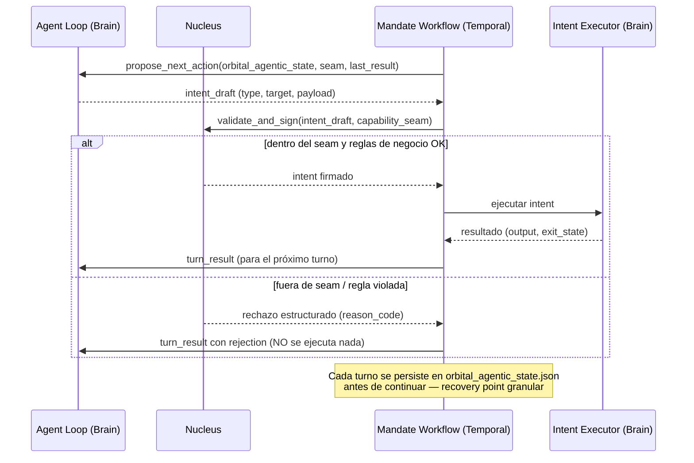

## 0️⃣ Encuadre CORPO / Enterprise Context

> Esta sección no es boilerplate legal ni introducción de cortesía. Fija el marco bajo el cual todo lo que sigue debe leerse, implementarse y — más importante — auditarse cuando algo no encaje.

**Qué es este documento, y qué no es.** Lo que sigue es una especificación técnica de gobierno sobre loops agénticos: cómo Nucleus firma intents individuales incluso cuando quien los propone es un agente autónomo, no un humano turno a turno. No es una feature aislada de producto ni un experimento de conveniencia de ingeniería. Es la capa de gobierno que hace posible que Cognituum siga siendo la misma promesa organizacional a medida que la ejecución de código se vuelve más autónoma — sin que esa autonomía diluya a quién le pertenece la decisión.

**Por qué esto le importa a una organización, no solo a un equipo de ingeniería.** Cognituum sostiene una tesis de diez años: que el criterio técnico de una organización —la decisión y su razón, no el código que produjo— le pertenece a la organización, no al modelo o al proveedor que participó en su construcción. Esa tesis se sostiene sobre **dos pilares independientes, no uno**:

1. **Persistencia a través de proveedores.** Que un Intent sobreviva el cambio de motor de IA — de Codex a Claude, de Claude a lo que exista dentro de cinco años — sin perder autoridad, estado ni evidencia. Este pilar está definido con precisión (batería EXC-001..EXC-010) y **su validación empírica sigue en curso**; este documento no la avanza ni la reemplaza.
2. **Gobierno de la autonomía.** Que la autoridad humana no se diluya a medida que la ejecución se vuelve más autónoma y más rápida — que un agente pueda proponer cientos de turnos sin que eso signifique cientos de renuncias silenciosas de control. **Este documento es el diseño de ese segundo pilar.**

Ninguno de los dos pilares sustituye al otro. Un sistema que resuelve portabilidad entre proveedores pero pierde el control cuando la ejecución se vuelve autónoma no es defendible a diez años. Tampoco lo es un sistema que gobierna la autonomía perfectamente pero queda atrapado dentro de un solo proveedor. Este documento existe porque el segundo pilar, hasta esta especificación, era una preocupación nombrada sin mecanismo — la Sección 8 de la tesis estratégica de Cognituum advertía explícitamente que *"la gobernanza puede volverse otra burocracia"* si el costo de mantener control humano crece más rápido que el valor de conservarlo. Lo que sigue es la respuesta de diseño a esa advertencia, no una promesa nueva sin sustento.

**Por qué esto es infraestructura institucional y no una herramienta.** Toda decisión de diseño en este documento —firma individual de cada intent sin excepción, opacidad total sobre las reglas de gobierno (`cor`), límites infranqueables a la auto-extensión de un Mandate delegado, clasificación verificada contra la forma física del cambio y no contra lo que el agente declara— responde a una sola pregunta, y ninguna otra: **¿quién es responsable, de forma verificable, cuando algo sale mal?** Esa pregunta no la hace un desarrollador evaluando una herramienta para su flujo de trabajo. La hace un CTO, un equipo de seguridad, o un auditor externo evaluando si una organización puede delegar ejecución de código a un sistema autónomo sin perder trazabilidad legal y operativa sobre lo que ese sistema hizo. Ese es el estándar bajo el que este documento fue escrito, y es el estándar bajo el que debe seguir revisándose.

**Disciplina de lectura para todo lo que sigue.** Cada mecanismo de esta especificación debe poder responder, sin ambigüedad, a: ¿esto reduce la autoridad humana real, o solo reduce la fricción de ejercerla? Si la respuesta no es clara, el diseño no está listo para producción, sin importar cuán elegante sea el resto de la arquitectura.

---

## 8️⃣ Mandates Agénticos — Gobernanza Formal sobre Agent Loops

### 📝 Registro de cambios

| Versión | Cambios |
|---|---|
| v6.1 | **Breaking change de taxonomía de intents.** `cor` deja de significar *Coordination* (merges cognitivos, orden de trabajo — semántica de v6.0 §6️⃣) y pasa a significar **Core/Governance**: modificación o consulta de reglas de negocio, invariantes del sistema y políticas de orquestación de Nucleus. `cor` queda **no accesible ni en lectura ni en escritura** para cualquier Agent Loop (política Zero-Read/Zero-Write, ver §8.2.2). La mecánica de resolución e integración de código que conceptualmente vivía bajo el `cor` de v6.0 se formaliza como intent nuevo: **`mrg`** (Merge & Integration) — fusión de ramas y resolución de conflictos lógicos a nivel de repositorio local, accesible por el Agent Loop bajo `mrg_constraints` del seam. Cualquier Mandate publicado bajo semántica v6.0 que referencie `cor` con sentido de coordinación debe migrarse explícitamente antes de ejecutarse bajo runtime v6.1. |
| v6.1 + Addendum (22 ago 2026) | Sesión de revisión conjunta sobre el borrador v6.1: cierre de cuatro ambigüedades operativas (§8.2, §8.2.1, §8.5), incorporación de un marco experimental de patrones inspirados en DeepSeek Harness (`dsh`) con condiciones estrictas (§8.2.3), corrección de secuenciación del roadmap (Fase 1 antes que `propose_next_action`, §9.2.1) y fijación de las decisiones de diseño no obvias de la Activity base de Fase 1/Genesis (§9.2.2). Detalle de cada resolución integrado en su sección correspondiente; ver también §10 para lo que sigue explícitamente abierto. |
| v6.1 + Nota cruzada Gravity (27 ago 2026) | Se incorpora, en §8.2.3, la nota cruzada de herencia de `governance.gravityRules[]` en sub-Mandates delegados, formalizada en `BLOOM_Mandate_Universal_Schema_v1_2_0.md`. No modifica ninguna condición ya fijada para la herencia del `capability_seam` (patrón 3) — la complementa, dejando explícito que Gravity se hereda por adición obligatoria mientras el seam se hereda por subconjunto. |

---

### 8.0 Principio rector

Todo lo que sigue es una consecuencia directa de la invariante ya establecida:

> **La autoridad nunca se distribuye, aunque el acceso sí.**

Un Mandate Agéntico no es una excepción a esa regla — es la prueba de estrés más dura que se le puede hacer. La pregunta de diseño no es "¿cómo dejamos que el agente actúe con más libertad?", sino **"¿cómo hacemos que la libertad del agente sea indistinguible, desde el punto de vista de Nucleus, de la de un desarrollador humano que propone intents uno por uno?"**. Si Nucleus firma cada paso igual en ambos casos, la agentiabilidad es solo velocidad de propuesta, no una nueva superficie de autoridad.

---

### 8.1 El Mandate Agéntico como evolución del Mandate, no como entidad nueva

Recuperando el consenso previo: un intent es determinista y atómico; un Mandate ya es un Workflow de Temporal con estado. Lo único que cambia en la variante agéntica es **quién decide la secuencia de Actions**:

| | Mandate Declarativo (v6.0 actual) | Mandate Agéntico (propuesta) |
|---|---|---|
| Secuencia de Actions | Fija, definida en `mandate.json` al momento de la firma | Generada turno a turno por un *decision loop* |
| Quién decide el próximo paso | El autor humano, de antemano | El agente (IA), en runtime, dentro de un scope firmado |
| Qué firma Nucleus | El Mandate completo (la secuencia entera) | El **scope** del Mandate al crearlo, y **cada intent propuesto** individualmente en cada turno |
| Runtime | Workflow de Temporal ejecutando pasos fijos | El mismo Workflow de Temporal, pero con una Activity de tipo `agent_turn` que llama al loop antes de cada paso |
| Mutabilidad | El contrato nunca cambia post-firma | El contrato (`mandate.json`) tampoco cambia — lo que crece es el Orbital Agentic State (`orbital_agentic_state.json`), turno a turno |

Esto es clave: **no se crea un nuevo nivel en la jerarquía**. Sigue siendo `Nucleus → Mandate → Action → Intent`. Lo que se agrega es un campo `execution_mode` en el Mandate, y una nueva Activity de Temporal (`propose_next_action`) que reemplaza la lectura secuencial de una lista fija por una invocación al agente. Cómo se secuencia la construcción de ambas Activities entre fases queda fijado en §9.2.1.

```
Nivel 1 — Nucleus         Autoridad, firma cada intent propuesto (sin excepción)
Nivel 2 — Mandate         execution_mode: "declarative" | "agentic"
Nivel 3 — Action          En modo agéntico, generada dinámicamente turno a turno
Nivel 4 — Intent          exp / cor / dev / doc / tst / mrg — idéntico en ambos modos
```

---

### 8.1.1 Nota Técnica de Arquitectura: Asimetría de Gobernanza e Invariantes Orbitales (`cor`, `mrg`, `tst`)

La evolución del protocolo BTIPS en su versión v6.1 responde directamente a la implementación del modelo de **Gobernanza Orbital**. Los intents `cor`, `mrg` y `tst` formalizan la separación absoluta entre la trayectoria del agente y las leyes del sistema:

- **`cor` (Core/Governance) — Las Leyes del Campo Gravitatorio:** Representa el Plano de Control de Nucleus. Se rige bajo la política **Zero-Read / Zero-Write para Agent Loops**. Un agente no solo tiene prohibido modificar `cor`, sino que la política misma es opaca a la lectura del LLM para eliminar el vector de ataque por reconocimiento. Es un canal exclusivo para el operador humano o decisiones de sistema de Nucleus.
- **`mrg` (Merge & Integration) — Control de Convergencia:** Sustituye la antigua semántica operativa de `cor` v6.0. Gobierna la fusión de múltiples fuentes de cambio mediante clasificación determinista (`source_refs >= 2`). Impide que un agente camufle integraciones complejas como modificaciones simples (`dev`).
- **`tst` (Validation & Test Runner) — Telemetría Determinista de Cierre:** Resuelve el problema de la falta de confianza epistémica en la autodeclaración del LLM. `tst` es la **única fuente de verdad objetiva** capaz de validar si la trayectoria orbital alcanzó el objetivo. Como invariante física, cualquier `mrg` exitoso invalida retroactivamente las ejecuciones previas de `tst`, exigiendo un nuevo `tst pass` para permitir la transición del Mandate a estado `completed`.

> ⚠️ **Marca de ratificación pendiente — no eliminar hasta decisión explícita.** La frase original de este bloque describía a `mrg` "aplicando reglas físicas en dos fases (*dry-run* y límites de colisión) antes de alterar la trayectoria principal". Ese mecanismo de dry-run (firma condicional → ejecución de prueba en el Runner → rechazo post-ejecución si se excede `max_conflict_files`, vía `reason_code: MERGE_CONFLICT_BUDGET_EXCEEDED`) **no forma parte de esta spec unificada** — es una propuesta de extensión hecha al formalizar BSIP-010, todavía sin firma. Se omitió esa frase de este bloque a propósito. Si se ratifica, esta nota se reemplaza por el texto original completo; si no, el mecanismo de validación de `max_conflict_files` queda abierto como pregunta de diseño, igual que el origen de los `source_refs` múltiples (§10).

---

### 8.2 Capability Seam — el "alcance acotado" como contrato firmado

Tomando la idea de `dsh` de aislar capacidades por scope, pero resolviéndola de forma compatible con la invariante de BTIPS: en `dsh` el aislamiento vive en el runtime del plugin (confianza en el sandbox). En BTIPS **el seam no es un mecanismo de sandboxing técnico — es una cláusula del contrato firmado**, y Nucleus la evalúa en cada turno, no solo al cargar el agente.

Un Mandate Agéntico declara su seam así:

```jsonc
{
  "mandate_id": "mnd_8f2a1c",
  "execution_mode": "agentic",
  "objective": "Estabilizar la capa de autenticación en el módulo de sesiones",

  "capability_seam": {
    "allowed_intent_types": ["exp", "dev", "tst", "mrg", "doc"],
    "forbidden_intent_types": ["cor"],
    "scope_paths": ["src/auth/**", "tests/auth/**"],
    "forbidden_paths": [".bloom/**", ".env*", "src/vault/**"],
    "max_turns": 25,
    "max_dev_intents": 12,
    "requires_tst_before_close": true,
    "mrg_constraints": {
      "allowed_source_refs": ["local branches only"],
      "requires_tst_rerun_after_merge": true,
      "max_conflict_files": 8
    },
    "escalation": {
      "on_scope_violation": "reject_and_notify_human",
      "on_budget_exceeded": "pause_and_request_extension",
      "on_forbidden_path_touch": "reject_intent_hard_stop",
      "on_intent_misclassified": "reject_and_wait_for_resubmission"
    }
  },

  "signed_by": "nucleus:master_key_fingerprint",
  "signature": "..."
}
```

Puntos de diseño importantes:

* **`forbidden_intent_types: ["cor"]`** — un agente nunca puede proponer un intent `cor`. Bajo la redefinición v6.1, `cor` opera sobre la "constitución" del proyecto — reglas de negocio, invariantes, políticas de orquestación — nunca sobre integración de código. Si un agente pudiera invocarlo, podría reconfigurar sus propios límites de seguridad, su presupuesto de tokens o sus `forbidden_paths`. Por eso queda reservado a autoridad humana directa o a Nucleus actuando por sí mismo, nunca al loop.
* **`mrg_constraints`** acota la integración de código, que sí es una operación legítima del Agent Loop pero con perfil de riesgo distinto al de `dev`: mientras `dev` modifica dentro de un scope conocido de antemano, `mrg` por definición toca la intersección de cambios que pueden venir de fuera del seam original (otra rama, otro Mandate, otro agente). `allowed_source_refs` limita de dónde puede traccionar (solo ramas locales, nunca remotos externos); `max_conflict_files` acota el radio de un solo merge. El mecanismo concreto que produce esa segunda rama local candidata a mergear queda abierto — ver §10.
* **Invariante innegociable:** si un `mrg` se ejecuta con éxito, **invalida la validez de cualquier `tst` previo**. El conjunto de cambios post-merge nunca fue el que ese `tst` validó originalmente. Por eso `requires_tst_rerun_after_merge: true` no es opcional dentro de un seam que permite `mrg` — el Mandate solo puede cerrarse (`status = "completed"`) si, después del último `mrg` ejecutado, corre un nuevo `tst` en estado `pass`. Un `tst` anterior al `mrg`, por más que haya dado `pass`, no cuenta para el cierre.
* **`scope_paths` / `forbidden_paths`** no son una sugerencia para el agente — son una precondición que **Nucleus verifica contra el diff real del intent antes de firmarlo**, no contra lo que el agente dice que va a tocar. Esta verificación aplica **exclusivamente al diff propuesto por el agente o por el humano**: nunca restringe la escritura interna de Nucleus/Executor como bookkeeping de infraestructura (por ejemplo, la persistencia interna bajo `.bloom/.intents/.tst/` o `.bloom/.intents/.mrg/`, ver §8.4 y §8.2.3). `forbidden_paths` es una cláusula contra el contenido que el agente intenta modificar, no un perímetro que el propio sistema deba respetar al llevar sus registros.
* El seam se firma **una sola vez, al crear el Mandate**, igual que hoy se firma `mandate.json`. Lo que varía turno a turno es solo *qué Action concreta se propone dentro de ese seam ya inmutable* — el seam mismo nunca se amplía en runtime sin una nueva firma humana. Esta misma regla es la que sostiene los límites de delegación de sub-Mandates descritos en §8.2.3.
* **`on_intent_misclassified: "reject_and_wait_for_resubmission"`** — Nucleus rechaza el draft mal clasificado y **no lo corrige**. El agente recibe el `reason_code` estructurado (`INTENT_MISCLASSIFIED`), reclasifica por su cuenta y vuelve a proponer el intent en el turno siguiente. Ningún turno se "corrige" automáticamente por Nucleus — ver el flujo completo en el ejemplo de §8.5.
* **Modelo de presupuesto de tokens: dual, no binario.** `orbital_agentic_state.json` lleva un ledger inmutable de consumo propio (`budget_consumed`, ver §8.5) que sirve para auditoría y portabilidad del Mandate en el Marketplace, **y en paralelo** ese mismo consumo debita contra la cuota organizacional del Tenant en Nucleus, que es la que alimenta el modelo de pricing (§9.3, Fase 4). Los dos registros no son excluyentes ni alternativos — coexisten porque responden a necesidades distintas: el ledger local es del Mandate y viaja con él; la cuota del Tenant es de la organización y es lo que Nucleus factura.

#### 8.2.1 Clasificación determinista — `dev` vs `mrg`

La frontera entre `dev` y `mrg` no puede depender de cómo el agente etiquetó su propio draft — tiene que ser verificable por Nucleus contra la forma física del cambio:

| Intent | Regla física de validación |
|---|---|
| `dev` | El draft declara **un único** `source_ref` (diff local, un solo origen de cambio) |
| `mrg` | El draft declara **dos o más** `source_ref` (múltiples branches, repos o referencias a integrar) |

Si un draft se presenta como `dev` pero su payload trae ≥2 `source_ref`, o se presenta como `mrg` con uno solo, Nucleus lo rechaza sin ejecutar nada:

```jsonc
{
  "nucleus_decision": "rejected",
  "reason_code": "INTENT_MISCLASSIFIED",
  "detail": "declared_type=dev but source_refs=2; expected mrg"
}
```

Esto cierra la ambigüedad de clasificación **en el punto de firma**, no en la intención declarada del agente — la propia estructura del draft es la prueba, no la etiqueta que trae. Tras el rechazo, el manejo es el descrito en §8.2: `reject_and_wait_for_resubmission` — el agente reclasifica y vuelve a proponer en el turno siguiente, sin corrección automática de Nucleus.

#### 8.2.2 Opacidad total sobre `cor` — Zero-Read / Zero-Write

`cor` no es solo `forbidden` para escritura — es **opaco por completo** para el Agent Loop:

* El agente **nunca** puede consultar la política o regla de negocio cruda detrás de `cor`, ni siquiera en modo lectura. No hay un `cor` de solo-consulta accesible al loop.
* Toda la telemetría que el agente recibe sobre los límites del sistema llega **exclusivamente filtrada** a través de los `reason_code` estructurados de un rechazo (`SCOPE_VIOLATION`, `PATH_FORBIDDEN`, `INTENT_MISCLASSIFIED`, etc. — ver §8.3).
* Esto no es solo higiene de permisos: cierra un vector de reconocimiento. Un agente que pudiera leer `cor` directamente podría enumerar con precisión los límites exactos del sistema (qué paths, qué presupuestos, qué reglas) en vez de descubrirlos indirectamente turno a turno vía rechazo — lo segundo da al operador humano visibilidad y control sobre cuánta información de la política se filtra hacia el loop; lo primero se lo regala de una.

#### 8.2.3 Patrones de Inspiración Agéntica (`dsh`) — marco experimental y condiciones aprobadas

**Encuadre explícito:** la integración de los patrones que siguen es **estrictamente experimental e investigativa**. No se importa código ni dependencias físicas de `deepseek-ai/deepseek-harness`; se abstraen conceptualmente y se adaptan al modelo de gobierno inmutable de BTIPS descrito en §8.0. Ningún patrón de esta sección se acepta si contradice la invariante rectora — dos de los cuatro llevan una condición dura que el diseño de Fase 2 (§9.3) debe respetar sin excepción.

| Patrón (inspiración `dsh`) | Condición aprobada |
|---|---|
| **1. Inyección dinámica de herramientas vía seam (schema filtering)** | Aprobado sin reservas, con aclaración: es optimización de UX/prompt para reducir alucinaciones — mostrarle al LLM solo el subconjunto de intents/paths relevantes al seam vigente — **nunca** reemplazo de la validación estructural real en Nucleus (§8.2, §8.2.1). Un intent fuera de seam se rechaza igual aunque nunca se le haya mostrado su schema al LLM. |
| **2. Re-compresión de contexto (turn compression)** | Aprobado con condición dura: `orbital_agentic_state.json` conserva **siempre** el log crudo, sin comprimir (ver §8.5). La ventana de contexto que efectivamente recibe el LLM en cada turno usa el esquema **"3 últimos turnos crudos + resumen comprimido del resto"** — nunca un reemplazo total por resumen, para no perder memoria de corto plazo del loop ni capacidad forense de auditoría sobre el historial completo. |
| **3. Sub-Mandates delegados (hijos de `orbital`)** | Aprobado con tres condiciones **innegociables**: (a) presupuesto del hijo **descontado del remanente del padre**, nunca asignado fresco; (b) sub-seam validado por Nucleus como **subconjunto estricto** contra el seam del padre (`padre ⊇ hijo`), verificado estructuralmente igual que la clasificación `dev`/`mrg` de §8.2.1 — nunca aceptado solo porque el loop lo declara; (c) `max_depth: 2` como límite infranqueable. Sin estas tres condiciones, un Orbital firmado una sola vez podría multiplicar su capacidad total sin una segunda firma humana en ningún punto — rompiendo directamente el principio rector de §8.0. |
| **4. Sandboxing de ejecución en Project Runners** | Aprobado, con la misma lógica que el patrón 1: es defensa en profundidad, no reemplazo de la firma de Nucleus. Condición: la validación de `forbidden_paths` (§8.2) se evalúa **siempre en el host de Nucleus**, nunca contra la vista del contenedor del Runner — para que un sandboxing mal configurado no le oculte a Nucleus una ruta que debería bloquear. |

> **Herencia de Gravity en sub-Mandates (ver `BLOOM_Mandate_Universal_Schema_v1_2_0.md`):** mientras el `capability_seam` se hereda por subconjunto (`hijo ⊆ padre`, un sub-Mandate solo puede tener igual o menor alcance que su padre), las reglas de `governance.gravityRules[]` se heredan por adición obligatoria: un sub-Mandate incorpora automáticamente, de forma íntegra y de solo lectura, todo el criterio Gravity de su padre (`inheritedGravityRules[]`), y solo puede añadir reglas propias adicionales — nunca contradecir ni relajar las heredadas, salvo mediante una `exception` explícita y nombrada. La profundidad de herencia sigue el mismo `max_depth: 2` ya fijado para el seam, sin mecanismo de propagación adicional.

---

### 8.3 El loop turno a turno — cómo interactúa el agente con Nucleus



Detalles operativos:

1. **El agente nunca ejecuta nada directamente.** Solo produce un *intent draft* — la misma forma de datos que un desarrollador humano produciría al crear un intent desde el Conductor o el plugin VS Code. No hay diferencia de formato entre "intent propuesto por humano" e "intent propuesto por agente"; la única diferencia es el `proposer_type` en los metadatos, que queda en el log de auditoría.
2. **El rechazo es información, no un error crudo.** Cuando Nucleus rechaza un draft (por tocar `forbidden_paths`, exceder `max_dev_intents`, presentar un `mrg` mal formado, o violar una regla de negocio), el agente recibe un `reason_code` estructurado (`SCOPE_VIOLATION`, `BUDGET_EXCEEDED`, `PATH_FORBIDDEN`, `INTENT_MISCLASSIFIED`) en vez de un stack trace de shell. Esto es lo que permite que el propio loop razone y se autocorrija — vía `reject_and_wait_for_resubmission` (§8.2) — sin necesitar acceso a nada fuera del contrato.
3. **Persistencia por turno, no por Mandate completo.** Cada turno (propuesta → firma/rechazo → ejecución → resultado) es un punto de recovery de Temporal. Si el proceso crashea a mitad de un Mandate agéntico de 25 turnos, se retoma en el turno N sin repetir trabajo — exactamente la misma garantía que ya está documentada para Mandates declarativos, solo que ahora el "próximo paso" no estaba escrito de antemano, sino que se vuelve a pedir al agente con el `orbital_agentic_state` reconstruido.
4. **Nucleus sigue siendo el único firmante.** El Agent Loop corre dentro de Brain (o como Activity de Temporal invocando un provider de IA), pero no tiene ni necesita credenciales de ejecución. Solo Nucleus tiene la vault authority y la potestad de firma — el agente "sabe programar" pero no "puede tocar nada" sin pasar por el mismo checkpoint que cualquier otro intent en el sistema.

---

### 8.4 El intent `tst` como criterio de parada objetivo

`tst` cierra el feedback loop que hoy falta entre `exp` (explorar sin alterar) y `dev` (modificar código). Su rol en el Mandate Agéntico es doble: **gate de calidad** y **criterio de terminación**.

```
.bloom/.intents/.tst/
```

Reglas de diseño:

* **`tst` no modifica el repositorio.** Ejecuta la suite de pruebas (o un subconjunto acotado por el seam) y produce un resultado determinista: `pass` / `fail` + payload estructurado (qué falló, dónde).
* **Es el único intent tipo que puede llevar el `orbital_agentic_state.status` a `completed`.** Ningún `dev` puede cerrar un Mandate por sí mismo — el contrato exige que la última Action exitosa antes del cierre sea un `tst` en estado `pass`, si `requires_tst_before_close: true` (ver §8.2).
* **Self-healing acotado**: si `tst` falla, el resultado (no el error crudo, sino el resumen estructurado) vuelve al agente como contexto del próximo turno, quien puede proponer un nuevo `dev` correctivo. Esto se repite hasta `pass` o hasta agotar `max_turns` / `max_dev_intents` — lo que ocurra primero. Esta capacidad de self-healing es **exclusiva del loop agéntico**: la Activity base de Fase 1/Genesis no la implementa (ver §9.2.2).
* La persistencia interna de `tst` (y, en Fase 3, de `mrg`) bajo `.bloom/.intents/.tst/` y `.bloom/.intents/.mrg/` es bookkeeping de infraestructura de Nucleus/Executor, no del diff propuesto por el agente — por eso no cae bajo `forbidden_paths` aunque ese path pudiera coincidir con un prefijo bloqueado para el agente (ver aclaración en §8.2).
* **Criterios de parada del Mandate Agéntico** (cualquiera dispara cierre, éxito o no):

| Condición | Resultado |
|---|---|
| `tst` en `pass` tras un `dev` dentro del seam, **sin `mrg` posterior** | `orbital_agentic_state.status = "completed"` |
| `mrg` ejecutado con éxito, seguido de un nuevo `tst` en `pass` | `orbital_agentic_state.status = "completed"` |
| `mrg` ejecutado con éxito, **sin** `tst` posterior en `pass` | Mandate permanece `running` — cualquier `tst` anterior al `mrg` queda invalidado, no cuenta para el cierre |
| `max_turns` alcanzado sin `tst pass` vigente | `status = "exhausted"`, escalación humana |
| Intent propuesto viola `capability_seam` de forma repetida (umbral configurable), incluyendo rechazos por `INTENT_MISCLASSIFIED` | `status = "aborted"`, escalación humana inmediata |
| Presupuesto de tokens/tiempo excedido | `status = "paused"`, requiere `nucleus mandate resume` con extensión firmada |

---

### 8.5 Orbital Agentic State (`orbital_agentic_state.json`) — trazabilidad turno a turno

`orbital_agentic_state.json` es el contrato independiente de estado para la ejecución agéntica Orbital. Conserva el historial de turnos, incluyendo los rechazos — que son tan auditables como las ejecuciones exitosas—, el consumo acumulado y el contexto Gravity inyectado.

No extiende ni reemplaza el `mandate_state.json` operacional de Nucleus. Ambos artefactos se correlacionan exclusivamente por `mandate_id`; no comparten archivo, schema ni ciclo de vida. `mandate_state.json` continúa perteneciendo al workflow operacional real de Nucleus, mientras el Orbital Agentic State describe el loop agéntico documentado en esta sección.

**Invariante de conteo:** `turn_count` incrementa en **todo** turno, firmado o rechazado, sin excepción. Es la defensa real contra un loop roto que reintenta indefinidamente sin costo — si solo contaran los turnos firmados, un agente atascado rechazando repetidamente nunca gatillaría `max_turns` ni escalación.

```jsonc
{
  "mandate_id": "mnd_8f2a1c",
  "status": "running",
  "turn_count": 8,
  "turns": [
    {
      "turn": 1,
      "proposed_by": "agent",
      "intent_draft": { "type": "exp", "target": "src/auth/session.py" },
      "nucleus_decision": "signed",
      "intent_id": "exp_991a",
      "result": "findings_summary: ..."
    },
    {
      "turn": 4,
      "proposed_by": "agent",
      "intent_draft": { "type": "dev", "target": "src/vault/keys.py" },
      "nucleus_decision": "rejected",
      "reason_code": "PATH_FORBIDDEN",
      "result": null
    },
    {
      "turn": 6,
      "proposed_by": "agent",
      "intent_draft": { "type": "dev", "source_refs": ["local/session-fix", "local/token-refresh"] },
      "nucleus_decision": "rejected",
      "reason_code": "INTENT_MISCLASSIFIED",
      "detail": "declared_type=dev but source_refs=2; expected mrg",
      "result": null
    },
    {
      "turn": 7,
      "proposed_by": "agent",
      "intent_draft": { "type": "mrg", "source_refs": ["local/session-fix", "local/token-refresh"] },
      "nucleus_decision": "signed",
      "intent_id": "mrg_2b71",
      "result": "merged, 2 conflict files resolved"
    },
    {
      "turn": 8,
      "proposed_by": "agent",
      "intent_draft": { "type": "tst", "target": "tests/auth/**" },
      "nucleus_decision": "signed",
      "intent_id": "tst_04c2",
      "result": "pass",
      "note": "tst posterior al mrg del turno 7 — único tst vigente para cierre"
    }
  ],
  "budget_consumed": { "turns": 8, "dev_intents": 3, "tokens": 131900 }
}
```

El rechazo del turno 4 y la reclasificación del turno 6 quedan en el registro exactamente igual que un turno exitoso — son evidencia de que el seam y la clasificación determinista funcionaron, no ruido a descartar. Nótese que el turno 6 fue **rechazado** (`reject_and_wait_for_resubmission`, §8.2) y el agente volvió a proponer, ahora correctamente clasificado como `mrg`, en el turno 7: Nucleus nunca corrigió el draft del turno 6 por su cuenta. Para el pitch a Enterprise, este es el artefacto que demuestra gobernanza: no "confiamos en que el agente se comportó", sino "acá está cada intento, firmado o rechazado, con motivo — y el `tst` que cerró el Mandate es el que realmente corresponde al estado final del código, post-merge".

`budget_consumed.tokens` es el ledger propio del Mandate (auditoría, portabilidad en Marketplace); en paralelo, ese mismo consumo debita contra la cuota organizacional del Tenant en Nucleus (modelo dual, ver §8.2 y §9.3 Fase 4).

---

### 8.6.1 Matriz consolidada de Intents — v6.1

| Intent | Tipo | Responsabilidad material | Accesible por Agent Loop |
|---|---|---|---|
| `exp` | Exploratorio | Lectura, AST, inspección de contexto sin alteración | **Sí** |
| `dev` | Operativo | Modificación, escritura o refactor de código — un único `source_ref` | **Sí** (bajo `scope_paths`) |
| `tst` | Validación | Ejecución de pruebas deterministas en el Runner | **Sí** |
| `mrg` | Integración | Fusión de ramas / resolución de conflictos lógicos — ≥2 `source_ref` | **Sí** (bajo `mrg_constraints`) |
| `doc` | Documentación | Generación y actualización de especificaciones | **Sí** |
| `cor` | **Gobernanza** | Modificación o consulta de reglas de negocio, invariantes y políticas del Core | **No** — `forbidden_intent_types`, Zero-Read/Zero-Write (§8.2.2) |

`inf` (Information Intent, definido en v6.0 §6️⃣) queda fuera de esta matriz porque no participa del ciclo agéntico estándar `exp → dev → tst [→ mrg → tst]`; se mantiene disponible como input pasivo bajo las mismas reglas de v6.0.

---

### 8.6 Encaje en la tabla "Qué es y qué NO es un Mandate"

Para mantener consistencia con la tabla de §7, se le agrega una fila:

| NO es / NO hace | SÍ es / SÍ hace |
|---|---|
| Un agente con acceso a shell u OS | Un loop de decisión que solo propone intents dentro de un seam firmado |
| Autoridad delegada al modelo de IA | Nucleus sigue firmando cada intent, propuesto por humano o por agente, sin distinción de trato |
| Un Mandate que confía en la etiqueta que el agente pone a su propio draft | Nucleus reclasifica `dev`/`mrg` por la forma física del cambio (`source_ref` singular vs. plural), no por lo declarado |
| Un cierre válido con un `tst` corrido antes de un `mrg` posterior | Un cierre exige el `tst` vigente más reciente — cualquier `mrg` exitoso invalida los `tst` previos |
| Un sub-Mandate delegado con presupuesto y seam propios, asignados fresco | Un sub-Mandate cuyo presupuesto se descuenta del remanente del padre y cuyo seam es subconjunto estricto del seam del padre, hasta `max_depth: 2` (§8.2.3) |

---

### 8.7 Grietas operativas — resolución de sesión

Sobre el borrador v6.1 se detectaron, en la sesión de revisión del 22 de agosto de 2026, cinco puntos de ambigüedad adicionales a los ya cerrados en el registro de cambios de v6.1 (ambigüedad `cor`/`mrg`, clasificación determinista `dev` vs `mrg`, invalidación de `tst` por `mrg`, opacidad Zero-Read/Zero-Write sobre `cor`; y en el roadmap, el naming comercial y la ubicación de ejecución de `tst`/`mrg`). De los cinco puntos nuevos, cuatro quedaron resueltos con una regla concreta — ya integrados en §8.2, §8.2.1 y §8.5 — y uno queda **aprobado como pendiente de diseño**, no resuelto:

| # | Punto | Resolución |
|---|---|---|
| 1 | Reclasificación de intent mal etiquetado | Renombrado `reject_and_reclassify` → `reject_and_wait_for_resubmission` (§8.2). Nucleus rechaza, el agente reclasifica y vuelve a proponer en el turno siguiente — ver ejemplo en §8.5. |
| 2 | `forbidden_paths` vs. escritura interna de `tst`/`mrg` | Aplica exclusivamente al diff propuesto por el agente/humano; nunca restringe el bookkeeping interno de Nucleus/Executor (§8.2, §8.4). |
| 3 | Origen de los `source_refs` múltiples que necesita `mrg` | **Sin resolución concreta — aprobado como pendiente de diseño antes de que `mrg` sea observable en Fase 3.** Ver §10. |
| 4 | Modelo de presupuesto de tokens | Modelo dual: ledger propio en `orbital_agentic_state.json` + débito paralelo contra la cuota del Tenant en Nucleus. No son excluyentes (§8.2, §8.5). |
| 5 | ¿Los turnos rechazados cuentan para `max_turns`? | Sí — `turn_count` incrementa en todo turno, firmado o rechazado (§8.5). |

---

## 9️⃣ Posicionamiento y Roadmap de Ejecución

### 9.1 Naming — Contrato vs. Comercial

| Capa | Término | Uso |
|---|---|---|
| `mandate.json` / código técnico | `execution_mode: "agentic"` | Nucleus, Brain, Temporal, logs de auditoría — precisión técnica interna |
| Pitch Enterprise, documentación de negocio, UI de Conductor | **`Supervised Loop`** (alt. *Guided Loop*) | Cara al cliente — refuerza que es desarrollo gobernado por contrato, no un agente suelto con acceso al sistema operativo |

Este desdoblamiento resuelve el punto de naming: el término técnico no cambia (evita romper compatibilidad de schema), pero de cara a Enterprise nunca se usa la palabra "agente" sin calificar — siempre "Supervised Loop" o "desarrollo gobernado por Mandate".

### 9.2 Primer Mandate Agéntico — `mandate_orbital`

Nombre confirmado: **`orbital`**, consistente con la convención narrativa ya establecida por `genesis`. La metáfora es correcta y vale dejarla en la spec: un loop de decisión que orbita a Nucleus, nunca escapa de su campo gravitatorio de reglas y firmas — cero grados de libertad para autoextenderse fuera del `capability_seam` firmado.

#### 9.2.1 Secuenciación de roadmap y arquitectura compartida de Workflow

Diseñar `propose_next_action` directamente, sin pasar antes por la Activity declarativa, descalza el roadmap: `propose_next_action` pertenece formalmente a **Fase 2 (Orbital)**, no a **Fase 1 (Genesis)**. La secuencia correcta arranca por la Activity de resolución declarativa de Fase 1 — la que lee la secuencia fija de `actions[]` de `mandate.json` — diseñada específicamente para dejar una interfaz de extensión limpia donde `propose_next_action` encaje en Fase 2 sin modificar el resto del Workflow.

Lo que hace posible esta secuenciación sin fricción: **Fase 1 y Fase 2 comparten el mismo Workflow de Temporal**, porque la invariante "Nucleus firma cada intent individualmente en el momento de ejecutarse, sin excepción" (§8.0, §8.3) aplica **igual** en modo declarativo que en modo agéntico. El Mandate firmado al crearse autoriza la existencia del contrato — no exime a cada intent individual de pasar, en runtime, por la misma validación que en Fase 2 realmente decide algo. Esto es lo que permite que el único punto de extensión entre fases sea el *resolver* (`resolveNextAction` en Fase 1, `propose_next_action` en Fase 2), y nada más del Workflow cambia entre una fase y la otra.

#### 9.2.2 Activity base de Fase 1 / Genesis — decisiones de diseño

Tres decisiones de diseño no obvias fijadas para la Activity base, sobre las que se apoya la extensión limpia hacia Fase 2 descrita arriba:

1. **`evaluateStopCondition` lanza error explícito para `execution_mode: "agentic"`**, en vez de dejar un `if` vacío o un `TODO` silencioso. Si Fase 2 arranca sin haber implementado primero el gate de `tst` (§8.4), el sistema falla ruidosamente en vez de dejar pasar un Mandate agéntico sin criterio de cierre real.
2. **En modo declarativo, un intent rechazado va directo a `status: "aborted"`, sin self-healing.** El self-healing (reintentar tras un `tst` fallido, reclasificar y reproponer — §8.4, §8.2) es una capacidad exclusiva del loop agéntico. Un Mandate declarativo no tiene mecanismo de razonamiento para corregirse en runtime: un rechazo ahí es error de autoría del contrato, no algo recuperable.
3. **`resolveNextAction` es una función pura (solo lee estado); el avance de `cursor` ocurre en `persistTurn`.** En Fase 2, `resolveNextAction` va a invocar al LLM — si esa misma función tuviera además efectos secundarios de escritura de estado, se mezclaría una llamada no-determinista con mutación de estado en el mismo punto, lo cual rompe la garantía de replay determinista que exige Temporal.

### 9.3 Roadmap de Implementación

| Fase | Mandate / Entregable | Contenido | Notas de consistencia con v6.1 + Addendum |
|---|---|---|---|
| **Fase 1 — Genesis** | `mandate_genesis` | Infraestructura atómica de Nucleus, firma inmutable de intents, persistencia en Temporal, ejecución determinista del flujo declarativo base vía Activity de resolución declarativa (§9.2.1, §9.2.2). **+ Entregable añadido: herramienta de detección/migración de Mandates v6.0 que usan `cor` con semántica de coordinación**, antes de que exista tráfico agéntico real en el sistema. | La migración no puede diferirse a Fase 2+: una vez que `orbital` esté en producción, cualquier ambigüedad de `cor` heredada es una superficie de riesgo activa, no solo de catálogo. La Activity base implementa las tres decisiones de §9.2.2 (fallo explícito en modo agéntico, aborto sin self-healing, `resolveNextAction` pura). |
| **Fase 2 — Orbital (build de loop y seam)** | `mandate_orbital` | Activity `propose_next_action` (decision loop turno a turno), reemplazando el resolver declarativo sobre el mismo Workflow de Temporal (§9.2.1). Capability Seam firmado en `mandate.json` (`scope_paths`, `max_turns`, `max_dev_intents`, `forbidden_intent_types: ["cor"]`). Lógica de clasificación determinista `dev` vs `mrg` implementada en Nucleus (aunque `mrg` todavía no tenga executor). Diseño de los patrones experimentales de §8.2.3 (schema filtering, turn compression, sub-Mandates, sandboxing) con sus condiciones aplicadas desde el arranque de esta fase. | **`mrg` no está en `allowed_intent_types` en esta fase** — la clasificación se construye y testea aquí, pero no es observable en producción hasta Fase 3, cuando `mrg` existe como intent real contra el cual reclasificar. **Un Mandate Orbital en Fase 2 no puede alcanzar `status: "completed"`** (el gate de `tst` no existe todavía) — requiere cierre manual (`nucleus mandate force-close`) durante esta fase. Los sub-Mandates (`max_depth: 2`, §8.2.3) se diseñan en esta fase pero heredan la misma restricción de cierre manual mientras no exista gate de `tst`. |
| **Fase 3 — Test, Merge y Cierre** | `tst` + `mrg` | `tst` desplegado en Project Runners. `mrg` desplegado también en Project Runners (mismo nivel que `tst`, ya que ambos operan sobre el código de un Project específico). Activación de `mrg_constraints` y de la regla de invalidación: todo `mrg` exitoso invalida los `tst` previos y exige un nuevo `tst pass` para cerrar. A partir de esta fase, `INTENT_MISCLASSIFIED` es un rechazo real y observable, y `mrg` pasa a ser un intent visible en producción. | Con esto se cierra el gate de salida — Orbital pasa a poder alcanzar `completed` de forma completamente automática, sin intervención humana. **Bloqueante de entrada a esta fase:** el mecanismo de origen de `source_refs` múltiples para `mrg` (grieta #3, §8.7) sigue sin resolución concreta y debe cerrarse antes de que `mrg` sea observable aquí — ver §10. El sandboxing de Runners (§8.2.3, patrón 4) entra en vigor en esta fase, con la validación de `forbidden_paths` siempre evaluada en el host de Nucleus. |
| **Fase 4 — Telemetría y Billing** | Integración Marketplace | `budget_consumed.tokens` del ledger local del Mandate (§8.5) conectado, en paralelo y no en sustitución, al saldo/cuota organizacional del Tenant en Nucleus, para el modelo de pricing — modelo dual ya resuelto en §8.2/§8.5. | El punto que en la versión anterior bloqueaba esta fase (binario por-Mandate vs. por-Tenant) queda resuelto: ambos registros coexisten. Lo que resta para esta fase es el diseño concreto de integración de esa telemetría con el motor de billing — ver §10. |

La secuencia `genesis → orbital` queda ensamblada con estos ajustes incorporados. Antes de pasar a diseño detallado de implementación de Fase 1, restan las preguntas explícitamente abiertas de §10.

---

## 🔟 Preguntas Abiertas / Registro de Incertidumbres

Estos puntos quedan explícitamente sin resolución concreta — no se fuerza una respuesta para no perder trazabilidad de lo que sigue pendiente de la próxima sesión de diseño:

* **Origen de `source_refs` múltiples para `mrg`** (grieta #3, §8.7). No está definido qué mecanismo crea la segunda rama local candidata a mergear, dado que `dev` solo produce diffs de un único origen. Hipótesis sobre la mesa, ninguna confirmada: ¿otro Mandate corriendo en paralelo sobre el mismo repo? ¿una rama pre-existente dejada por el humano antes de firmar el seam? **Aprobado como pendiente de diseño a resolver antes de que `mrg` sea observable en Fase 3** (§9.3).
* **Filesystem definitivo de `.mrg/`.** Definir si sigue el patrón de `.tst/` — probablemente `.bloom/.intents/.mrg/` — a confirmar al iniciar Fase 3. Relacionado con la aclaración de §8.4 sobre bookkeeping interno no sujeto a `forbidden_paths`.
* **Integración de telemetría de tokens con billing (Fase 4).** El modelo dual de presupuesto (§8.2, §8.5) ya está resuelto conceptualmente; lo que falta es el diseño concreto de cómo el ledger local de `orbital_agentic_state.json` se sincroniza operativamente con el motor de billing y cuota del Tenant en Nucleus — no es un problema de modelo, es un problema de implementación de esa sincronización.
* **`mandate.json` de ejemplo, Fase 1 declarativo, de punta a punta.** Pendiente para validar que el contrato de tipos (`mandate.types.ts`) cierra sin huecos antes de escribir el `mandate.json` real de referencia.
* **Migración de Mandates v6.0** — mecanismo concreto para detectar y migrar Mandates ya publicados en el Marketplace que usan `cor` con semántica de coordinación (v6.0), antes de que Orbital salga a producción. Incorporado como entregable de Fase 1 en el roadmap (§9.3) — no puede quedar como tarea ad-hoc post-lanzamiento, pero el mecanismo de detección en sí todavía no está diseñado.
* **Diseño de `propose_next_action` (Fase 2)** — ahora con la interfaz de extensión ya fijada (`ResolveNextActionInput`/`Output` en `mandate.types.ts`, §9.2.1), queda como el siguiente bloque de trabajo formal de la próxima sesión.
