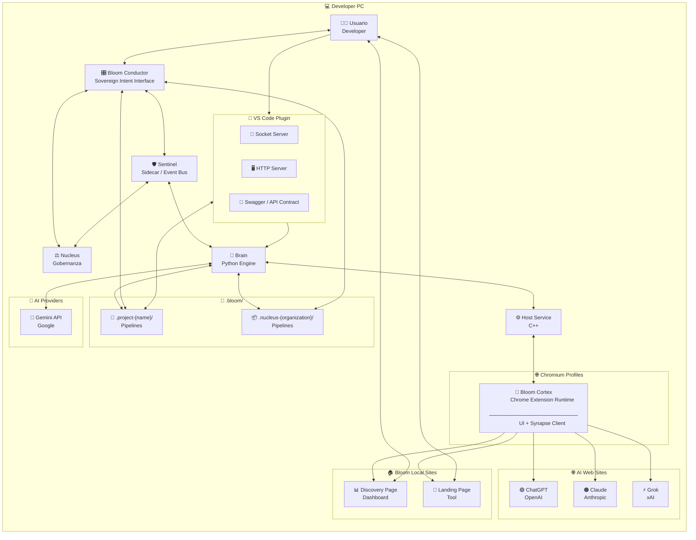

### 📦 BTIPS (Bloom Technical Intent Package)

BTIP convierte la interacción con inteligencia artificial en un proceso de ingeniería reproducible, donde cada intención técnica queda formalizada, versionada y gobernada por contexto real.

---

## 🧭 Contexto de Uso — Por qué existe BTIP

BTIP nace de un problema concreto: los modelos de IA trabajan rápido, pero **pierden contexto**, **no dejan rastro estructurado** y **no escalan cognitivamente** cuando un proyecto crece o involucra múltiples personas, herramientas y decisiones.

La arquitectura BTIP introduce una **unidad mínima de trabajo persistente** donde cada acción técnica queda registrada como un intent, junto con su contexto, entradas, salidas y efectos en el sistema. De esta forma, el conocimiento no vive en prompts efímeros ni en la memoria del modelo, sino en **Bloom Technical Intent Package**.

BTIP convierte la interacción con IA en un **proceso de ingeniería**, no en una conversación. Esto permite que una organización mantenga coherencia técnica, acelere iteraciones y transfiera conocimiento entre humanos y modelos sin degradación ni ambigüedad.

---

## 1️⃣ Concepto clave (dejémoslo cristalino)

### 🌐 Organización Bloom

* **1 solo Nucleus**
* **N Projects**
* **Todos comparten el mismo runtime local**
* **El Nucleus no desarrolla features**
  👉 **Gobierna, explora y coordina**

Pensalo así:

> **Projects = ejecución**
>
> **Nucleus = conciencia organizacional**

---

## 2️⃣ Diagrama SIMPLE actualizado — Arquitectura con Nucleus

Este es el **diagrama definitivo de presentación**.
Sigue siendo simple, pero ahora **explica la pirámide**.

👉 Pegalo en **[https://mermaid.live](https://mermaid.live)**



## 2.1️⃣ Bloom Runtime Infrastructure

La ejecución de BTIPS se apoya en una infraestructura de **Sidecar** que independiza la lógica organizacional de la interfaz visual.

*   **Sentinel Sidecar:** Proceso *daemon* que actúa como orquestador persistente. Mantiene el Event Bus activo y garantiza que la ejecución técnica no se interrumpa si el Launcher se cierra.
*   **Synapse Protocol:** Handshake de 3 fases (Extension ↔ Host ↔ Brain) que valida la integridad del canal antes de procesar intents.
*   **Data Persistence & Stateless UI:** El Launcher opera como una **Stateless UI**. No depende de estados volátiles en memoria, sino que reconstruye su realidad escaneando los archivos de intents en el Filesystem (`.bloom/intents/`) y sincronizando eventos perdidos mediante *polling* histórico al Sidecar.

---

## 2.2️⃣ Nucleus Governance Layer
Nucleus es la autoridad de mando y el árbitro de identidad del sistema. Actúa como el puente entre la voluntad del propietario y la ejecución técnica.

*   **Identity & Role Management:** Gestiona la jerarquía de poder (Master/Architect/Specialist), validando quién tiene permiso para ejecutar acciones sensibles.
*   **Vault Authority:** Es el único componente capaz de autorizar el flujo de llaves (API Keys/OAuth) desde el almacenamiento seguro de Chrome hacia el motor de ejecución.
*   **Organizacional Truth:** Nucleus firma digitalmente el estado de los proyectos en el filesystem, asegurando que la configuración de la organización sea inalterable para colaboradores no autorizados.

---

## 2.3️⃣ Bloom Cortex

Bloom Cortex es el **runtime de ejecución cognitiva en Chromium**.
Se materializa como una **Chrome Extension versionada, inmutable y reproducible**, empaquetada como un artefacto `.blx` y desplegada por Sentinel en cada perfil.

Cortex actúa como la **capa de interacción directa con el usuario y los AI Providers**, exponiendo la UI, gestionando el contexto de navegación y ejecutando el protocolo Synapse como cliente activo. No contiene lógica organizacional ni persistencia: su función es **conectar intención humana, contexto web y capacidades del sistema** de forma segura y gobernada.

El runtime de Cortex incluye páginas web locales (Discovery y Landing) que permiten explorar intents, inicializar perfiles y establecer el contexto cognitivo antes de cualquier ejecución técnica. Cortex es deliberadamente **stateless**, delegando autoridad, versionado y despliegue a Sentinel, y razonamiento profundo a Brain.

---

## 2.4️⃣ Bloom Conductor

**Bloom Conductor** es la terminal de interacción humana soberana y el centro de comando estratégico del ecosistema. Como una *Stateless UI* de alta precisión, actúa como el nervio óptico que permite al usuario visualizar el pulso del Event Bus en tiempo real y forjar intenciones técnicas mediante un editor de intents avanzado. Es el espacio donde la complejidad del sistema se simplifica en una interfaz de observabilidad total, diseñada para orquestar la ejecución de los workers sin retener estado volátil, garantizando que la verdad operativa y el historial de ejecución residan siempre de forma segura en el sistema de archivos.

Su función principal es elevar el proceso de desarrollo a un nivel de gobernanza consciente, facilitando la creación, edición e integración de intents —especialmente los de tipo `cor` (coordinación)— para lograr merges cognitivos que superan las limitaciones lógicas de las herramientas de versionado tradicionales. Al operar en simbiosis con el Sentinel Sidecar, el Conductor asegura que la voluntad del usuario se transmute en acciones técnicas verificables y reproducibles, convirtiéndose en el órgano vital para la dirección estratégica y la convergencia lógica de toda la organización Bloom.

---

## 3️⃣ Nucleus — Documentación Básica (oficial)

### 🧠 Nucleus (Proyecto Maestro de la Organización)

El **Nucleus** es el proyecto raíz y único de cada organización Bloom.
Representa el **nivel más alto de la pirámide cognitiva**.

### 🎯 Propósito

* Centralizar **exploración estratégica**
* Gobernar decisiones técnicas
* Mantener coherencia entre proyectos
* Registrar conocimiento transversal
* Orquestar evolución organizacional

### 🧩 Características clave

* **Uno solo por organización**
* Vive en `.bloom/.nucleus-{org}/`
* No implementa features productivas
* No modifica código de proyectos directamente
* Es **fuente de verdad estructural**

---

## 4️⃣ Qué se hace en el Nucleus (MUY IMPORTANTE)

### 🧪 Intents permitidos

✔️ **`exp` — Exploration (principal)**
✔️ **`inf` — Information**
✔️ **`cor` — Coordination (organizacional)**
✔️ **`doc` — Documentation estratégica**

❌ `dev` **NO es el foco**
(Solo en tooling interno del Nucleus, nunca en productos)

---

### 🧠 Tipos de conocimiento que vive en Nucleus

Basado en tu árbol real:

* Principios de arquitectura
* Patrones aprobados
* Decisiones (ADR)
* Estándares de calidad
* Seguridad y compliance
* Relaciones entre proyectos
* Mapas de dependencias
* Findings exploratorios
* Reportes organizacionales

👉 Todo eso **no pertenece a un proyecto**, pertenece a la **organización**.

---

## 5️⃣ Relación Nucleus ↔ Projects (modelo mental)

```
            NUCLEUS
        (Explora / Gobierna)
                │
        ┌───────┴────────┐
        │                │
     Project A        Project B
   (dev / doc)      (dev / doc)
```

## 2.1️⃣ Bloom Runtime Infrastructure

La ejecución de BTIPS se apoya en una infraestructura de **Sidecar** que garantiza que la lógica de la organización sea independiente de la interfaz visual.

### 🛡️ Sentinel Sidecar (The Orchestrator)
Sentinel opera como un proceso **Daemon (Sidecar)** persistente. Su función no es solo ejecutar comandos, sino mantener el **Event Bus** activo entre el cerebro (Brain) y la interfaz (Electron). 
*   **Persistent Execution:** Sentinel sobrevive al cierre de la UI de Electron, permitiendo que tareas largas finalicen y se registren sin intervención del usuario.
*   **Event Bus TCP:** Canal bidireccional asíncrono que transporta eventos de sistema y resultados de intents en tiempo real.

### 🔌 Synapse Protocol (Handshake de 3 Fases)
Para garantizar una ejecución técnica infalible, el runtime implementa un saludo de tres vías antes de cada operación:
1.  **Extension → Host:** La extensión notifica su disponibilidad.
2.  **Host → Extension:** El Bridge C++ valida capacidades y versión.
3.  **Host → Brain:** El canal se declara oficialmente "Conectado" y listo para recibir intents.

### 🗄️ Stateless UI & Data Persistence
Bajo esta arquitectura, el **Electron Launcher es una "Stateless UI"**. 
*   **Single Source of Truth:** La verdad no reside en la memoria de la aplicación, sino en el **Bloom File System** (archivos `.json` en cada proyecto).
*   **Rehydration:** Al abrirse, Electron reconstruye su estado escaneando los archivos de intents y solicitando al Sentinel los eventos perdidos vía *polling* histórico al bus. Esto asegura que el usuario siempre vea el estado real de la organización, sin importar cortes de energía o cierres de la aplicación.


### Reglas de oro

* Un **Project** puede:

  * ejecutar `dev`
  * ejecutar `doc`
  * ejecutar `exp` local
* El **Nucleus**:

  * define **cómo** se hacen las cosas
  * decide **cuándo** se integran
  * coordina **impacto cognitivo**

> Cuando algo afecta a más de un proyecto
> 👉 **sube al Nucleus**

---
Perfecto.
Voy **directo, corto y técnico**.
**Tres líneas por intent**: qué es, para qué se usa y dónde vive.

---

## `dev` — Development Intent

Produce o modifica **código ejecutable** del sistema o del producto.
Se usa para features, fixes, refactors e integración técnica.
Se ejecuta **en Projects**, dentro de `.bloom/.intents/.dev/`.

---

## `doc` — Documentation Intent

Genera o actualiza **documentación viva y verificable**.
Se usa para explicar decisiones, estado real y evolución del sistema.
Se ejecuta **en Projects y en Nucleus**, dentro de `.bloom/.intents/.doc/`.

---

## `exp` — Exploration Intent

Explora **alternativas, hipótesis y escenarios posibles**.
Se usa para reducir incertidumbre y tomar decisiones informadas.
Se ejecuta **principalmente en Nucleus**, dentro de `.bloom/.intents/.exp/`.

---

## `inf` — Information Intent

Recopila **información factual** sin transformarla ni decidir.
Se usa para validar supuestos y alimentar otros intents.
Se ejecuta **en Projects o Nucleus**, como input pasivo.

---

## `cor` — Coordination Intent

Coordina y gobierna **acciones humanas y sistémicas**.
Se usa para merges cognitivos, orden de trabajo y control de impacto.
Se ejecuta **en Nucleus o en Projects complejos**, como autoridad.

---


