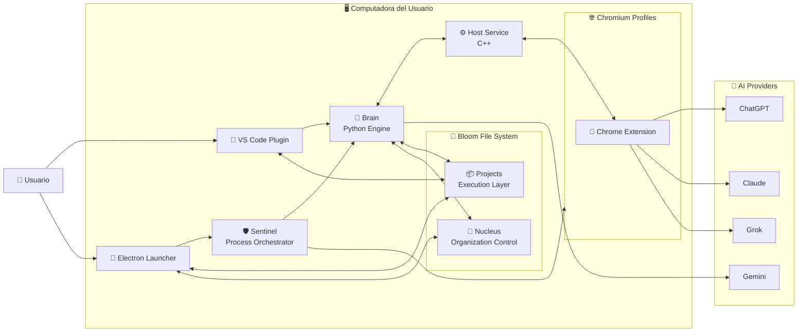

### 📦 BTIPS (Bloom Technical Intent Package)

BTIP convierte la interacción con inteligencia artificial en un proceso de ingeniería reproducible, donde cada intención técnica queda formalizada, versionada y gobernada por contexto real.

---

## 🧭 Contexto de Uso — Por qué existe BTIP

BTIP nace de un problema concreto: los modelos de IA trabajan rápido, pero **pierden contexto**, **no dejan rastro estructurado** y **no escalan cognitivamente** cuando un proyecto crece o involucra múltiples personas, herramientas y decisiones.

La arquitectura BTIP introduce una **unidad mínima de trabajo persistente** donde cada acción técnica queda registrada como un intent, junto con su contexto, entradas, salidas y efectos en el sistema. De esta forma, el conocimiento no vive en prompts efímeros ni en la memoria del modelo, sino en **Bloom Technical Intent Package**.

BTIP convierte la interacción con IA en un **proceso de ingeniería**, no en una conversación. Esto permite que una organización mantenga coherencia técnica, acelere iteraciones y transfiera conocimiento entre humanos y modelos sin degradación ni ambigüedad.

---

## 1️⃣ Concepto clave (dejémoslo cristalino)

### 🌐 Organización Bloom

* **1 solo Nucleus**
* **N Projects**
* **Todos comparten el mismo runtime local**
* **El Nucleus no desarrolla features**
  👉 **Gobierna, explora y coordina**

Pensalo así:

> **Projects = ejecución**
>
> **Nucleus = conciencia organizacional**

---

## 2️⃣ Diagrama SIMPLE actualizado — Arquitectura con Nucleus

Este es el **diagrama definitivo de presentación**.
Sigue siendo simple, pero ahora **explica la pirámide**.

👉 Pegalo en **[https://mermaid.live](https://mermaid.live)**



---

## 3️⃣ Nucleus — Documentación Básica (oficial)

### 🧠 Nucleus (Proyecto Maestro de la Organización)

El **Nucleus** es el proyecto raíz y único de cada organización Bloom.
Representa el **nivel más alto de la pirámide cognitiva**.

### 🎯 Propósito

* Centralizar **exploración estratégica**
* Gobernar decisiones técnicas
* Mantener coherencia entre proyectos
* Registrar conocimiento transversal
* Orquestar evolución organizacional

### 🧩 Características clave

* **Uno solo por organización**
* Vive en `.bloom/.nucleus-{org}/`
* No implementa features productivas
* No modifica código de proyectos directamente
* Es **fuente de verdad estructural**

---

## 4️⃣ Qué se hace en el Nucleus (MUY IMPORTANTE)

### 🧪 Intents permitidos

✔️ **`exp` — Exploration (principal)**
✔️ **`inf` — Information**
✔️ **`cor` — Coordination (organizacional)**
✔️ **`doc` — Documentation estratégica**

❌ `dev` **NO es el foco**
(Solo en tooling interno del Nucleus, nunca en productos)

---

### 🧠 Tipos de conocimiento que vive en Nucleus

Basado en tu árbol real:

* Principios de arquitectura
* Patrones aprobados
* Decisiones (ADR)
* Estándares de calidad
* Seguridad y compliance
* Relaciones entre proyectos
* Mapas de dependencias
* Findings exploratorios
* Reportes organizacionales

👉 Todo eso **no pertenece a un proyecto**, pertenece a la **organización**.

---

## 5️⃣ Relación Nucleus ↔ Projects (modelo mental)

```
            NUCLEUS
        (Explora / Gobierna)
                │
        ┌───────┴────────┐
        │                │
     Project A        Project B
   (dev / doc)      (dev / doc)
```

### Reglas de oro

* Un **Project** puede:

  * ejecutar `dev`
  * ejecutar `doc`
  * ejecutar `exp` local
* El **Nucleus**:

  * define **cómo** se hacen las cosas
  * decide **cuándo** se integran
  * coordina **impacto cognitivo**

> Cuando algo afecta a más de un proyecto
> 👉 **sube al Nucleus**

---
Perfecto.
Voy **directo, corto y técnico**.
**Tres líneas por intent**: qué es, para qué se usa y dónde vive.

---

## `dev` — Development Intent

Produce o modifica **código ejecutable** del sistema o del producto.
Se usa para features, fixes, refactors e integración técnica.
Se ejecuta **en Projects**, dentro de `.bloom/.intents/.dev/`.

---

## `doc` — Documentation Intent

Genera o actualiza **documentación viva y verificable**.
Se usa para explicar decisiones, estado real y evolución del sistema.
Se ejecuta **en Projects y en Nucleus**, dentro de `.bloom/.intents/.doc/`.

---

## `exp` — Exploration Intent

Explora **alternativas, hipótesis y escenarios posibles**.
Se usa para reducir incertidumbre y tomar decisiones informadas.
Se ejecuta **principalmente en Nucleus**, dentro de `.bloom/.intents/.exp/`.

---

## `inf` — Information Intent

Recopila **información factual** sin transformarla ni decidir.
Se usa para validar supuestos y alimentar otros intents.
Se ejecuta **en Projects o Nucleus**, como input pasivo.

---

## `cor` — Coordination Intent

Coordina y gobierna **acciones humanas y sistémicas**.
Se usa para merges cognitivos, orden de trabajo y control de impacto.
Se ejecuta **en Nucleus o en Projects complejos**, como autoridad.

---


