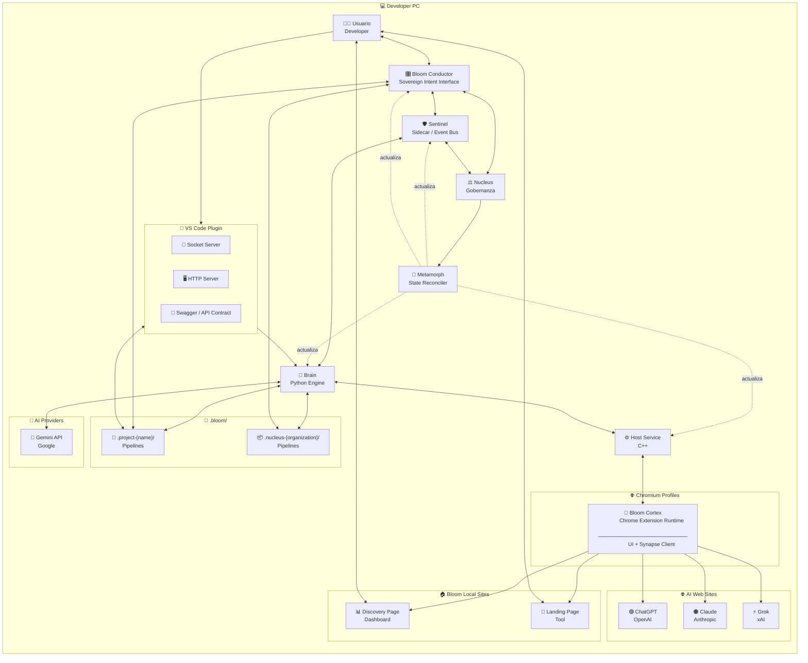

### 📦 BTIPS (Bloom Technical Intent Package)

BTIP convierte la interacción con inteligencia artificial en un proceso de ingeniería reproducible, donde cada intención técnica queda formalizada, versionada y gobernada por contexto real.

---

## 🧭 Contexto de Uso — Por qué existe BTIP

BTIP nace de un problema concreto: los modelos de IA trabajan rápido, pero **pierden contexto**, **no dejan rastro estructurado** y **no escalan cognitivamente** cuando un proyecto crece o involucra múltiples personas, herramientas y decisiones.

La arquitectura BTIP introduce una **unidad mínima de trabajo persistente** donde cada acción técnica queda registrada como un intent, junto con su contexto, entradas, salidas y efectos en el sistema. De esta forma, el conocimiento no vive en prompts efímeros ni en la memoria del modelo, sino en **Bloom Technical Intent Package**.

BTIP convierte la interacción con IA en un **proceso de ingeniería**, no en una conversación. Esto permite que una organización mantenga coherencia técnica, acelere iteraciones y transfiera conocimiento entre humanos y modelos sin degradación ni ambigüedad.

---

## 1️⃣ Concepto clave (dejémoslo cristalino)

### 🌐 Organización Bloom

* **1 solo Nucleus**
* **N Projects**
* **Todos comparten el mismo runtime local**
* **El Nucleus no desarrolla features**
  👉 **Gobierna, explora y coordina**

Pensalo así:

> **Projects = ejecución**
>
> **Nucleus = conciencia organizacional**

---

## 2️⃣ Diagrama SIMPLE actualizado — Arquitectura con Nucleus

Este es el **diagrama definitivo de presentación**.
Sigue siendo simple, pero ahora **explica la pirámide**.

👉 Pegalo en **[https://mermaid.live](https://mermaid.live)**



## 2. ARQUITECTURA DE BLOOM

### 2.1️⃣ Bloom Runtime Infrastructure

La ejecución de BTIPS se apoya en una infraestructura de **Sidecar** que independiza la lógica organizacional de la interfaz visual.

*   **Sentinel Sidecar:** Proceso *daemon* que actúa como orquestador persistente. Mantiene el Event Bus activo y garantiza que la ejecución técnica no se interrumpa si el Launcher se cierre.
*   **Synapse Protocol:** Handshake de 3 fases (Extension ↔ Host ↔ Brain) que valida la integridad del canal antes de procesar intents.
*   **Data Persistence & Stateless UI:** El Launcher opera como una **Stateless UI**. No depende de estados volátiles en memoria, sino que reconstruye su realidad escaneando los archivos de intents en el Filesystem (`.bloom/intents/`) y sincronizando eventos perdidos mediante *polling* histórico al Sidecar.

---

### 2.2️⃣ Nucleus Governance Layer

Nucleus es la autoridad de mando y el árbitro de identidad del sistema. Actúa como el puente entre la voluntad del propietario y la ejecución técnica.

*   **Identity & Role Management:** Gestiona la jerarquía de poder (Master/Architect/Specialist), validando quién tiene permiso para ejecutar acciones sensibles.
*   **Vault Authority:** Es el único componente capaz de autorizar el flujo de llaves (API Keys/OAuth) desde el almacenamiento seguro de Chrome hacia el motor de ejecución.
*   **Organizacional Truth:** Nucleus firma digitalmente el estado de los proyectos en el filesystem, asegurando que la configuración de la organización sea inalterable para colaboradores no autorizados.
*   **System State Authority:** Único componente autorizado para invocar actualizaciones de binarios del sistema vía Metamorph, validando manifests firmados provenientes de Bartcave.

---

### 2.3️⃣ Bloom Cortex

Bloom Cortex es el **runtime de ejecución cognitiva en Chromium**.
Se materializa como una **Chrome Extension versionada, inmutable y reproducible**, empaquetada como un artefacto `.blx` y desplegada por Sentinel en cada perfil.

Cortex actúa como la **capa de interacción directa con el usuario y los AI Providers**, exponiendo la UI, gestionando el contexto de navegación y ejecutando el protocolo Synapse como cliente activo. No contiene lógica organizacional ni persistencia: su función es **conectar intención humana, contexto web y capacidades del sistema** de forma segura y gobernada.

El runtime de Cortex incluye páginas web locales (Discovery y Landing) que permiten explorar intents, inicializar perfiles y establecer el contexto cognitivo antes de cualquier ejecución técnica. Cortex es deliberadamente **stateless**, delegando autoridad, versionado y despliegue a Sentinel, y razonamiento profundo a Brain.

---

### 2.4️⃣ Bloom Conductor (Sovereign Intent Interface)

**Bloom Conductor** es la terminal de interacción humana soberana y el centro de comando estratégico del ecosistema. Como una *Stateless UI* de alta precisión, actúa como el nervio óptico que permite al usuario visualizar el pulso del Event Bus en tiempo real y forjar intenciones técnicas mediante un editor de intents avanzado.

#### La Filosofía del Conductor

El Conductor no es "otra interfaz más". Es el **órgano de gobernanza consciente** donde la complejidad del sistema se simplifica en una interfaz de observabilidad total. Su diseño deliberadamente stateless garantiza que la verdad operativa y el historial de ejecución residan siempre de forma segura en el sistema de archivos, no en memoria volátil de la aplicación.

#### Capacidades Principales

* **Event Bus Visualization**: Observa en tiempo real cada evento que fluye por el sistema (intents ejecutándose, resultados llegando, errores detectados)
* **Intent Editor Avanzado**: Crea, edita e integra intents con sintaxis asistida, especialmente los de tipo `cor` (coordinación) para merges cognitivos
* **Vault Shield**: Visualiza de forma transparente cuando el sistema accede a credenciales cifradas, eliminando la opacidad de las operaciones de seguridad
* **Project Switcher**: Navega entre Nucleus y Projects sin perder contexto
* **Rehydration Automática**: Al abrirse, reconstruye su estado escaneando `.bloom/` y sincronizando eventos perdidos del Sidecar

#### Relación con el Ecosistema

El Conductor NO se comunica con Sentinel. Se conecta directamente con **Nucleus** vía HTTP/WebSocket, elevando el nivel de abstracción. Esto permite que el desarrollador opere a nivel de "intención organizacional" sin preocuparse por detalles de ejecución de bajo nivel.

Cuando el usuario forja un intent en el Conductor, este se serializa como un archivo `.json` en `.bloom/.intents/`, y Nucleus se encarga de orquestar su ejecución mediante Temporal workflows. El Conductor simplemente observa el progreso vía eventos y presenta resultados cuando están listos.

#### El Merge Cognitivo

Una de las capacidades más poderosas del Conductor es facilitar **merges cognitivos** que superan las limitaciones de herramientas tradicionales como Git. Cuando dos intents `dev` modifican el mismo archivo de formas incompatibles, el Conductor permite crear un intent `cor` (coordinación) que:

1. Analiza ambas modificaciones
2. Consulta al modelo de IA sobre la mejor forma de integrarlas
3. Genera una versión reconciliada que preserva la intención de ambos cambios
4. Valida que el resultado sea compilable/funcional

Esto convierte conflictos técnicos en **decisiones asistidas por IA**, no en batallas manuales de texto.

---

### 2.5️⃣ Brain (Python Engine)

**Brain** es el motor de ejecución Python que materializa las intenciones técnicas en acciones concretas. Opera como un servidor TCP persistente que acepta comandos del Event Bus (Sentinel) y ejecuta pipelines declarativos en el contexto de Projects y Nucleus.

#### Responsabilidades Principales

* **Pipeline Execution:** Ejecuta secuencias de acciones definidas en archivos `.json` (intents)
* **Context Management:** Mantiene el estado de cada intent (inputs, outputs, errores, progreso)
* **AI Provider Integration:** Se comunica con modelos de IA (Gemini, Claude, GPT) para razonamiento asistido
* **File System Operations:** Lee, escribe y transforma archivos siguiendo las instrucciones de cada intent
* **Event Broadcasting:** Publica eventos de progreso al Event Bus para observabilidad en tiempo real

#### Arquitectura Interna

Brain opera con un diseño modular:

```
Brain
├── Pipeline Engine (ejecuta intents)
├── Provider Adapters (Gemini, Claude, GPT)
├── File System Manager (operaciones seguras)
├── Event Publisher (broadcast al Event Bus)
└── Vault Client (obtiene credenciales de Nucleus)
```

#### Ciclo de Vida de un Intent

1. **Recepción:** Sentinel envía `EXECUTE_INTENT` con path al archivo `.json`
2. **Parsing:** Brain lee el intent y valida su estructura
3. **Contexto:** Carga inputs, archivos relacionados y estado previo
4. **Ejecución:** Procesa el pipeline paso a paso
5. **Progreso:** Publica eventos `INTENT_PROGRESS` periódicamente
6. **Finalización:** Emite `INTENT_COMPLETED` o `INTENT_FAILED`
7. **Persistencia:** Guarda outputs y actualiza el filesystem

#### Integración con AI Providers

Brain no mantiene llaves de API en memoria ni en disco. Cuando necesita comunicarse con un provider:

1. Solicita la llave a Nucleus vía `VAULT_GET_KEY`
2. Nucleus valida la autorización (rol del usuario, scope del intent)
3. Si aprueba, descifra la llave del Chrome Storage y la envía a Brain
4. Brain usa la llave temporalmente y la descarta al finalizar

Este modelo garantiza que las credenciales nunca persistan fuera del vault controlado por Nucleus.

#### Event Bus Protocol

Brain actúa como servidor TCP en el Event Bus. Cuando Sentinel arranca, se conecta a Brain y mantiene esa conexión abierta. Todos los mensajes fluyen por este socket.

##### El Protocolo: 4 Bytes + JSON

Cada mensaje tiene:
1. **Header**: 4 bytes (BigEndian) indicando longitud del payload
2. **Payload**: JSON con estructura estándar

##### Eventos Típicos

**Sentinel → Brain**:
* `EXECUTE_INTENT`: Ejecuta un intent específico
* `VAULT_GET_KEY`: Solicita una llave del vault
* `POLL_EVENTS`: Pide eventos perdidos desde timestamp X

**Brain → Sentinel**:
* `INTENT_STARTED`: Intent comenzó ejecución
* `INTENT_PROGRESS`: Actualización de progreso (0.0 a 1.0)
* `INTENT_COMPLETED`: Intent terminó exitosamente
* `INTENT_FAILED`: Intent falló con error
* `VAULT_KEY_RECEIVED`: Llave obtenida del vault

##### Resiliencia: Reconexión Automática

Si la conexión se cae (Brain crashea, red se cae), Sentinel:
1. Detecta la desconexión
2. Espera 2 segundos
3. Reintenta conectar
4. Si falla, espera 4 segundos (backoff exponencial)
5. Continúa hasta máximo 60 segundos entre intentos

Cuando reconecta, Sentinel envía `POLL_EVENTS` para recuperar cualquier evento perdido durante la desconexión.

##### Sequence Numbers: Detectar Pérdida de Mensajes

Cada evento tiene un `sequence` number incremental. Si Sentinel recibe:
* Evento seq=42
* Evento seq=45

Sabe que perdió los eventos 43 y 44, y puede solicitarlos explícitamente a Brain vía `POLL_EVENTS`.

---

### 2.6️⃣ Metamorph (Declarative State Reconciler)

**Metamorph** es el reconciliador declarativo de estado que gobierna las actualizaciones del sistema Bloom. A diferencia de updaters tradicionales que ejecutan comandos imperativos, Metamorph opera mediante **reconciliación continua**: compara el estado actual del sistema con el estado deseado (declarado en manifests) y converge atómicamente hacia él.

#### Principios Fundamentales

**Declarativo vs Imperativo:**
* **Imperativo:** "Descarga brain.exe, detén el servicio, reemplaza el binario, reinicia"
* **Declarativo:** "El sistema debe tener Brain v2.5.0 en canal stable"

Metamorph detecta la diferencia y ejecuta las acciones necesarias automáticamente.

**Atomicidad Total:**
Cada reconciliación es una transacción atómica. Si algún paso falla:
* Se restauran los binarios anteriores desde backup
* Se reinician servicios con versiones previas
* El sistema nunca queda en estado inconsistente

**Zero Trust Networking:**
Metamorph **jamás se conecta a internet**. Solo opera sobre manifests pre-validados por Nucleus. Este diseño de seguridad garantiza que actualizaciones maliciosas no puedan ejecutarse incluso si el sistema es comprometido.

#### Arquitectura de Seguridad

El flujo de actualización sigue una cadena de validación estricta:

```
Bartcave (Backend Remoto)
    ↓ genera manifest firmado
Nucleus (Governance Local)
    ↓ valida firma digital + ACL
Metamorph (State Reconciler)
    ↓ reconcilia estado local
Sistema Actualizado
```

**Responsabilidades por Componente:**

1. **Bartcave:** Genera manifests firmados digitalmente con información de versiones, hashes SHA256 y URLs de descarga
2. **Nucleus:** Valida la firma, verifica ACL (quién puede actualizar qué), y autoriza la invocación de Metamorph
3. **Metamorph:** Ejecuta la reconciliación sin validar firmas (confía en Nucleus como autoridad upstream)

Este modelo sigue el principio de **Zero Trust interno**: cada capa valida solo lo que le corresponde, delegando autoridad explícitamente.

#### Capacidades de Inspección

Metamorph interroga todos los binarios del sistema usando contratos estandarizados:

**`--version`**: Versión simple parseables
```
brain 2.5.0
```

**`--info`**: Metadata estructurada en JSON
```json
{
  "name": "brain",
  "version": "2.5.0",
  "build_date": "2026-02-10",
  "channel": "stable",
  "capabilities": ["pipeline_v3", "temporal_workflows"],
  "requires": {
    "host": ">=2.0.0",
    "sentinel": ">=1.5.0"
  }
}
```

Con esta información, Metamorph construye un **mapa completo del estado del sistema** antes de cualquier operación.

#### Proceso de Reconciliación

Cuando Nucleus invoca Metamorph con un manifest validado, se ejecuta el siguiente flujo:

1. **Inspección:** Metamorph interroga todos los binarios (`--info`) y construye el estado actual
2. **Comparación:** Detecta diferencias entre estado actual y estado deseado (manifest)
   * Versiones desactualizadas
   * Canales divergentes (stable vs beta)
   * Dependencias faltantes
   * Capabilities incompatibles
3. **Descarga:** Obtiene artefactos necesarios en área de staging
4. **Validación:** Verifica hashes SHA256 contra manifest
5. **Detención Segura:** Detiene servicios Windows dependientes con timeout configurado
6. **Swap Atómico:** Reemplaza binarios en una sola operación transaccional
7. **Reinicio:** Levanta servicios con nuevas versiones
8. **Verificación:** Ejecuta `--info` nuevamente para confirmar reconciliación exitosa
9. **Reporte:** Notifica a Nucleus el resultado (éxito o fallo con detalles)

#### Rollback Automático

Si cualquier paso falla:

* **Antes del swap:** Se aborta sin modificar el sistema
* **Durante/después del swap:** Se restauran binarios previos desde snapshot automático
* **Servicios caídos:** Se reinician con versiones anteriores
* **Estado inconsistente:** Imposible por diseño (atomicidad)

#### Formato de Manifest

Metamorph espera manifests con esta estructura (ya validados por Nucleus):

```json
{
  "manifest_version": "1.1",
  "system_version": "2.5.0",
  "release_channel": "stable",
  "artifacts": [
    {
      "name": "brain",
      "binary": "brain.exe",
      "version": "2.5.0",
      "sha256": "abc123...",
      "channel": "stable",
      "capabilities": ["pipeline_v3"],
      "requires": {
        "host": ">=2.0.0"
      }
    },
    {
      "name": "sentinel",
      "binary": "sentinel.exe",
      "version": "1.5.0",
      "sha256": "def456...",
      "channel": "stable"
    }
  ]
}
```

#### Relación con el Ecosistema

**Metamorph NO participa del Event Bus.** Es un componente invocado bajo demanda por Nucleus cuando:

* El usuario solicita explícitamente una actualización desde el Conductor
* Nucleus detecta actualizaciones críticas de seguridad
* Un proyecto requiere una versión específica de un binario

Metamorph actualiza los siguientes componentes:
* **Brain** (motor Python)
* **Host** (bridge C++)
* **Sentinel** (Event Bus daemon)
* **Conductor** (Electron UI)
* **Cortex** (Chrome Extension, empaquetada como `.blx`)

**NO actualiza:**
* Nucleus mismo (requiere proceso especial)
* Proyectos individuales (gestionados por intents `dev`)

#### Filosofía de Diseño

Metamorph cierra el ciclo de gobernanza técnica:

* **Nucleus gobierna la intención organizacional** (qué intents ejecutar, quién puede hacerlo)
* **Metamorph gobierna el estado binario del sistema** (qué versiones deben estar instaladas)

Ambos operan bajo el principio de **reconciliación declarativa vs comandos imperativos**, garantizando que el sistema converja hacia un estado conocido y reproducible sin importar el estado inicial.

---

## 3️⃣ Nucleus — Documentación Básica (oficial)

### 🧠 Nucleus (Proyecto Maestro de la Organización)

El **Nucleus** es el proyecto raíz y único de cada organización Bloom.
Representa el **nivel más alto de la pirámide cognitiva**.

### 🎯 Propósito

* Centralizar **exploración estratégica**
* Gobernar decisiones técnicas
* Mantener coherencia entre proyectos
* Registrar conocimiento transversal
* Orquestar evolución organizacional

### 🧩 Características clave

* **Uno solo por organización**
* Vive en `.bloom/.nucleus-{org}/`
* No implementa features productivas
* No modifica código de proyectos directamente
* Es **fuente de verdad estructural**

---

## 4️⃣ Qué se hace en el Nucleus (MUY IMPORTANTE)

### 🧪 Intents permitidos

✔️ **`exp` — Exploration (principal)**
✔️ **`inf` — Information**
✔️ **`cor` — Coordination (organizacional)**
✔️ **`doc` — Documentation estratégica**

❌ `dev` **NO es el foco**
(Solo en tooling interno del Nucleus, nunca en productos)

---

### 🧠 Tipos de conocimiento que vive en Nucleus

Basado en tu árbol real:

* Principios de arquitectura
* Patrones aprobados
* Decisiones (ADR)
* Estándares de calidad
* Seguridad y compliance
* Relaciones entre proyectos
* Mapas de dependencias
* Findings exploratorios
* Reportes organizacionales

👉 Todo eso **no pertenece a un proyecto**, pertenece a la **organización**.

---

## 5️⃣ Relación Nucleus ↔ Projects (modelo mental)

```
            NUCLEUS
        (Explora / Gobierna)
                │
        ┌───────┴────────┐
        │                │
     Project A        Project B
   (dev / doc)      (dev / doc)
```

### Reglas de oro

* Un **Project** puede:

  * ejecutar `dev`
  * ejecutar `doc`
  * ejecutar `exp` local
* El **Nucleus**:

  * define **cómo** se hacen las cosas
  * decide **cuándo** se integran
  * coordina **impacto cognitivo**

> Cuando algo afecta a más de un proyecto
> 👉 **sube al Nucleus**

---

## 6️⃣ Definición de Intents — Tipos y Ubicaciones

### `dev` — Development Intent

Produce o modifica **código ejecutable** del sistema o del producto.
Se usa para features, fixes, refactors e integración técnica.
Se ejecuta **en Projects**, dentro de `.bloom/.intents/.dev/`.

---

### `doc` — Documentation Intent

Genera o actualiza **documentación viva y verificable**.
Se usa para explicar decisiones, estado real y evolución del sistema.
Se ejecuta **en Projects y en Nucleus**, dentro de `.bloom/.intents/.doc/`.

---

### `exp` — Exploration Intent

Explora **alternativas, hipótesis y escenarios posibles**.
Se usa para reducir incertidumbre y tomar decisiones informadas.
Se ejecuta **principalmente en Nucleus**, dentro de `.bloom/.intents/.exp/`.

---

### `inf` — Information Intent

Recopila **información factual** sin transformarla ni decidir.
Se usa para validar supuestos y alimentar otros intents.
Se ejecuta **en Projects o Nucleus**, como input pasivo.

---

### `cor` — Coordination Intent

Coordina y gobierna **acciones humanas y sistémicas**.
Se usa para merges cognitivos, orden de trabajo y control de impacto.
Se ejecuta **en Nucleus o en Projects complejos**, como autoridad.

---