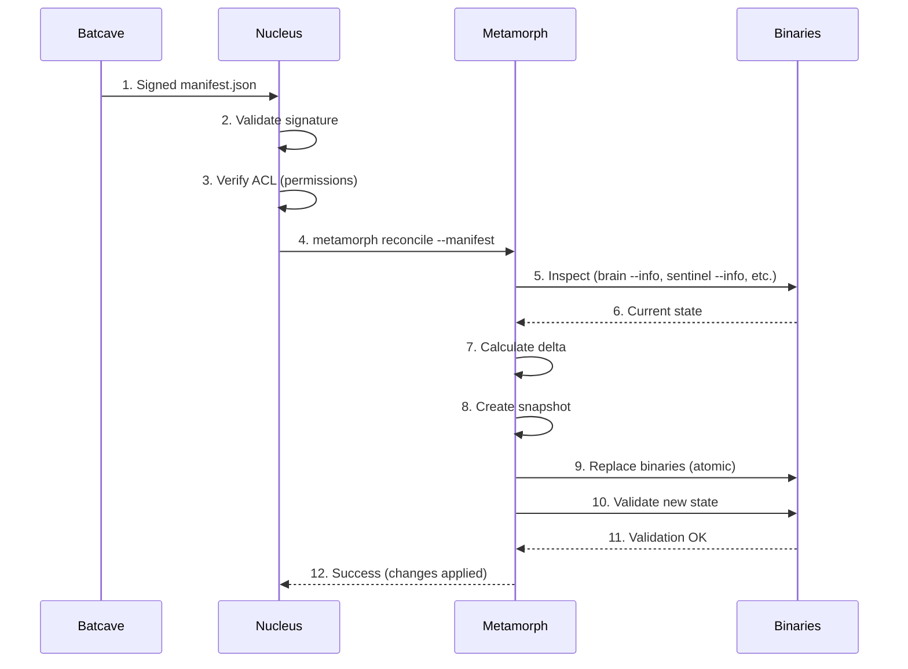
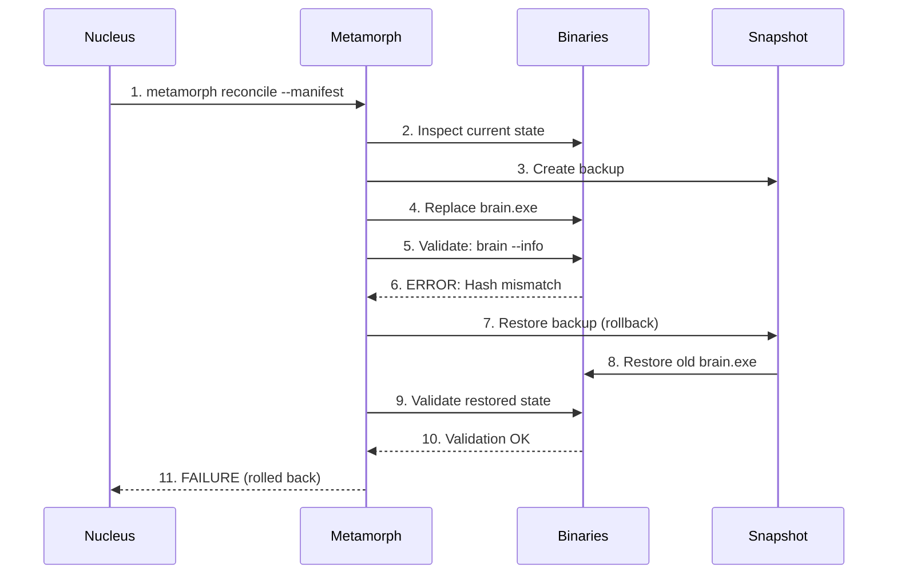
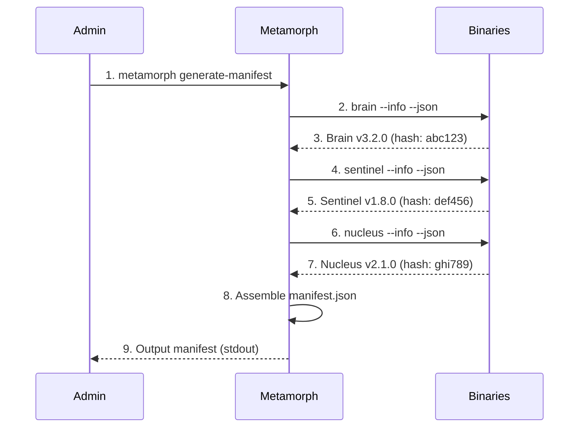

# 🔄 BTIPS Module: Metamorph

**System State Reconciler for Bloom Organization**

---

## 📋 Overview

- **Purpose:** Declarative state reconciliation system for atomic updates of BTIPS binaries
- **Language:** Golang
- **Location:** `installer/metamorph/`
- **Runtime Location:** `AppData/Local/BloomNucleus/bin/metamorph/`
- **Dependencies:** None (offline-only, trusts Nucleus for validation)
- **Communication:** Invoked by Nucleus, operates on filesystem only

---

## 🎯 Core Philosophy

**Metamorph does NOT execute imperative commands.** Instead, it operates via **declarative state reconciliation**:

```
Desired State (Manifest)  -  Current State (Inspection)  =  Delta → Actions
```

### **Key Principles:**

1. **Offline-Only:** Metamorph NEVER connects to internet
2. **Trust Boundary:** Nucleus validates manifests, Metamorph trusts Nucleus
3. **Atomic Updates:** All-or-nothing, never partial state
4. **Automatic Rollback:** Failed updates trigger snapshot restoration
5. **Manifest Immutability:** Manifests are content-addressed (SHA-256)

---

## 🏗️ Architecture

### **Internal Structure**

```
installer/metamorph/
├── main.go                      # Entry point
├── metamorph-config.json        # Configuration
├── VERSION                      # Current version
├── go.mod / go.sum              # Dependencies
│
├── internal/
│   ├── cli/                     # Command-line interface
│   │   ├── root.go              # Root command setup
│   │   ├── config.go            # Config management
│   │   └── help_renderer.go    # Help system
│   │
│   ├── core/                    # Core utilities
│   │   ├── build_info.go        # Build metadata
│   │   ├── logger.go            # Logging system
│   │   ├── paths.go             # Path resolution
│   │   ├── registry.go          # Command registry
│   │   └── version.go           # Version info
│   │
│   ├── inspection/              # Binary interrogation
│   │   ├── inspect.go           # Inspect all binaries
│   │   └── status.go            # System health status
│   │
│   ├── reconciliation/          # State convergence
│   │   ├── generate_manifest.go # Create manifest from current state
│   │   └── reconcile.go         # Apply manifest changes
│   │
│   ├── rollback/                # Snapshot management
│   │   └── rollback.go          # Restore previous state
│   │
│   ├── maintenance/             # Cleanup operations
│   │   └── cleanup.go           # Remove old snapshots/staging
│   │
│   └── system/                  # System introspection
│       ├── info.go              # System information
│       └── version.go           # Version display
│
└── scripts/
    ├── build.bat                # Windows build script
    └── build_number.txt         # Auto-incremented build number
```

---

## 📦 Runtime Deployment

### **Production Location**

```
AppData/Local/BloomNucleus/
└── bin/
    ├── metamorph/
    │   ├── metamorph.exe           # Main binary
    │   ├── metamorph-config.json   # Runtime config
    │   └── help/
    │       ├── metamorph_help.txt  # Human-readable help
    │       ├── metamorph_help.json # Machine-readable help
    │       └── metamorph_info.json # Binary metadata
    │
    └── [other binaries Metamorph manages]
        ├── brain/
        │   └── brain.exe
        ├── nucleus/
        │   └── nucleus.exe
        ├── sentinel/
        │   └── sentinel.exe
        ├── native/
        │   └── bloom-host.exe
        ├── conductor/
        │   └── bloom-conductor.exe
        ├── cortex/
        │   └── bloom-cortex.blx
        ├── temporal/
        │   └── temporal.exe
        └── ollama/
            └── ollama.exe
```

---

## 🔧 Core Responsibilities

### **1. Binary Inspection**

**Purpose:** Interrogate all BTIPS binaries to build system state map

**How it works:**
```bash
# Metamorph calls --info on each binary
brain.exe --info --json
nucleus.exe --info --json
sentinel.exe --info --json
# ... etc
```

**Expected response format:**
```json
{
  "name": "Brain",
  "version": "3.2.0",
  "build_number": 42,
  "build_date": "2024-02-08",
  "hash": "sha256_abc123...",
  "capabilities": ["intent_execution", "synapse_server"]
}
```

**State Map Example:**
```json
{
  "binaries": {
    "brain": {
      "path": "C:\\Users\\user\\AppData\\Local\\BloomNucleus\\bin\\brain\\brain.exe",
      "version": "3.2.0",
      "hash": "sha256_abc123...",
      "size_bytes": 15728640,
      "last_modified": "2024-02-08T10:30:00Z"
    },
    "sentinel": {
      "path": "C:\\Users\\user\\AppData\\Local\\BloomNucleus\\bin\\sentinel\\sentinel.exe",
      "version": "1.8.0",
      "hash": "sha256_def456...",
      "size_bytes": 8388608,
      "last_modified": "2024-02-01T14:20:00Z"
    }
  },
  "timestamp": "2024-02-13T11:29:00Z",
  "system_healthy": true
}
```

---

### **2. Manifest Generation**

**Purpose:** Capture current system state as a manifest

**Use case:** Create snapshot for deployment or rollback

```bash
# Generate manifest from current state
metamorph generate-manifest > current_state.json
```

**Generated Manifest Structure:**
```json
{
  "version": "2.0.0",
  "timestamp": 1707818940,
  "signature": "sha256_signature_from_nucleus",
  "components": {
    "brain": {
      "version": "3.2.0",
      "build_number": 42,
      "hash": "sha256_abc123...",
      "path": "brain/brain.exe",
      "size_bytes": 15728640
    },
    "sentinel": {
      "version": "1.8.0",
      "build_number": 28,
      "hash": "sha256_def456...",
      "path": "sentinel/sentinel.exe",
      "size_bytes": 8388608
    },
    "nucleus": {
      "version": "2.1.0",
      "build_number": 35,
      "hash": "sha256_ghi789...",
      "path": "nucleus/nucleus.exe",
      "size_bytes": 12582912
    },
    "host": {
      "version": "2.1.0",
      "build_number": 12,
      "hash": "sha256_jkl012...",
      "path": "native/bloom-host.exe",
      "size_bytes": 2097152
    },
    "cortex": {
      "version": "1.2.4",
      "build_number": 42,
      "hash": "sha256_mno345...",
      "path": "cortex/bloom-cortex.blx",
      "size_bytes": 2457600
    },
    "conductor": {
      "version": "1.5.0",
      "build_number": 22,
      "hash": "sha256_pqr678...",
      "path": "conductor/bloom-conductor.exe",
      "size_bytes": 104857600
    }
  },
  "metadata": {
    "generated_by": "metamorph",
    "metamorph_version": "1.0.0",
    "platform": "windows_amd64",
    "hostname": "DEV-MACHINE"
  }
}
```

---

### **3. State Reconciliation**

**Purpose:** Apply manifest to converge system to desired state

**Invocation Flow:**

```
1. Nucleus downloads signed manifest from Batcave
2. Nucleus validates signature (cryptographic verification)
3. Nucleus verifies ACL (who can update what)
4. Nucleus invokes: metamorph reconcile --manifest /path/to/manifest.json
5. Metamorph inspects current binaries
6. Metamorph calculates delta (what needs to change)
7. Metamorph creates snapshot (rollback point)
8. Metamorph executes atomic updates
9. Metamorph validates new state matches manifest
10. If validation fails → automatic rollback
```

**Reconciliation Algorithm:**

```go
// Pseudocode
func Reconcile(manifest Manifest) error {
    // Step 1: Inspect current state
    currentState := InspectAllBinaries()
    
    // Step 2: Calculate delta
    delta := CalculateDelta(currentState, manifest)
    
    if delta.IsEmpty() {
        log.Info("System already in desired state")
        return nil
    }
    
    // Step 3: Create snapshot
    snapshotID := CreateSnapshot(currentState)
    defer func() {
        if err := recover(); err != nil {
            log.Error("Update failed, rolling back...")
            Rollback(snapshotID)
        }
    }()
    
    // Step 4: Apply changes atomically
    for _, change := range delta.Changes {
        if err := ApplyChange(change); err != nil {
            return fmt.Errorf("failed to apply change: %w", err)
        }
    }
    
    // Step 5: Validate new state
    newState := InspectAllBinaries()
    if !ValidateState(newState, manifest) {
        return errors.New("validation failed after update")
    }
    
    log.Info("Reconciliation successful")
    return nil
}
```

**Delta Calculation:**

```json
{
  "changes": [
    {
      "type": "UPDATE",
      "component": "brain",
      "from_version": "3.2.0",
      "to_version": "3.3.0",
      "action": "replace_binary",
      "staging_url": "file:///staging/brain_3.3.0.exe"
    },
    {
      "type": "UPDATE",
      "component": "cortex",
      "from_version": "1.2.3",
      "to_version": "1.2.4",
      "action": "replace_archive",
      "staging_url": "file:///staging/bloom-cortex_1.2.4.blx"
    },
    {
      "type": "NO_CHANGE",
      "component": "nucleus",
      "version": "2.1.0"
    }
  ],
  "total_changes": 2,
  "estimated_time_seconds": 15
}
```

---

### **4. Snapshot Management**

**Purpose:** Enable rollback to previous working state

**Snapshot Structure:**

```
AppData/Local/BloomNucleus/snapshots/
├── snapshot_20240213_112900/
│   ├── manifest.json          # State at time of snapshot
│   ├── brain_3.2.0.exe        # Backed-up binary
│   ├── sentinel_1.8.0.exe
│   ├── nucleus_2.1.0.exe
│   └── metadata.json          # Snapshot metadata
│
└── snapshot_20240208_153000/
    └── ...
```

**Snapshot Metadata:**
```json
{
  "snapshot_id": "snapshot_20240213_112900",
  "created_at": "2024-02-13T11:29:00Z",
  "reason": "pre_update_backup",
  "components_backed_up": ["brain", "cortex"],
  "total_size_bytes": 18874368,
  "can_rollback": true
}
```

**Rollback Process:**

```bash
# Automatic rollback (on update failure)
metamorph reconcile --manifest update.json
# → Update fails validation
# → Metamorph automatically restores snapshot

# Manual rollback
metamorph rollback
# → Prompts: "Select snapshot to restore"
# → Lists available snapshots with timestamps
# → Restores selected snapshot
# → Validates restored state
```

---

### **5. Maintenance & Cleanup**

**Purpose:** Remove old snapshots and staging files to free disk space

```bash
# Clean up old snapshots (keep last 3)
metamorph cleanup

# Output:
{
  "cleaned": 5,
  "freed_bytes": 104857600,
  "snapshots_kept": 3,
  "snapshots_removed": [
    "snapshot_20240201_100000",
    "snapshot_20240202_120000",
    "snapshot_20240203_140000",
    "snapshot_20240204_160000",
    "snapshot_20240205_180000"
  ]
}
```

**Cleanup Policy:**
- Keep last 3 snapshots (configurable)
- Remove snapshots older than 30 days
- Remove staging files after successful reconciliation
- Never remove current snapshot (safety)

---

## 💻 CLI Reference

### **SYSTEM Commands**

#### **version**

Display version and build information

```bash
metamorph version

# Output:
Metamorph v1.0.0-build.2
Build Date: 2026-02-13
Build Time: 11:29:00

# JSON output
metamorph --json version

# Output:
{
  "name": "Metamorph",
  "version": "1.0.0",
  "build_number": 2,
  "build_date": "2026-02-13",
  "build_time": "11:29:00",
  "full_version": "v1.0.0-build.2"
}
```

---

#### **info**

Display detailed system information

```bash
metamorph info

# Output:
Metamorph System Information
────────────────────────────
Name:         Metamorph
Version:      1.0.0
Build:        2
Capabilities: state_inspection, manifest_reconciliation
Paths:
  Binary:     C:\Users\user\AppData\Local\BloomNucleus\bin\metamorph\metamorph.exe
  Config:     C:\Users\user\AppData\Local\BloomNucleus\bin\metamorph\metamorph-config.json
  Snapshots:  C:\Users\user\AppData\Local\BloomNucleus\snapshots

# JSON output
metamorph --json info

# Output:
{
  "name": "Metamorph",
  "version": "1.0.0",
  "build_number": 2,
  "capabilities": ["state_inspection", "manifest_reconciliation"],
  "paths": {
    "binary": "C:\\Users\\user\\AppData\\Local\\BloomNucleus\\bin\\metamorph\\metamorph.exe",
    "config": "C:\\Users\\user\\AppData\\Local\\BloomNucleus\\bin\\metamorph\\metamorph-config.json",
    "snapshots": "C:\\Users\\user\\AppData\\Local\\BloomNucleus\\snapshots"
  }
}
```

---

### **INSPECTION Commands**

#### **inspect**

Inspect all binaries and show detailed info

**Basic Inspection (managed binaries only):**

```bash
metamorph inspect

# Output:
System Binary Inspection
────────────────────────────────────────────────────────────
Brain         v3.2.0 (build 42)   15.0 MB   ✓ Healthy
Sentinel      v1.8.0 (build 28)    8.0 MB   ✓ Healthy
Nucleus       v2.1.0 (build 35)   12.0 MB   ✓ Healthy
Host          v2.1.0 (build 12)    2.0 MB   ✓ Healthy
Cortex        v1.2.4 (build 42)    2.3 MB   ✓ Healthy
Conductor     v1.5.0 (build 22)  100.0 MB   ✓ Healthy
Metamorph     v1.0.0 (build 2)     8.5 MB   ✓ Healthy
────────────────────────────────────────────────────────────
Total: 7 components, 148.3 MB
```

**Extended Inspection (include external binaries):**

```bash
metamorph inspect --all

# Output:
System Binary Inspection
────────────────────────────────────────────────────────────
MANAGED BINARIES (Updatable by Metamorph)
────────────────────────────────────────────────────────────
Brain         v3.2.0 (build 42)   15.0 MB   ✓ Healthy
Sentinel      v1.8.0 (build 28)    8.0 MB   ✓ Healthy
Nucleus       v2.1.0 (build 35)   12.0 MB   ✓ Healthy
Host          v2.1.0 (build 12)    2.0 MB   ✓ Healthy
Cortex        v1.2.4 (build 42)    2.3 MB   ✓ Healthy
Conductor     v1.5.0 (build 22)  100.0 MB   ✓ Healthy
Metamorph     v1.0.0 (build 2)     8.5 MB   ✓ Healthy

EXTERNAL BINARIES (Auditable Only)
────────────────────────────────────────────────────────────
Temporal      v1.22.0             25.0 MB   ✓ Healthy   (Update: 1.23.0 available)
Ollama        v0.1.25            450.0 MB   ✓ Healthy   (Update: 0.1.26 available)
Chromium      v146.0.7635.0      180.0 MB   ✓ Healthy   (Up to date)
Node          v20.11.0            28.0 MB   ✓ Healthy   (Update: 20.11.1 available)
────────────────────────────────────────────────────────────
Total: 11 components, 831.3 MB
Managed: 7 binaries (148.3 MB)
External: 4 binaries (683.0 MB)
Updates available: 3 external binaries
```

**JSON Output:**

```bash
metamorph --json inspect --all

# Output:
{
  "managed_binaries": [
    {
      "name": "Brain",
      "path": "C:\\Users\\user\\AppData\\Local\\BloomNucleus\\bin\\brain\\brain.exe",
      "version": "3.2.0",
      "build_number": 42,
      "hash": "sha256_abc123...",
      "size_bytes": 15728640,
      "last_modified": "2024-02-08T10:30:00Z",
      "status": "healthy",
      "updatable_by_metamorph": true,
      "capabilities": ["intent_execution", "synapse_server"]
    },
    {
      "name": "Sentinel",
      "path": "C:\\Users\\user\\AppData\\Local\\BloomNucleus\\bin\\sentinel\\sentinel.exe",
      "version": "1.8.0",
      "build_number": 28,
      "hash": "sha256_def456...",
      "size_bytes": 8388608,
      "last_modified": "2024-02-01T14:20:00Z",
      "status": "healthy",
      "updatable_by_metamorph": true,
      "capabilities": ["orchestration", "event_bus"]
    }
  ],
  "external_binaries": [
    {
      "name": "Temporal",
      "path": "C:\\Users\\user\\AppData\\Local\\BloomNucleus\\bin\\temporal\\temporal.exe",
      "version": "1.22.0",
      "hash": "sha256_ghi789...",
      "size_bytes": 26214400,
      "last_modified": "2024-01-15T09:00:00Z",
      "status": "healthy",
      "updatable_by_metamorph": false,
      "source": "temporal.io",
      "update_method": "nucleus_download",
      "latest_version": "1.23.0",
      "update_available": true
    },
    {
      "name": "Ollama",
      "path": "C:\\Users\\user\\AppData\\Local\\BloomNucleus\\bin\\ollama\\ollama.exe",
      "version": "0.1.25",
      "hash": "sha256_jkl012...",
      "size_bytes": 471859200,
      "last_modified": "2024-02-01T10:00:00Z",
      "status": "healthy",
      "updatable_by_metamorph": false,
      "source": "ollama.ai",
      "update_method": "external_installer",
      "latest_version": "0.1.26",
      "update_available": true
    },
    {
      "name": "Chromium",
      "path": "C:\\Users\\user\\AppData\\Local\\BloomNucleus\\bin\\chrome-win\\chrome.exe",
      "version": "146.0.7635.0",
      "hash": "sha256_mno345...",
      "size_bytes": 188743680,
      "last_modified": "2024-01-20T08:00:00Z",
      "status": "healthy",
      "updatable_by_metamorph": false,
      "source": "chromium.org",
      "update_method": "nucleus_download",
      "latest_version": "146.0.7635.0",
      "update_available": false
    },
    {
      "name": "Node",
      "path": "C:\\Users\\user\\AppData\\Local\\BloomNucleus\\bin\\node\\node.exe",
      "version": "20.11.0",
      "hash": "sha256_pqr678...",
      "size_bytes": 29360128,
      "last_modified": "2024-01-10T12:00:00Z",
      "status": "healthy",
      "updatable_by_metamorph": false,
      "source": "nodejs.org",
      "update_method": "nucleus_download",
      "latest_version": "20.11.1",
      "update_available": true
    }
  ],
  "summary": {
    "total_binaries": 11,
    "managed_count": 7,
    "external_count": 4,
    "total_size_bytes": 871694336,
    "managed_size_bytes": 155713536,
    "external_size_bytes": 715980800,
    "healthy_count": 11,
    "missing_count": 0,
    "corrupted_count": 0,
    "updates_available": 3
  },
  "timestamp": "2024-02-15T11:29:00Z"
}
```

**Flags:**
- `--all` / `-a` - Include external binaries (Temporal, Ollama, Chromium, Node)

**Binary Categories:**

**Managed Binaries** (updatable by Metamorph):
- Brain, Nucleus, Sentinel, Host, Cortex, Conductor, Metamorph

**External Binaries** (auditable only):
- Temporal, Ollama, Chromium, Node

**Version Detection Methods:**

- **Managed:** `{binary} --info --json` (fallback to `--version`)
- **Temporal:** `temporal.exe --version` → "temporal version 1.22.0"
- **Ollama:** `ollama.exe --version` → "ollama version is 0.1.25"
- **Chromium:** `chrome.exe --version` → "Google Chrome 146.0.7635.0"
- **Node:** `node.exe --version` → "v20.11.0"

**Status Values:**
- `healthy` - Binary exists, version detected, hash calculated
- `missing` - Binary file not found
- `corrupted` - Hash mismatch or execution failure
- `unknown` - Version detection failed

---

#### **status**

Display current system state

```bash
metamorph status

# Output:
System Status: Operational ✓
Last Check: 2026-02-13T10:00:00Z
All components healthy

# JSON output
metamorph --json status

# Output:
{
  "timestamp": "2026-02-13T10:00:00Z",
  "system_healthy": true,
  "status": "operational"
}
```

---

### **RECONCILIATION Commands**

#### **generate-manifest**

Generate manifest from current state

```bash
metamorph generate-manifest

# Output: (JSON manifest to stdout)
{
  "version": "2.0.0",
  "timestamp": 1707818940,
  "components": {
    "brain": { "version": "3.2.0", ... },
    "sentinel": { "version": "1.8.0", ... }
  }
}

# Save to file
metamorph generate-manifest > current_state.json

# JSON output (same as above)
metamorph --json generate-manifest
```

---

#### **reconcile**

Reconcile system against manifest

```bash
# Basic usage
metamorph reconcile --manifest update_manifest.json

# Output:
Reconciliation Started
────────────────────────────────────────────────────────────
Reading manifest: update_manifest.json
Inspecting current state...
Calculating delta...
  → Brain: 3.2.0 → 3.3.0 (UPDATE)
  → Cortex: 1.2.3 → 1.2.4 (UPDATE)
  → Nucleus: 2.1.0 (NO CHANGE)
Creating snapshot: snapshot_20240213_112900
Applying changes...
  ✓ Updated Brain (15.2 MB)
  ✓ Updated Cortex (2.4 MB)
Validating new state...
  ✓ Brain v3.3.0 verified
  ✓ Cortex v1.2.4 verified
Reconciliation Complete ✓
────────────────────────────────────────────────────────────
Time: 12.5 seconds
Changes: 2 components updated

# JSON output
metamorph --json reconcile --manifest update_manifest.json

# Output:
{
  "status": "success",
  "changes": [
    {
      "component": "brain",
      "from_version": "3.2.0",
      "to_version": "3.3.0",
      "action": "updated"
    },
    {
      "component": "cortex",
      "from_version": "1.2.3",
      "to_version": "1.2.4",
      "action": "updated"
    }
  ],
  "snapshot_id": "snapshot_20240213_112900",
  "duration_seconds": 12.5,
  "timestamp": "2024-02-13T11:29:12Z"
}
```

**Manifest File Example:**
```json
{
  "version": "2.0.0",
  "timestamp": 1707818940,
  "signature": "sha256_signed_by_nucleus",
  "components": {
    "brain": {
      "version": "3.3.0",
      "hash": "sha256_new_hash",
      "url": "file:///staging/brain_3.3.0.exe"
    },
    "cortex": {
      "version": "1.2.4",
      "hash": "sha256_new_hash",
      "url": "file:///staging/bloom-cortex_1.2.4.blx"
    }
  }
}
```

---

### **ROLLBACK Commands**

#### **rollback**

Rollback to previous snapshot

```bash
metamorph rollback

# Output (interactive):
Available Snapshots:
────────────────────────────────────────────────────────────
[1] snapshot_20240213_112900 (2024-02-13 11:29:00)
    Components: brain, cortex
    Size: 18.0 MB
    
[2] snapshot_20240208_153000 (2024-02-08 15:30:00)
    Components: brain, sentinel, nucleus
    Size: 36.0 MB
    
[3] snapshot_20240201_100000 (2024-02-01 10:00:00)
    Components: brain
    Size: 15.0 MB

Select snapshot to restore [1-3]: 1

Rolling back to snapshot_20240213_112900...
  ✓ Restored Brain v3.2.0
  ✓ Restored Cortex v1.2.3
Validating restored state...
  ✓ Brain v3.2.0 verified
  ✓ Cortex v1.2.3 verified
Rollback Complete ✓

# JSON output
metamorph --json rollback

# Output:
{
  "status": "success",
  "snapshot": "snapshot_20240213_112900",
  "restored_components": ["brain", "cortex"],
  "timestamp": "2024-02-13T11:35:00Z"
}
```

**Automatic Rollback (on reconcile failure):**

```bash
# If reconcile fails validation
metamorph reconcile --manifest broken_manifest.json

# Output:
Reconciliation Started
────────────────────────────────────────────────────────────
...
Applying changes...
  ✓ Updated Brain (15.2 MB)
Validating new state...
  ✗ Brain v3.3.0 failed integrity check
  
Automatic Rollback Triggered
  ✓ Restored Brain v3.2.0
Rollback Complete ✓

Error: Reconciliation failed validation
```

---

### **MAINTENANCE Commands**

#### **cleanup**

Clean up staging and old snapshots

```bash
metamorph cleanup

# Output:
Cleanup Started
────────────────────────────────────────────────────────────
Scanning snapshots directory...
Found 8 snapshots (total: 250 MB)
Keeping last 3 snapshots (policy)
Removing 5 old snapshots...
  ✓ Removed snapshot_20240201_100000 (15 MB)
  ✓ Removed snapshot_20240202_120000 (30 MB)
  ✓ Removed snapshot_20240203_140000 (25 MB)
  ✓ Removed snapshot_20240204_160000 (20 MB)
  ✓ Removed snapshot_20240205_180000 (10 MB)
Scanning staging directory...
  ✓ Removed 3 staging files (5 MB)
Cleanup Complete ✓
────────────────────────────────────────────────────────────
Freed: 105 MB
Snapshots kept: 3

# JSON output
metamorph --json cleanup

# Output:
{
  "cleaned": 5,
  "freed_bytes": 110100480,
  "snapshots_kept": 3,
  "snapshots_removed": [
    "snapshot_20240201_100000",
    "snapshot_20240202_120000",
    "snapshot_20240203_140000",
    "snapshot_20240204_160000",
    "snapshot_20240205_180000"
  ],
  "staging_files_removed": 3
}
```

---

## 🔄 Execution Flows

### **Flow 1: Standard Update (Nucleus → Metamorph)**



**Timeline:**
1. **T+0s:** Nucleus receives manifest from Batcave
2. **T+1s:** Nucleus validates signature (cryptographic)
3. **T+2s:** Nucleus verifies user permissions (ACL)
4. **T+3s:** Metamorph starts inspection
5. **T+5s:** Delta calculated, snapshot created
6. **T+7s:** Binary replacement begins
7. **T+15s:** Validation complete
8. **T+16s:** Success response to Nucleus

---

### **Flow 2: Update with Rollback (Validation Failure)**



**Timeline:**
1. **T+0s:** Update starts
2. **T+5s:** Snapshot created
3. **T+10s:** New binary deployed
4. **T+11s:** Validation fails (hash mismatch)
5. **T+12s:** Rollback triggered
6. **T+15s:** Old binary restored
7. **T+16s:** Rollback validation succeeds
8. **T+17s:** Error reported to Nucleus

---

### **Flow 3: Manual Manifest Generation**



**Use case:** Create deployment package for production

```bash
# Generate manifest
metamorph generate-manifest > prod_v2.0.0.json

# Send to Batcave for signing
curl -X POST https://batcave.bloom.dev/sign \
  -H "Content-Type: application/json" \
  -d @prod_v2.0.0.json

# Batcave returns signed manifest
# Deploy to production via Nucleus
```

---

## 🗄️ Filesystem & State

### **Configuration**

**Location:** `AppData/Local/BloomNucleus/bin/metamorph/metamorph-config.json`

```json
{
  "snapshots": {
    "directory": "C:\\Users\\user\\AppData\\Local\\BloomNucleus\\snapshots",
    "max_count": 3,
    "max_age_days": 30
  },
  "staging": {
    "directory": "C:\\Users\\user\\AppData\\Local\\BloomNucleus\\staging",
    "cleanup_after_success": true
  },
  "validation": {
    "strict_mode": true,
    "verify_signatures": false,
    "verify_hashes": true
  },
  "logging": {
    "level": "info",
    "file": "C:\\Users\\user\\AppData\\Local\\BloomNucleus\\logs\\metamorph\\metamorph.log"
  }
}
```

---

### **Snapshot Storage**

**Location:** `AppData/Local/BloomNucleus/snapshots/`

```
snapshots/
├── snapshot_20240213_112900/
│   ├── manifest.json          # State at snapshot time
│   ├── metadata.json          # Snapshot metadata
│   ├── binaries/
│   │   ├── brain_3.2.0.exe
│   │   └── cortex_1.2.3.blx
│   └── checksums.txt          # SHA-256 hashes
│
└── snapshot_20240208_153000/
    └── ...
```

---

### **Staging Area**

**Location:** `AppData/Local/BloomNucleus/staging/`

```
staging/
├── brain_3.3.0.exe           # Downloaded/staged binaries
├── cortex_1.2.4.blx
└── manifest_pending.json     # Manifest being processed
```

**Lifecycle:**
1. Nucleus downloads binaries to staging
2. Nucleus creates manifest pointing to staging files
3. Metamorph reads from staging during reconciliation
4. After success, staging files are cleaned up
5. If failure, staging files remain for retry

---

## 🛠️ Development Guide

### **Building Metamorph**

```bash
cd installer/metamorph

# Windows
scripts\build.bat

# Output:
Building Metamorph v1.0.0 (build 3)
go build -o metamorph.exe -ldflags "-X main.Version=1.0.0 -X main.BuildNumber=3"
Build successful: metamorph.exe (8.5 MB)

# Copy to native
copy metamorph.exe ..\native\bin\win64\metamorph\
```

---

### **Testing Locally**

```bash
# Test inspection
metamorph inspect --json

# Test manifest generation
metamorph generate-manifest > test_manifest.json

# Test reconciliation (dry-run mode - not implemented yet)
metamorph reconcile --manifest test_manifest.json --dry-run

# Test cleanup
metamorph cleanup --json
```

---

### **Adding New Commands**

**Step 1:** Define command in `internal/cli/root.go`

```go
var reconcileCmd = &cobra.Command{
    Use:   "reconcile",
    Short: "Reconcile system against manifest",
    Run: func(cmd *cobra.Command, args []string) {
        manifestPath, _ := cmd.Flags().GetString("manifest")
        reconciliation.Reconcile(manifestPath)
    },
}

func init() {
    reconcileCmd.Flags().StringP("manifest", "m", "", "Path to manifest file")
    rootCmd.AddCommand(reconcileCmd)
}
```

**Step 2:** Implement logic in `internal/reconciliation/reconcile.go`

```go
func Reconcile(manifestPath string) error {
    manifest, err := loadManifest(manifestPath)
    if err != nil {
        return err
    }
    
    currentState := inspection.InspectAllBinaries()
    delta := calculateDelta(currentState, manifest)
    
    // ... rest of reconciliation logic
}
```

**Step 3:** Update help in `internal/cli/help_renderer.go`

---

## 🆘 Troubleshooting

### **Issue: "Manifest validation failed"**

**Cause:** Manifest signature doesn't match or is missing

**Debug:**
```bash
# Check manifest structure
cat manifest.json | jq .

# Verify signature field exists
cat manifest.json | jq .signature

# Check Nucleus logs for signature validation
tail -f AppData/Local/BloomNucleus/logs/nucleus/nucleus_orchestration_*.log | grep signature
```

**Fix:**
- Ensure manifest is signed by Nucleus: `nucleus sign-manifest manifest.json`
- Don't invoke Metamorph directly for production updates (use Nucleus)

---

### **Issue: "Snapshot creation failed"**

**Cause:** Insufficient disk space or permissions

**Debug:**
```bash
# Check disk space
dir AppData\Local\BloomNucleus\snapshots

# Check permissions
icacls AppData\Local\BloomNucleus\snapshots
```

**Fix:**
```bash
# Clean up old snapshots
metamorph cleanup

# Or manually remove old snapshots
rmdir /s /q AppData\Local\BloomNucleus\snapshots\snapshot_old
```

---

### **Issue: "Binary not found during inspection"**

**Cause:** Binary missing or not in expected location

**Debug:**
```bash
# Check binary exists
dir AppData\Local\BloomNucleus\bin\brain\brain.exe

# Test binary responds to --info
AppData\Local\BloomNucleus\bin\brain\brain.exe --info --json
```

**Fix:**
- Reinstall missing binary
- Update `metamorph-config.json` with correct paths

---

### **Issue: "Rollback fails"**

**Cause:** Snapshot corrupted or missing

**Debug:**
```bash
# List snapshots
dir AppData\Local\BloomNucleus\snapshots

# Check snapshot integrity
cat AppData\Local\BloomNucleus\snapshots\snapshot_20240213_112900\checksums.txt
```

**Fix:**
- Manual restore from backup
- Re-run full installation if no valid snapshots

---

## 📊 Metrics & Observability

### **Telemetry Events**

Metamorph publishes events to `AppData/Local/BloomNucleus/logs/telemetry.json`

**Event: Reconciliation Started**
```json
{
  "event": "METAMORPH_RECONCILE_START",
  "timestamp": 1707818940,
  "manifest_version": "2.0.0",
  "components_to_update": ["brain", "cortex"]
}
```

**Event: Reconciliation Complete**
```json
{
  "event": "METAMORPH_RECONCILE_SUCCESS",
  "timestamp": 1707819055,
  "duration_seconds": 15,
  "components_updated": ["brain", "cortex"],
  "snapshot_id": "snapshot_20240213_112900"
}
```

**Event: Rollback Triggered**
```json
{
  "event": "METAMORPH_ROLLBACK",
  "timestamp": 1707819060,
  "reason": "validation_failed",
  "snapshot_id": "snapshot_20240213_112900",
  "components_restored": ["brain"]
}
```

---

## 🔐 Security Model

### **Trust Boundary**

```
Internet (UNTRUSTED)
  ↓
Batcave (TRUSTED - signs manifests)
  ↓
Nucleus (VALIDATES - cryptographic signature)
  ↓
Metamorph (TRUSTS NUCLEUS - no signature check)
  ↓
Binaries (UPDATED)
```

**Key Points:**
- Metamorph **never** validates signatures (trusts Nucleus)
- Metamorph **never** connects to internet
- Metamorph only accepts manifests from Nucleus
- All validation happens at Nucleus level

---

### **Attack Mitigation**

| Attack Vector | Mitigation |
|---------------|------------|
| **Malicious Manifest** | Nucleus validates signature before passing to Metamorph |
| **Binary Tampering** | Metamorph verifies SHA-256 hashes after update |
| **Rollback Corruption** | Snapshots include checksums.txt for integrity |
| **Privilege Escalation** | Metamorph runs with same privileges as Nucleus (no elevation) |
| **Path Traversal** | All paths are validated against allowed directories |

---

## 📚 Related Documentation

| Document | Purpose |
|----------|---------|
| **[BTIPS-SECURITY-COMPLIANCE.md](./BTIPS-SECURITY-COMPLIANCE.md)** | Metamorph's role in system governance |
| **[BTIPS-TECHNICAL-OVERVIEW.md](./BTIPS-TECHNICAL-OVERVIEW.md)** | Metamorph in system architecture |
| **BTIPS-MODULE-NUCLEUS.md** *(planned)* | Nucleus commands for invoking Metamorph |

---

## 🎯 Quick Reference

### **Common Operations**

```bash
# Check version
metamorph version

# Inspect system
metamorph inspect --json

# Generate manifest
metamorph generate-manifest > state.json

# Apply update (via Nucleus)
nucleus metamorph reconcile --manifest update.json

# Manual rollback
metamorph rollback

# Cleanup
metamorph cleanup
```

---

## 🔮 Future Enhancements

### **Planned Features**

1. **Dry-Run Mode**
   ```bash
   metamorph reconcile --manifest update.json --dry-run
   # Shows what would change without applying
   ```

2. **Progressive Rollout**
   ```bash
   metamorph reconcile --manifest update.json --progressive
   # Updates one component at a time, validates before next
   ```

3. **Dependency Resolution**
   ```json
   {
     "brain": {
       "version": "3.3.0",
       "requires": {
         "host": ">=2.1.0",
         "cortex": ">=1.2.0"
       }
     }
   }
   ```

4. **Health Checks Integration**
   ```bash
   metamorph reconcile --manifest update.json --health-check
   # Runs health checks after each component update
   ```

---

*Last Updated: February 15, 2024*  
*Module Version: 1.0*  
*Status: Core Commands Implemented, Inspection Pending*
