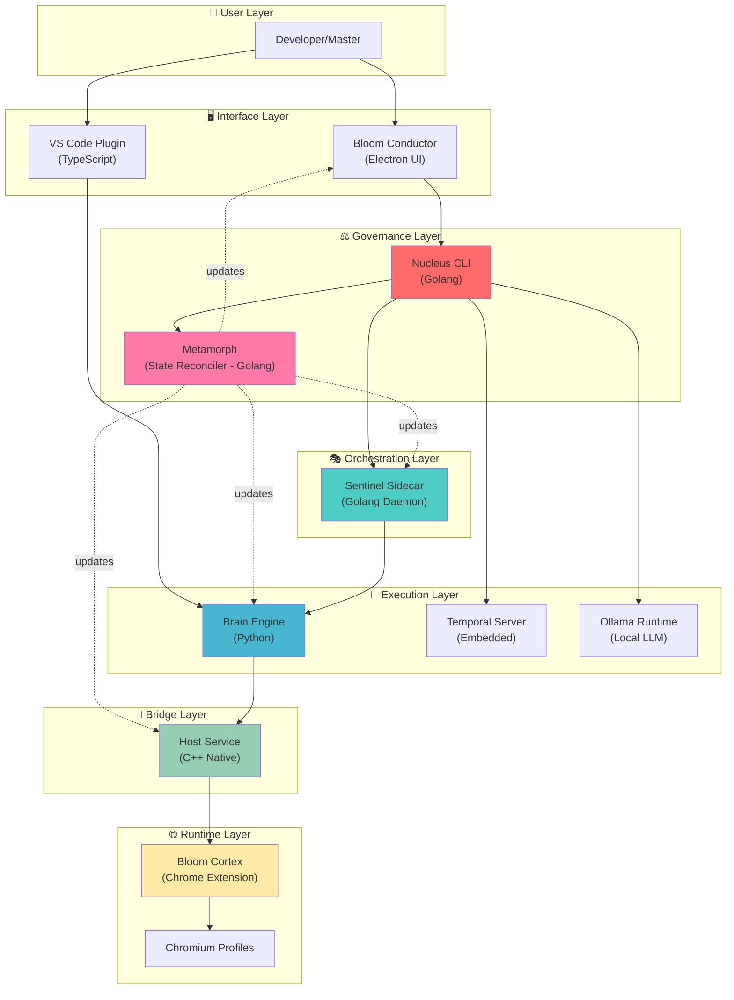

# 🗺️ BTIPS Technical Overview

**Bloom Technical Intent Package (BTIPS)** - Reproducible, Governed AI-Human Collaboration System

---

## 📋 Table of Contents

1. [Architecture Overview](#architecture-overview)
2. [Project Structure](#project-structure)
3. [Component Hierarchy](#component-hierarchy)
4. [Communication Protocols](#communication-protocols)
5. [Filesystem Layout](#filesystem-layout)
6. [Runtime Dependencies](#runtime-dependencies)
7. [Build & Deployment](#build--deployment)
8. [Related Documentation](#related-documentation)

---

## 🏗️ Architecture Overview

BTIPS implements a **multi-tier orchestration architecture** where each component operates in a strict hierarchy of authority and communication:



### **Key Architectural Decisions**

1. **Hierarchical Communication**: Components communicate **only with their direct neighbors** in the hierarchy, preventing tight coupling and ensuring governability.

2. **Stateless UI**: Conductor and VSCode Plugin are **stateless** - they reconstruct reality by scanning the filesystem and polling the Event Bus.

3. **Daemon Persistence**: Sentinel runs as a persistent background service, ensuring intents complete even if UI is closed.

4. **Chrome-Native Security**: Credentials live in Chrome's OS-encrypted storage, never in plaintext files.

5. **Temporal Workflows**: Complex orchestrations (profile launches, intent coordination) use Temporal for reliability and observability.

---

## 📂 Project Structure

```
bloom-development-extension/          # Root repository
│
├── src/                              # VS Code Plugin (TypeScript)
│   ├── api/                          # HTTP/WebSocket server
│   ├── commands/                     # VS Code command handlers
│   ├── core/                         # Core managers (context, git, intent)
│   ├── ui/                           # Webview panels (intent form, profile manager)
│   ├── strategies/                   # Project detection strategies
│   └── extension.ts                  # Plugin entry point
│
├── installer/                        # All Subprojects (Build Artifacts)
│   │
│   ├── batcave/                      # Dynamic Deployment System
│   │   └── src/                      # TypeScript - creates Nucleus/Projects
│   │
│   ├── conductor/                    # Bloom Conductor (Electron App)
│   │   ├── launcher/                 # Main stateless UI
│   │   └── setup/                    # Onboarding/installation UI
│   │
│   ├── cortex/                       # Bloom Cortex (Chrome Extension)
│   │   ├── extension/                # Extension source (JS)
│   │   │   ├── manifest.json
│   │   │   ├── background.js
│   │   │   └── content.js
│   │   └── build-cortex/             # Python builder → .blx package
│   │
│   ├── host/                         # Host Service (C++ Bridge) ✅ CORRECTED LOCATION
│   │   ├── bloom-host.cpp            # Main entry point
│   │   ├── synapse_logger.cpp/h      # Logging subsystem
│   │   ├── chunked_buffer.cpp/h      # Binary protocol handler
│   │   └── build.sh                  # Compilation script
│   │
│   ├── sentinel/                     # Sentinel Sidecar (Golang)
│   │   ├── cmd/sentinel/             # CLI entry point
│   │   ├── internal/                 # Core logic
│   │   │   ├── orchestration/        # Profile/Chrome lifecycle
│   │   │   ├── bridge/               # JSON-RPC with Electron
│   │   │   ├── ollama/               # Ollama FSM manager
│   │   │   └── temporal/             # Temporal client wrapper
│   │   └── go.mod
│   │
│   ├── nucleus/                      # Nucleus CLI (Golang)
│   │   ├── internal/                 # Core modules
│   │   │   ├── governance/           # Alfred, Vault, Ownership
│   │   │   ├── orchestration/        # Temporal workflows/activities
│   │   │   │   └── temporal/         # Bootstrap, health, lifecycle
│   │   │   ├── supervisor/           # Health checks, dev-start
│   │   │   └── vault/                # Credential management
│   │   ├── scripts/                  # Build scripts
│   │   │   └── simulation_env/       # Simulated Nucleus workspace
│   │   └── main.go
│   │
│   ├── metamorph/                    # Metamorph State Reconciler (Golang)
│   │   ├── internal/                 # Core reconciliation logic
│   │   │   ├── inspection/           # Binary interrogation
│   │   │   ├── manifest/             # Manifest parsing & validation
│   │   │   ├── reconciler/           # State convergence engine
│   │   │   ├── snapshot/             # Rollback management
│   │   │   └── executor/             # Atomic update operations
│   │   ├── cmd/metamorph/            # CLI entry point
│   │   └── go.mod
│   │
│   ├── brain/                        # Brain Engine (Python)
│   │   ├── api/                      # HTTP server routes
│   │   ├── cli/                      # Command handlers
│   │   │   ├── intent/               # Intent CRUD operations
│   │   │   ├── nucleus/              # Nucleus management
│   │   │   ├── profile/              # Profile/account management
│   │   │   └── synapse/              # Synapse protocol CLI
│   │   ├── core/                     # Core managers
│   │   │   ├── profile/              # Profile launcher, accounts
│   │   │   │   └── web/              # Discovery & Landing page templates
│   │   │   ├── context/              # Project detection strategies
│   │   │   ├── intent/               # Intent execution engine
│   │   │   └── synapse/              # Synapse protocol implementation
│   │   ├── shared/                   # Shared utilities
│   │   └── entry.py                  # Main entry point
│   │
│   └── native/                       # Compiled Binaries & Assets
│       └── bin/
│           ├── cortex/
│           │   └── bloom-cortex.blx  # Packaged Chrome extension
│           ├── win32/ & win64/       # Platform-specific binaries
│           │   ├── brain/
│           │   │   └── brain.exe
│           │   ├── host/
│           │   │   └── bloom-host.exe
│           │   ├── nucleus/
│           │   │   ├── nucleus.exe
│           │   │   └── help/         # nucleus_help.json/txt
│           │   ├── metamorph/
│           │   │   ├── metamorph.exe
│           │   │   └── help/         # metamorph_help.json/txt
│           │   └── sentinel/
│           │       ├── sentinel.exe
│           │       └── help/         # sentinel_help.json/txt
│           ├── darwin/ & linux/      # macOS/Linux binaries
│           └── temporal/             # Temporal Server binaries
│
└── contracts/                        # Shared TypeScript Types
    ├── types.ts                      # Core data structures
    ├── websocket-protocol.ts         # WebSocket events
    └── state-machines.ts             # FSM definitions
```

---

## 🔗 Component Hierarchy

### **Communication Flow (Left to Right)**

```
Conductor ←→ Nucleus ←→ Sentinel ←→ Brain ←→ Host ←→ Cortex
   (UI)      (Gov)      (Daemon)    (Engine)  (Bridge)  (Extension)
```

**Rules:**
- Each component **only talks to its direct neighbors**
- No diagonal communication (e.g., Conductor cannot directly call Brain)
- Hierarchy enforces governance: Nucleus has authority over Sentinel, Sentinel over Brain, etc.

### **Component Responsibilities**

| Component | Role | Language | Location | Key Functions |
|-----------|------|----------|----------|---------------|
| **Conductor** | Stateless UI for event visualization and intent editing | JavaScript (Electron) | `installer/conductor/` | Event Bus observer, Intent editor, Vault Shield display |
| **Nucleus** | Governance authority and orchestration control | Golang | `installer/nucleus/` | Team management, Temporal control, Vault authority, Alfred governance, Metamorph authorization |
| **Metamorph** | Declarative state reconciler for system updates | Golang | `installer/metamorph/` | Binary inspection, Manifest reconciliation, Atomic updates, Rollback management |
| **Sentinel** | Persistent daemon and event router | Golang | `installer/sentinel/` | Browser lifecycle, Event Bus TCP server, Ollama/Temporal supervision |
| **Brain** | Execution engine and context manager | Python | `installer/brain/` | Intent execution, Profile management, Context generation, Synapse server |
| **Host** | Native bridge between system and browser | C++ | `installer/host/` | Synapse protocol handler, Chrome extension communication, Binary I/O |
| **Cortex** | Chrome extension runtime | JavaScript | `installer/cortex/` | Discovery/Landing pages, Synapse client, Vault credential access |
| **VS Code Plugin** | IDE integration for intent authoring | TypeScript | `src/` | Intent forms, Context collection, Git orchestration, API server |

---

## 📡 Communication Protocols

### **1. Synapse Protocol (Extension ↔ System)**

**3-Phase Handshake:**

```
Phase 1: Extension → Host
{
  "type": "HANDSHAKE_INIT",
  "extension_id": "bloom-cortex-v1.2.3",
  "protocol_version": "3.0"
}

Phase 2: Host → Extension
{
  "type": "HANDSHAKE_ACK",
  "session_token": "sha256(...)",
  "allowed_operations": ["READ_INTENT", "WRITE_ARTIFACT"]
}

Phase 3: Host → Brain
{
  "type": "CHANNEL_READY",
  "profile_id": "profile_001"
}
```

**Message Format:** 4-byte header (length) + JSON payload

### **2. Event Bus (Brain ↔ Sentinel)**

**TCP Socket:** `127.0.0.1:5678` (configurable via `--brain-addr`)

**Event Types:**
- `EXECUTE_INTENT`: Trigger intent execution
- `LAUNCH_PROFILE`: Start Chrome profile
- `VAULT_GET_KEY`: Request credential from Vault
- `INTENT_PROGRESS`: Update progress (0.0 - 1.0)
- `INTENT_COMPLETED`: Intent finished successfully
- `INTENT_FAILED`: Intent failed with error

**Sequence Numbers:** Every event has a monotonic sequence number to detect message loss.

**Reconnection:** Exponential backoff (2s → 4s → 8s → max 60s)

**Polling:** Sentinel can request historical events via `POLL_EVENTS` with timestamp.

### **3. JSON-RPC (Conductor ↔ Nucleus)**

**HTTP/WebSocket:** Conductor connects to Nucleus's HTTP server (default port: configurable)

**Example Request:**
```json
POST /api/nucleus/team/add
{
  "github_id": "alice",
  "role": "architect",
  "name": "Alice Johnson"
}
```

**Example Response:**
```json
{
  "success": true,
  "member_id": "mem_001",
  "message": "Team member added successfully"
}
```

### **4. Native Messaging (Host ↔ Cortex)**

**Chrome Native Messaging Protocol:**
- Host registered in Windows Registry: `HKCU\Software\Google\Chrome\NativeMessagingHosts\com.bloom.host`
- Bidirectional stdin/stdout communication
- JSON messages with 4-byte length prefix

### **5. Metamorph Update Protocol (Declarative Reconciliation)**

**Philosophy:** Metamorph **never executes imperative commands**. Instead, it operates via **declarative state reconciliation**:

```
Desired State (Manifest)  -  Current State (Inspection)  =  Delta → Actions
```

**Invocation Flow:**

```
1. Batcave (remote) generates signed manifest.json
2. Nucleus downloads and validates signature
3. Nucleus verifies ACL (who can update what)
4. Nucleus invokes: metamorph reconcile --manifest /path/to/manifest.json
5. Metamorph inspects current binaries (brain --info, sentinel --info, etc.)
6. Metamorph calculates delta
7. Metamorph creates snapshot (rollback point)
8. Metamorph executes atomic updates (replace binaries)
9. Metamorph validates new state matches manifest
10. If validation fails → automatic rollback
```

**Security Properties:**
- **Offline Operation**: Metamorph NEVER connects to internet
- **Trust Boundary**: Nucleus validates signatures, Metamorph trusts Nucleus
- **Atomic Updates**: All-or-nothing, never partial state
- **Automatic Rollback**: Detects failed updates and restores snapshot
- **Manifest Immutability**: Manifests are content-addressed (SHA-256)

**Example Manifest:**
```json
{
  "version": "2.0.0",
  "timestamp": 1707418080,
  "signature": "sha256(...)",
  "components": {
    "brain": {
      "version": "3.3.0",
      "hash": "abc123...",
      "url": "file:///staging/brain.exe"
    },
    "sentinel": {
      "version": "1.9.0",
      "hash": "def456...",
      "url": "file:///staging/sentinel.exe"
    }
  }
}
```

**Binary Interrogation Standard:**

Every BTIPS binary must respond to `--info` flag with JSON:

```bash
$ brain.exe --info --json
{
  "name": "Brain",
  "version": "3.2.0",
  "build_number": 42,
  "hash": "sha256(...)",
  "capabilities": ["intent_execution", "synapse_server"]
}
```

This allows Metamorph to build a **complete system state map** before any operation.

---

## 🗄️ Filesystem Layout

### **Development Workspace**

```
~/development/                        # User's workspace
│
├── .nucleus-myorg/                   # Nucleus repository (git)
│   ├── .bloom/                       # Bloom runtime folder
│   │   ├── .intents/                 # Intent storage
│   │   │   ├── .exp/                 # Exploration intents
│   │   │   ├── .cor/                 # Coordination intents
│   │   │   └── .doc/                 # Documentation intents
│   │   ├── config/
│   │   │   └── nucleus.json          # Governance config
│   │   └── vault/                    # (empty - actual vault in Chrome)
│   ├── docs/                         # Nucleus documentation
│   ├── pipelines/                    # Temporal workflows
│   └── README.md
│
├── .project-alpha/                   # Project repository (git)
│   ├── .bloom/
│   │   ├── .intents/
│   │   │   ├── .dev/                 # Development intents
│   │   │   └── .doc/                 # Project documentation
│   │   └── config/
│   │       └── project.json          # Project config
│   ├── src/                          # Project source code
│   └── README.md
│
└── .project-beta/                    # Another project
    └── ...
```

### **AppData (Windows)**

```
C:\Users\{user}\AppData\Local\BloomNucleus\
│
├── config/
│   ├── nucleus.json                  # Organization governance
│   └── profiles.json                 # Chrome profile metadata
│
├── bin/                              # Copied from installer/native/bin
│   ├── brain/brain.exe
│   ├── nucleus/nucleus.exe
│   ├── sentinel/sentinel.exe
│   ├── host/bloom-host.exe
│   └── cortex/bloom-cortex.blx
│
├── logs/
│   ├── nucleus/                      # Nucleus logs
│   ├── sentinel/                     # Sentinel logs
│   ├── brain/                        # Brain logs
│   ├── temporal/                     # Temporal Server logs
│   │   ├── temporal.log
│   │   └── temporal.db               # SQLite database
│   └── telemetry.json                # Unified telemetry stream
│
└── profiles/                         # Chrome profile data
    ├── profile_001/
    │   ├── chrome-data/              # Chrome user data dir
    │   └── metadata.json
    └── profile_002/
        └── ...
```

---

## ⚙️ Runtime Dependencies

### **External Services**

| Service | Purpose | Controlled By | Default Port |
|---------|---------|---------------|--------------|
| **Temporal Server** | Workflow orchestration | Nucleus | 7233 (gRPC), 8233 (UI) |
| **Ollama** | Local LLM runtime | Sentinel (supervised by Nucleus) | 11434 (HTTP) |
| **Brain TCP Server** | Event Bus | Brain | 5678 |
| **Chromium** | Browser runtime | Sentinel (launched per profile) | Dynamic debug ports |

### **Binary Dependencies**

- **Windows:**
  - `nssm.exe` (Non-Sucking Service Manager) - for Windows Service registration
  - `temporal.exe` - Temporal Server binary
  - MinGW runtime DLLs (for Host)

- **macOS/Linux:**
  - `bloom-host` (native binary, no DLL deps)
  - Temporal binaries (platform-specific)

---

## 🛠️ Build & Deployment

### **Build Order**

1. **Host** (C++)
   ```bash
   cd installer/host
   ./build.sh  # Creates bloom-host.exe in native/bin/{platform}/host/
   ```

2. **Cortex** (Chrome Extension)
   ```bash
   cd installer/cortex/build-cortex
   python package.py  # Creates bloom-cortex.blx in native/bin/cortex/
   ```

3. **Nucleus** (Golang)
   ```bash
   cd installer/nucleus
   ./scripts/build.bat  # Windows
   ./scripts/build-darwin.sh  # macOS
   # Outputs to native/bin/{platform}/nucleus/nucleus.exe
   ```

4. **Sentinel** (Golang)
   ```bash
   cd installer/sentinel
   go build -o ../native/bin/win32/sentinel/sentinel.exe cmd/sentinel/main.go
   ```

5. **Brain** (Python)
   ```bash
   cd installer/brain
   pyinstaller entry.py --onefile --name brain
   # Outputs to native/bin/{platform}/brain/brain.exe
   ```

6. **Conductor** (Electron)
   ```bash
   cd installer/conductor
   npm run make  # Uses Electron Forge
   # Creates installer in out/make/
   ```

### **Deployment to AppData**

```bash
cd installer
python create_installer.py  # Copies native/bin/ → AppData/Local/BloomNucleus/bin/
```

### **Service Installation** (Windows)

```powershell
# Install Nucleus as Windows Service
cd "C:\Users\{user}\AppData\Local\BloomNucleus\bin\nucleus"
nssm install NucleusService nucleus.exe alfred start

# Install Brain as Windows Service
cd "C:\Users\{user}\AppData\Local\BloomNucleus\bin\brain"
nssm install BrainService brain.exe server
```

---

## 📚 Related Documentation

| Document | Purpose | Audience |
|----------|---------|----------|
| **[BTIPS-SECURITY-COMPLIANCE.md](./BTIPS-SECURITY-COMPLIANCE.md)** | Security model, governance, audit trail | Security teams, auditors, compliance |
| **[BTIPS-COMPONENTS.md](./BTIPS-COMPONENTS.md)** | Detailed component specs, CLI reference | Developers, system admins |
| **[BTIPS-RUNTIME-FLOWS.md](./BTIPS-RUNTIME-FLOWS.md)** | Sequence diagrams, execution flows | Architects, debuggers |
| **[BTIPS-DEVELOPMENT.md](./BTIPS-DEVELOPMENT.md)** | Development setup, debugging, testing | Contributors, plugin developers |
| **[BTIPS Intent Package Spec](./BTIPS__Bloom_Technical_Intent_Package_.md)** | Intent types, Nucleus vs. Projects, use cases | Product managers, users |

---

## 🎯 Quick Start Paths

### **For Users**
1. Read **[BTIPS Intent Package Spec](./BTIPS__Bloom_Technical_Intent_Package_.md)** for conceptual understanding
2. Install Conductor (Electron app)
3. Run onboarding: `nucleus init --github-id yourusername --master`
4. Create first project: VS Code → "BTIP: Create Project"

### **For Developers**
1. Read this document (Technical Overview)
2. Clone repository: `git clone https://github.com/yourorg/bloom-development-extension.git`
3. Build components: Follow [Build & Deployment](#build--deployment)
4. Run simulation: `cd installer/nucleus/scripts/simulation_env && nucleus dev-start --simulation`

### **For Security Reviewers**
1. Read **[BTIPS-SECURITY-COMPLIANCE.md](./BTIPS-SECURITY-COMPLIANCE.md)** first
2. Inspect Vault implementation: `installer/nucleus/internal/vault/`
3. Review Synapse Protocol: `installer/host/bloom-host.cpp` + `installer/brain/core/synapse/`
4. Check audit trail: `installer/brain/cli/intent/` (intent CRUD operations)

---

## 🔄 Version Information

- **Architecture Version:** 3.0 (Synapse Protocol v3)
- **Nucleus Version:** 2.1.0
- **Sentinel Version:** 1.8.0
- **Brain Version:** 3.2.0
- **Host Version:** 2.1.0
- **Cortex Version:** 1.2.3

**Compatibility Matrix:**
- Nucleus 2.x ↔ Sentinel 1.8+
- Sentinel 1.8+ ↔ Brain 3.2+
- Brain 3.2+ ↔ Host 2.1+
- Host 2.1+ ↔ Cortex 1.2+

**Breaking Changes:** Components with mismatched major versions will **refuse connection** and log error.

---

## 🆘 Troubleshooting

### **Common Issues**

1. **"Synapse handshake failed"**
   - Check Host version matches Cortex version
   - Verify Native Messaging manifest is registered: `reg query HKCU\Software\Google\Chrome\NativeMessagingHosts\com.bloom.host`
   - Check Host logs in `AppData/Local/BloomNucleus/logs/host/`

2. **"Vault locked"**
   - Unlock via: `nucleus vault-unlock`
   - Ensure Master profile is active in Chrome
   - Check Vault status: `nucleus vault-status`

3. **"Temporal Server not responding"**
   - Restart: `nucleus temporal force-stop && nucleus temporal start`
   - Check diagnostics: `nucleus temporal diagnostics --json`
   - Verify port 7233 not blocked: `netstat -an | findstr 7233`

4. **"Event Bus connection lost"**
   - Brain may have crashed - check: `tasklist | findstr brain.exe`
   - Restart Brain: `brain.exe server` (or via Windows Service)
   - Sentinel auto-reconnects with exponential backoff

### **Debug Commands**

```bash
# System health check
nucleus health --json --validate

# View real-time events
sentinel listen --filter profile_001

# Check full stack
sentinel cockpit --health

# Dump telemetry
cat AppData/Local/BloomNucleus/logs/telemetry.json | jq .
```

---

*Last Updated: February 8, 2024*  
*Architecture Version: 3.0*  
*Documentation Maintainer: BTIPS Core Team*
