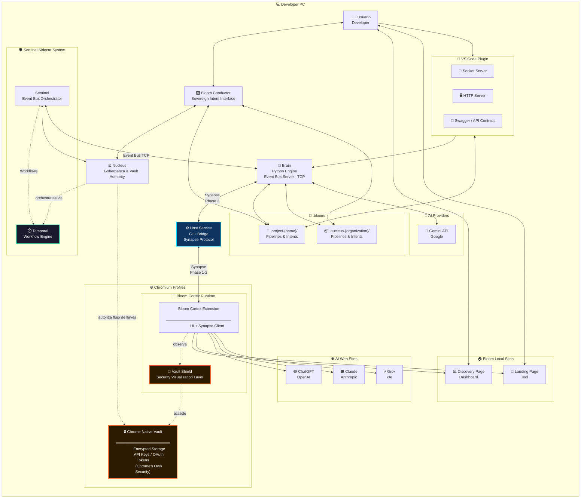

### 📦 BTIPS (Bloom Technical Intent Package)

BTIP convierte la interacción con inteligencia artificial en un proceso de ingeniería reproducible, donde cada intención técnica queda formalizada, versionada y gobernada por contexto real.

---

## 🧭 Contexto de Uso — Por qué existe BTIP

BTIP nace de un problema concreto: los modelos de IA trabajan rápido, pero **pierden contexto**, **no dejan rastro estructurado** y **no escalan cognitivamente** cuando un proyecto crece o involucra múltiples personas, herramientas y decisiones.

La arquitectura BTIP introduce una **unidad mínima de trabajo persistente** donde cada acción técnica queda registrada como un intent, junto con su contexto, entradas, salidas y efectos en el sistema. De esta forma, el conocimiento no vive en prompts efímeros ni en la memoria del modelo, sino en **Bloom Technical Intent Package**.

BTIP convierte la interacción con IA en un **proceso de ingeniería**, no en una conversación. Esto permite que una organización mantenga coherencia técnica, acelere iteraciones y transfiera conocimiento entre humanos y modelos sin degradación ni ambigüedad.

---

## 1️⃣ Concepto clave (dejémoslo cristalino)

### 🌐 Organización Bloom

* **1 solo Nucleus**
* **N Projects**
* **Todos comparten el mismo runtime local**
* **El Nucleus no desarrolla features**
  👉 **Gobierna, explora y coordina**

Pensalo así:

> **Projects = ejecución**
>
> **Nucleus = conciencia organizacional**

---

## 2️⃣ Diagrama SIMPLE actualizado — Arquitectura con Nucleus

Este es el **diagrama definitivo de presentación**.
Sigue siendo simple, pero ahora **explica la pirámide**.

👉 Pegalo en **[https://mermaid.live](https://mermaid.live)**



## 2. ARQUITECTURA DE BLOOM

### 2.1️⃣ Bloom Runtime Infrastructure

La ejecución de BTIPS se apoya en una infraestructura de **Sidecar** que independiza la lógica organizacional de la interfaz visual.

*   **Sentinel Sidecar:** Proceso *daemon* que actúa como orquestador persistente. Mantiene el Event Bus activo y garantiza que la ejecución técnica no se interrumpa si el Launcher se cierre.
*   **Synapse Protocol:** Handshake de 3 fases (Extension ↔ Host ↔ Brain) que valida la integridad del canal antes de procesar intents.
*   **Data Persistence & Stateless UI:** El Launcher opera como una **Stateless UI**. No depende de estados volátiles en memoria, sino que reconstruye su realidad escaneando los archivos de intents en el Filesystem (`.bloom/intents/`) y sincronizando eventos perdidos mediante *polling* histórico al Sidecar.

---

### 2.2️⃣ Nucleus Governance Layer

Nucleus es la autoridad de mando y el árbitro de identidad del sistema. Actúa como el puente entre la voluntad del propietario y la ejecución técnica.

*   **Identity & Role Management:** Gestiona la jerarquía de poder (Master/Architect/Specialist), validando quién tiene permiso para ejecutar acciones sensibles.
*   **Vault Authority:** Es el único componente capaz de autorizar el flujo de llaves (API Keys/OAuth) desde el almacenamiento seguro de Chrome hacia el motor de ejecución.
*   **Organizacional Truth:** Nucleus firma digitalmente el estado de los proyectos en el filesystem, asegurando que la configuración de la organización sea inalterable para colaboradores no autorizados.

---

### 2.3️⃣ Bloom Cortex

Bloom Cortex es el **runtime de ejecución cognitiva en Chromium**.
Se materializa como una **Chrome Extension versionada, inmutable y reproducible**, empaquetada como un artefacto `.blx` y desplegada por Sentinel en cada perfil.

Cortex actúa como la **capa de interacción directa con el usuario y los AI Providers**, exponiendo la UI, gestionando el contexto de navegación y ejecutando el protocolo Synapse como cliente activo. No contiene lógica organizacional ni persistencia: su función es **conectar intención humana, contexto web y capacidades del sistema** de forma segura y gobernada.

El runtime de Cortex incluye páginas web locales (Discovery y Landing) que permiten explorar intents, inicializar perfiles y establecer el contexto cognitivo antes de cualquier ejecución técnica. Cortex es deliberadamente **stateless**, delegando autoridad, versionado y despliegue a Sentinel, y razonamiento profundo a Brain.

---

### 2.4️⃣ Bloom Conductor (Sovereign Intent Interface)

**Bloom Conductor** es la terminal de interacción humana soberana y el centro de comando estratégico del ecosistema. Como una *Stateless UI* de alta precisión, actúa como el nervio óptico que permite al usuario visualizar el pulso del Event Bus en tiempo real y forjar intenciones técnicas mediante un editor de intents avanzado.

#### La Filosofía del Conductor

El Conductor no es "otra interfaz más". Es el **órgano de gobernanza consciente** donde la complejidad del sistema se simplifica en una interfaz de observabilidad total. Su diseño deliberadamente stateless garantiza que la verdad operativa y el historial de ejecución residan siempre de forma segura en el sistema de archivos, no en memoria volátil de la aplicación.

#### Capacidades Principales

* **Event Bus Visualization**: Observa en tiempo real cada evento que fluye por el sistema (intents ejecutándose, resultados llegando, errores detectados)
* **Intent Editor Avanzado**: Crea, edita e integra intents con sintaxis asistida, especialmente los de tipo `cor` (coordinación) para merges cognitivos
* **Vault Shield**: Visualiza de forma transparente cuando el sistema accede a credenciales cifradas, eliminando la opacidad de las operaciones de seguridad
* **Project Switcher**: Navega entre Nucleus y Projects sin perder contexto
* **Rehydration Automática**: Al abrirse, reconstruye su estado escaneando `.bloom/` y sincronizando eventos perdidos del Sidecar

#### Relación con el Ecosistema

El Conductor NO se comunica con Sentinel. Se conecta directamente con **Nucleus** vía HTTP/WebSocket, elevando el nivel de abstracción. Esto permite que el desarrollador opere a nivel de "intención organizacional" sin preocuparse por detalles de ejecución de bajo nivel.

Cuando el usuario forja un intent en el Conductor, este se serializa como un archivo `.json` en `.bloom/.intents/`, y Nucleus se encarga de orquestar su ejecución mediante Temporal workflows. El Conductor simplemente observa el progreso vía eventos y presenta resultados cuando están listos.

#### El Merge Cognitivo

Una de las capacidades más poderosas del Conductor es facilitar **merges cognitivos** que superan las limitaciones de herramientas tradicionales como Git. Cuando dos intents `dev` modifican el mismo archivo de formas incompatibles, el Conductor permite crear un intent `cor` (coordinación) que:

1. Analiza ambas modificaciones
2. Consulta al modelo de IA sobre la mejor forma de integrarlas
3. Genera una versión reconciliada que preserva la intención de ambos cambios
4. Valida que el resultado sea compilable/funcional

Esto convierte conflictos técnicos en **decisiones asistidas por IA**, no en batallas manuales de texto.

---

### 2.5️⃣ Brain (Python Engine)

**Brain** es el motor de ejecución cognitiva de Bloom. Su nombre no es metafórico: realmente actúa como el cerebro que interpreta intenciones humanas formalizadas (intents), las traduce a operaciones técnicas concretas y coordina su ejecución con el mundo exterior.

#### Por Qué Python

La elección de Python no fue casual. Brain necesita:
* Integrarse fácilmente con APIs de IA (Gemini, OpenAI, Anthropic)
* Manipular archivos, parsear código, ejecutar scripts
* Mantener lógica compleja sin sacrificar legibilidad
* Iterar rápido en nuevas capacidades

Python cumple todo esto mientras mantiene un balance entre performance y expresividad.

#### El Ciclo de Vida de un Intent

Cuando Nucleus decide que es momento de ejecutar un intent (por ejemplo, `dev_intent_abc123.json`), envía un comando a Sentinel, que lo reenvía a Brain. Brain entonces:

1. **Lee el intent** desde el filesystem (`.bloom/.intents/.dev/intent_abc123.json`)
2. **Valida dependencias**: ¿Necesita una API key? → Solicita al Vault
3. **Ejecuta la lógica**: Llama a Gemini para generar código, parsea respuesta, valida sintaxis
4. **Escribe resultados**: Crea archivos en el proyecto, actualiza el intent con el output
5. **Emite eventos**: Informa progreso a Nucleus vía Sentinel (Event Bus)
6. **Limpia memoria**: Si usó llaves del Vault, las sobrescribe con zeros y libera

Todo esto sucede de forma **idempotente**: si el proceso falla a mitad de camino, puede reiniciarse sin corromper el estado.

#### Memoria Volátil: El Principio de Confianza Cero

Brain nunca almacena secretos en disco. Cuando necesita una API key:
* La solicita al Vault vía Host → Cortex
* La mantiene en una variable Python (`_volatile_key`) **solo durante la transacción**
* La usa para el API call
* La sobrescribe con "0000..." y la libera inmediatamente

Si Brain crashea, la llave desaparece de la RAM. Si alguien inspecciona el disco, no encontrará nada.

#### Relación con Host C++

Brain no puede hablar directamente con Chrome. Necesita a Host como intérprete. Brain envía comandos JSON vía socket TCP (puerto 5678), Host los traduce al protocolo Chrome Native Messaging, y viceversa.

Esto crea una **frontera de seguridad**: Host valida tamaños de mensaje, previene payloads maliciosos y actúa como firewall entre el navegador y el motor de ejecución.

---

### 2.6️⃣ Host Service (C++)

**Host** es el puente invisible pero crítico entre dos mundos que no deberían poder hablarse: Chrome (sandboxed, aislado por seguridad) y el runtime local de Python. Implementado en C++ por razones de performance y control de bajo nivel, Host es la única pieza del sistema que realmente "toca" ambos lados de la frontera.

#### La Dualidad del Host

Host vive en un estado permanente de traducción simultánea:

* **Hacia Chrome**: Habla Chrome Native Messaging Protocol (stdin/stdout, LittleEndian)
* **Hacia Brain**: Habla TCP Socket Protocol (BigEndian, puerto 5678)

Cada mensaje que pasa por Host es convertido, validado y reenviado. Si un mensaje es demasiado grande para Chrome (>1MB), Host lo rechaza y notifica el error a Brain vía TCP.

#### El Handshake de 3 Fases

Antes de permitir cualquier comunicación, Host ejecuta un ritual de validación:

**Fase 1**: Extension envía `extension_ready` con su identidad (profile_id, launch_id)  
**Fase 2**: Host responde `host_ready` con sus capacidades  
**Fase 3**: Host notifica a Brain `PROFILE_CONNECTED`, y solo entonces el sistema está "listo"

Este handshake previene condiciones de carrera. Sin él, Brain podría enviar comandos a una Extension que aún no cargó, o Extension podría enviar datos a un Brain que aún no existe.

#### El Muro de 1MB

Chrome tiene un límite físico: mensajes de Native Messaging no pueden superar ~1MB. Host implementa un **muro de validación** que rechaza cualquier payload que exceda este límite ANTES de intentar enviarlo.

Si Brain intenta enviar un JSON de 5MB a la Extension, Host:
1. Detecta el tamaño excesivo
2. Aborta el envío
3. Construye un mensaje de error
4. Lo envía a Brain vía TCP
5. Brain puede entonces fragmentar el payload o usar otra estrategia

Esto convierte un crash silencioso en un error manejable.

#### Seguridad del Vault: El Canal Cifrado

Cuando Brain solicita una llave del Vault, Host no solo reenvía el mensaje. Agrega un **nonce** (número aleatorio único) que la Extension debe incluir en su firma criptográfica. Esto previene replay attacks: nadie puede interceptar una respuesta antigua y reusarla.

---

### 2.7️⃣ Synapse Protocol (Implementación)

**Synapse** es el lenguaje común que todos los componentes de Bloom hablan. No es solo un "protocolo de mensajes" — es el sistema nervioso que permite que piezas escritas en lenguajes diferentes (JavaScript, C++, Python, Go) colaboren como un organismo único.

#### El Problema que Resuelve

Sin Synapse, tendríamos:
* Chrome hablando su dialecto propietario
* Python usando su serialización
* Go con sus propias convenciones
* Cada uno asumiendo cosas diferentes sobre endianness, formato, validación

Synapse **estandariza todo**:
* Formato: JSON siempre
* Transporte: Length-prefixed binary (4 bytes antes del payload)
* Validación: Handshake de 3 fases obligatorio
* Trazabilidad: Sequence numbers y timestamps en cada mensaje

#### Endianness: El Detalle que Importa

Chrome Native Messaging usa **LittleEndian** (byte menos significativo primero).  
Brain/Sentinel usan **BigEndian** (byte más significativo primero).

Host traduce entre ambos. Sin esta traducción, un mensaje que dice "longitud: 256 bytes" podría interpretarse como "longitud: 65536 bytes" y causar corrupción de memoria.

#### El Handshake: Más que Cortesía

El handshake de 3 fases no es opcional. Garantiza que:
* Extension sabe quién es (profile_id, launch_id)
* Host conoce las capacidades de Extension
* Brain confirma que el perfil es válido antes de aceptar comandos

Sin este ritual, el sistema podría entrar en estados imposibles (ej: Brain enviando comandos a un perfil que aún no existe).

#### Heartbeats: Detectar Muerte Silenciosa

Cada 30 segundos, Host envía un `HEARTBEAT` a Brain. Si Brain no responde después de 3 intentos, Host asume que crasheó y cierra la conexión limpiamente.

Esto previene "conexiones zombie" donde Host cree que Brain está vivo pero en realidad murió hace 10 minutos.

---

### 2.8️⃣ Event Bus (Arquitectura)

**Event Bus** es el sistema nervioso central de Bloom. Es el canal TCP persistente y bidireccional que conecta Sentinel (sidecar) con Brain (motor de ejecución), permitiendo que eventos fluyan en tiempo real sin bloquear la ejecución principal.

#### Por Qué un Event Bus y No HTTP

HTTP es request-response: haces una pregunta, esperas la respuesta, continúas. Pero Bloom ejecuta intents que pueden tardar minutos. Si usáramos HTTP, el cliente quedaría bloqueado esperando.

El Event Bus es **asíncrono y full-duplex**:
* Sentinel puede enviar comandos a Brain sin esperar respuesta inmediata
* Brain puede emitir eventos de progreso mientras ejecuta (25%... 50%... 75%...)
* Nucleus puede suscribirse a estos eventos vía Sentinel
* Conductor recibe actualizaciones en tiempo real sin hacer polling

#### Arquitectura del Bus
```
Nucleus (Temporal Worker) 
    ↕ TCP (BigEndian, puerto configurable)
Sentinel (Event Bus Client)
    ↕ TCP (BigEndian, puerto 5678)
Brain (Event Bus Server)
```

Brain levanta un servidor TCP y espera conexiones. Cuando Sentinel arranca, se conecta a Brain y mantiene esa conexión abierta. Todos los mensajes fluyen por este socket.

#### El Protocolo: 4 Bytes + JSON

Cada mensaje tiene:
1. **Header**: 4 bytes (BigEndian) indicando longitud del payload
2. **Payload**: JSON con estructura estándar

#### Eventos Típicos

**Sentinel → Brain**:
* `EXECUTE_INTENT`: Ejecuta un intent específico
* `VAULT_GET_KEY`: Solicita una llave del vault
* `POLL_EVENTS`: Pide eventos perdidos desde timestamp X

**Brain → Sentinel**:
* `INTENT_STARTED`: Intent comenzó ejecución
* `INTENT_PROGRESS`: Actualización de progreso (0.0 a 1.0)
* `INTENT_COMPLETED`: Intent terminó exitosamente
* `INTENT_FAILED`: Intent falló con error
* `VAULT_KEY_RECEIVED`: Llave obtenida del vault

#### Resiliencia: Reconexión Automática

Si la conexión se cae (Brain crashea, red se cae), Sentinel:
1. Detecta la desconexión
2. Espera 2 segundos
3. Reintenta conectar
4. Si falla, espera 4 segundos (backoff exponencial)
5. Continúa hasta máximo 60 segundos entre intentos

Cuando reconecta, Sentinel envía `POLL_EVENTS` para recuperar cualquier evento perdido durante la desconexión.

#### Sequence Numbers: Detectar Pérdida de Mensajes

Cada evento tiene un `sequence` number incremental. Si Sentinel recibe:
* Evento seq=42
* Evento seq=45

Sabe que perdió los eventos 43 y 44, y puede solicitarlos explícitamente a Brain vía `POLL_EVENTS`.

---


## 3️⃣ Nucleus — Documentación Básica (oficial)

### 🧠 Nucleus (Proyecto Maestro de la Organización)

El **Nucleus** es el proyecto raíz y único de cada organización Bloom.
Representa el **nivel más alto de la pirámide cognitiva**.

### 🎯 Propósito

* Centralizar **exploración estratégica**
* Gobernar decisiones técnicas
* Mantener coherencia entre proyectos
* Registrar conocimiento transversal
* Orquestar evolución organizacional

### 🧩 Características clave

* **Uno solo por organización**
* Vive en `.bloom/.nucleus-{org}/`
* No implementa features productivas
* No modifica código de proyectos directamente
* Es **fuente de verdad estructural**

---

## 4️⃣ Qué se hace en el Nucleus (MUY IMPORTANTE)

### 🧪 Intents permitidos

✔️ **`exp` — Exploration (principal)**
✔️ **`inf` — Information**
✔️ **`cor` — Coordination (organizacional)**
✔️ **`doc` — Documentation estratégica**

❌ `dev` **NO es el foco**
(Solo en tooling interno del Nucleus, nunca en productos)

---

### 🧠 Tipos de conocimiento que vive en Nucleus

Basado en tu árbol real:

* Principios de arquitectura
* Patrones aprobados
* Decisiones (ADR)
* Estándares de calidad
* Seguridad y compliance
* Relaciones entre proyectos
* Mapas de dependencias
* Findings exploratorios
* Reportes organizacionales

👉 Todo eso **no pertenece a un proyecto**, pertenece a la **organización**.

---

## 5️⃣ Relación Nucleus ↔ Projects (modelo mental)

```
            NUCLEUS
        (Explora / Gobierna)
                │
        ┌───────┴────────┐
        │                │
     Project A        Project B
   (dev / doc)      (dev / doc)
```

## 2.1️⃣ Bloom Runtime Infrastructure

La ejecución de BTIPS se apoya en una infraestructura de **Sidecar** que garantiza que la lógica de la organización sea independiente de la interfaz visual.

### 🛡️ Sentinel Sidecar (The Orchestrator)
Sentinel opera como un proceso **Daemon (Sidecar)** persistente. Su función no es solo ejecutar comandos, sino mantener el **Event Bus** activo entre el cerebro (Brain) y la interfaz (Electron). 
*   **Persistent Execution:** Sentinel sobrevive al cierre de la UI de Electron, permitiendo que tareas largas finalicen y se registren sin intervención del usuario.
*   **Event Bus TCP:** Canal bidireccional asíncrono que transporta eventos de sistema y resultados de intents en tiempo real.

### 🔌 Synapse Protocol (Handshake de 3 Fases)
Para garantizar una ejecución técnica infalible, el runtime implementa un saludo de tres vías antes de cada operación:
1.  **Extension → Host:** La extensión notifica su disponibilidad.
2.  **Host → Extension:** El Bridge C++ valida capacidades y versión.
3.  **Host → Brain:** El canal se declara oficialmente "Conectado" y listo para recibir intents.

### 🗄️ Stateless UI & Data Persistence
Bajo esta arquitectura, el **Electron Launcher es una "Stateless UI"**. 
*   **Single Source of Truth:** La verdad no reside en la memoria de la aplicación, sino en el **Bloom File System** (archivos `.json` en cada proyecto).
*   **Rehydration:** Al abrirse, Electron reconstruye su estado escaneando los archivos de intents y solicitando al Sentinel los eventos perdidos vía *polling* histórico al bus. Esto asegura que el usuario siempre vea el estado real de la organización, sin importar cortes de energía o cierres de la aplicación.


### Reglas de oro

* Un **Project** puede:

  * ejecutar `dev`
  * ejecutar `doc`
  * ejecutar `exp` local
* El **Nucleus**:

  * define **cómo** se hacen las cosas
  * decide **cuándo** se integran
  * coordina **impacto cognitivo**

> Cuando algo afecta a más de un proyecto
> 👉 **sube al Nucleus**

---
Perfecto.
Voy **directo, corto y técnico**.
**Tres líneas por intent**: qué es, para qué se usa y dónde vive.

---

## `dev` — Development Intent

Produce o modifica **código ejecutable** del sistema o del producto.
Se usa para features, fixes, refactors e integración técnica.
Se ejecuta **en Projects**, dentro de `.bloom/.intents/.dev/`.

---

## `doc` — Documentation Intent

Genera o actualiza **documentación viva y verificable**.
Se usa para explicar decisiones, estado real y evolución del sistema.
Se ejecuta **en Projects y en Nucleus**, dentro de `.bloom/.intents/.doc/`.

---

## `exp` — Exploration Intent

Explora **alternativas, hipótesis y escenarios posibles**.
Se usa para reducir incertidumbre y tomar decisiones informadas.
Se ejecuta **principalmente en Nucleus**, dentro de `.bloom/.intents/.exp/`.

---

## `inf` — Information Intent

Recopila **información factual** sin transformarla ni decidir.
Se usa para validar supuestos y alimentar otros intents.
Se ejecuta **en Projects o Nucleus**, como input pasivo.

---

## `cor` — Coordination Intent

Coordina y gobierna **acciones humanas y sistémicas**.
Se usa para merges cognitivos, orden de trabajo y control de impacto.
Se ejecuta **en Nucleus o en Projects complejos**, como autoridad.

---


