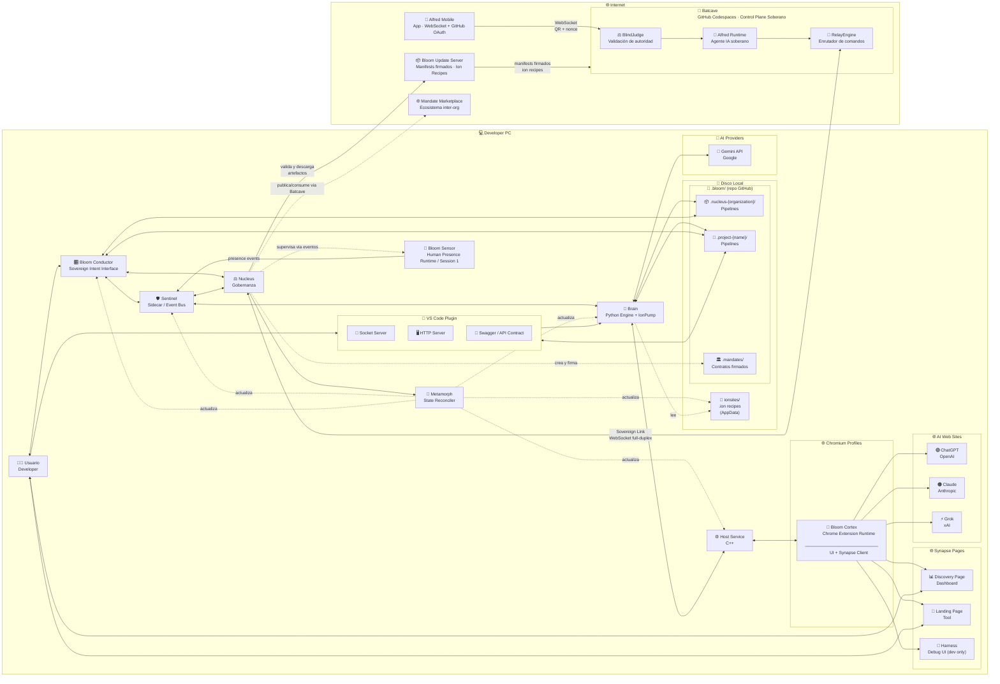

### 📦 BTIPS (Bloom Technical Intent Package) — v4.0

BTIP convierte la interacción con inteligencia artificial en un proceso de ingeniería reproducible, donde cada intención técnica queda formalizada, versionada y gobernada por contexto real.

---

## 🧭 Contexto de Uso — Por qué existe BTIP

BTIP nace de un problema concreto: los modelos de IA trabajan rápido, pero **pierden contexto**, **no dejan rastro estructurado** y **no escalan cognitivamente** cuando un proyecto crece o involucra múltiples personas, herramientas y decisiones.

La arquitectura BTIP introduce una **unidad mínima de trabajo persistente** donde cada acción técnica queda registrada como un intent, junto con su contexto, entradas, salidas y efectos en el sistema. De esta forma, el conocimiento no vive en prompts efímeros ni en la memoria del modelo, sino en **Bloom Technical Intent Package**.

BTIP convierte la interacción con IA en un **proceso de ingeniería**, no en una conversación. Esto permite que una organización mantenga coherencia técnica, acelere iteraciones y transfiera conocimiento entre humanos y modelos sin degradación ni ambigüedad.

---

## 1️⃣ Concepto clave (dejémoslo cristalino)

### 🌐 Organización Bloom

* **1 solo Nucleus**
* **N Projects**
* **Todos comparten el mismo runtime local**
* **El Nucleus no desarrolla features**
  👉 **Gobierna, explora y coordina**

Pensalo así:

> **Projects = ejecución**
>
> **Nucleus = conciencia organizacional**

---

## 2️⃣ Diagrama SIMPLE actualizado — Arquitectura con Nucleus

Este es el **diagrama definitivo de presentación**.
Sigue siendo simple, pero ahora **explica la pirámide**.

👉 Pegalo en **[https://mermaid.live](https://mermaid.live)**



## 2. ARQUITECTURA DE BLOOM

### 2.1️⃣ Bloom Runtime Infrastructure

La ejecución de BTIPS se apoya en una infraestructura de **Sidecar** que independiza la lógica organizacional de la interfaz visual.

*   **Sentinel Sidecar:** Proceso *daemon* que actúa como orquestador persistente. Mantiene el Event Bus activo y garantiza que la ejecución técnica no se interrumpa si el Workspace se cierre.
*   **Synapse Protocol:** Handshake de 3 fases (Extension ↔ Host ↔ Brain) que valida la integridad del canal antes de procesar intents.
*   **Data Persistence & Stateless UI:** El Workspace (Conductor) opera como una **Stateless UI**. No depende de estados volátiles en memoria, sino que reconstruye su realidad escaneando los archivos de intents en el Filesystem (`.bloom/intents/`) y sincronizando eventos perdidos mediante *polling* histórico al Sidecar.

---

### 2.2️⃣ Nucleus Governance Layer

Nucleus es la autoridad de mando y el árbitro de identidad del sistema. Actúa como el puente entre la voluntad del propietario y la ejecución técnica.

*   **Identity & Role Management:** Gestiona la jerarquía de poder (Master/Architect/Specialist), validando quién tiene permiso para ejecutar acciones sensibles.
*   **Vault Authority:** Es el único componente capaz de autorizar el flujo de llaves (API Keys/OAuth) desde el almacenamiento seguro de Chrome hacia el motor de ejecución.
*   **Organizacional Truth:** Nucleus firma digitalmente el estado de los proyectos en el filesystem, asegurando que la configuración de la organización sea inalterable para colaboradores no autorizados.
*   **System State Authority:** Único componente autorizado para invocar actualizaciones de binarios del sistema vía Metamorph, validando manifests firmados provenientes de Bartcave.

---

### 2.3️⃣ Bloom Cortex

Bloom Cortex es el **runtime de ejecución cognitiva en Chromium**.
Se materializa como una **Chrome Extension versionada, inmutable y reproducible**, empaquetada como un artefacto `.blx` y desplegada por Sentinel en cada perfil.

Cortex actúa como la **capa de interacción directa con el usuario y los AI Providers**, exponiendo la UI, gestionando el contexto de navegación y ejecutando el protocolo Synapse como cliente activo. No contiene lógica organizacional ni persistencia: su función es **conectar intención humana, contexto web y capacidades del sistema** de forma segura y gobernada.

El runtime de Cortex incluye tres páginas web locales que operan sobre el mismo canal Synapse y comparten el mismo mecanismo de autodescripción de protocolo:

* **Discovery** — Onboarding del usuario. Guía el flujo desde la instalación hasta tener GitHub auth, API key y cuenta registrada en Nucleus.
* **Landing** — Dashboard del perfil activo. Estado de sesión, cuentas vinculadas, stats de uso y acciones rápidas post-onboarding.
* **Harness** — Herramienta de debug y observabilidad del protocolo. Existe **únicamente en builds dev** — no se despliega en producción.

Cortex es deliberadamente **stateless**, delegando autoridad, versionado y despliegue a Sentinel, y razonamiento profundo a Brain.

#### El Protocolo Synapse y los Manifests Autodescriptivos

Los tres activos de Cortex comparten un canal único de **Chrome Native Messaging** con Brain. Cada activo se autodescribe mediante un objeto `*_PROTOCOL_MANIFEST` expuesto en `self.*`:

* `DISCOVERY_PROTOCOL_MANIFEST` — mensajes del flujo de onboarding
* `LANDING_PROTOCOL_MANIFEST` — mensajes del dashboard del perfil
* `IONPUMP_PROTOCOL_MANIFEST` — comandos DOM y eventos de automatización web

Este mecanismo garantiza que agregar un mensaje al protocolo actualice automáticamente cualquier componente que los consuma — sin pasos adicionales, sin builds separados.

#### Harness — Observabilidad del Protocolo

El Harness es la herramienta de observabilidad y simulación del protocolo Synapse para developers. No tiene conocimiento hardcodeado de ningún mensaje: lee los `*_PROTOCOL_MANIFEST` dinámicamente al cargar y genera su UI a partir de ellos.

Sus cuatro paneles:

* **Feed** — observador pasivo. Registra todos los mensajes `chrome.runtime` en tiempo real sin interferir con el routing de `background.js`.
* **Simulate** — simulador activo. Genera botones dinámicamente desde los manifests. Despacha al canal correcto: `chrome.runtime.sendMessage` para mensajes internos, `chrome.tabs.sendMessage` para comandos DOM a tabs activos.
* **Config** — identidad de sesión. Muestra `profileId` y `launchId`, permite override manual, y contiene el selector de tab activo para mensajes de IonPump.
* **Protocols** — inspección de manifests. Visualiza los manifests cargados para verificar que el autodescubrimiento funcionó correctamente.

**Activación:** `sentinel seed <alias> <master> --dev`. En producción, `generate_harness_page()` es un no-op y el directorio `harness/` nunca se crea. **El Harness no requiere rebuild de Cortex para actualizarse** — un re-seed es suficiente.

---

### 2.4️⃣ Bloom Conductor (Sovereign Intent Interface)

**Bloom Conductor** es la terminal de interacción humana soberana y el centro de comando estratégico del ecosistema. Como una *Stateless UI* de alta precisión, actúa como el nervio óptico que permite al usuario visualizar el pulso del Event Bus en tiempo real y forjar intenciones técnicas mediante un editor de intents avanzado.

#### La Filosofía del Conductor

El Conductor no es "otra interfaz más". Es el **órgano de gobernanza consciente** donde la complejidad del sistema se simplifica en una interfaz de observabilidad total. Su diseño deliberadamente stateless garantiza que la verdad operativa y el historial de ejecución residan siempre de forma segura en el sistema de archivos, no en memoria volátil de la aplicación.

#### Capacidades Principales

* **Event Bus Visualization**: Observa en tiempo real cada evento que fluye por el sistema (intents ejecutándose, resultados llegando, errores detectados)
* **Intent Editor Avanzado**: Crea, edita e integra intents con sintaxis asistida, especialmente los de tipo `cor` (coordinación) para merges cognitivos
* **Vault Shield**: Visualiza de forma transparente cuando el sistema accede a credenciales cifradas, eliminando la opacidad de las operaciones de seguridad
* **Project Switcher**: Navega entre Nucleus y Projects sin perder contexto
* **Rehydration Automática**: Al abrirse, reconstruye su estado escaneando `.bloom/` y sincronizando eventos perdidos del Sidecar

#### Relación con el Ecosistema

El Conductor NO se comunica con Sentinel. Se conecta directamente con **Nucleus** vía HTTP/WebSocket, elevando el nivel de abstracción. Esto permite que el desarrollador opere a nivel de "intención organizacional" sin preocuparse por detalles de ejecución de bajo nivel.

Cuando el usuario forja un intent en el Conductor, este se serializa como un archivo `.json` en `.bloom/.intents/`, y Nucleus se encarga de orquestar su ejecución mediante Temporal workflows. El Conductor simplemente observa el progreso vía eventos y presenta resultados cuando están listos.

#### El Merge Cognitivo

Una de las capacidades más poderosas del Conductor es facilitar **merges cognitivos** que superan las limitaciones de herramientas tradicionales como Git. Cuando dos intents `dev` modifican el mismo archivo de formas incompatibles, el Conductor permite crear un intent `cor` (coordinación) que:

1. Analiza ambas modificaciones
2. Consulta al modelo de IA sobre la mejor forma de integrarlas
3. Genera una versión reconciliada que preserva la intención de ambos cambios
4. Valida que el resultado sea compilable/funcional

Esto convierte conflictos técnicos en **decisiones asistidas por IA**, no en batallas manuales de texto.

---

### 2.5️⃣ Brain (Python Engine)

**Brain** es el motor de ejecución Python que materializa las intenciones técnicas en acciones concretas. Opera como un servidor TCP persistente que acepta comandos del Event Bus (Sentinel) y ejecuta pipelines declarativos en el contexto de Projects y Nucleus.

#### Responsabilidades Principales

* **Pipeline Execution:** Ejecuta secuencias de acciones definidas en archivos `.json` (intents)
* **Context Management:** Mantiene el estado de cada intent (inputs, outputs, errores, progreso)
* **AI Provider Integration:** Se comunica con modelos de IA (Gemini, Claude, GPT) para razonamiento asistido
* **File System Operations:** Lee, escribe y transforma archivos siguiendo las instrucciones de cada intent
* **Event Broadcasting:** Publica eventos de progreso al Event Bus para observabilidad en tiempo real

#### Arquitectura Interna

Brain opera con un diseño modular:

```
Brain
├── Pipeline Engine (ejecuta intents)
├── IonPump Runtime (automatización web via .ion recipes)
├── Provider Adapters (Gemini, Claude, GPT)
├── File System Manager (operaciones seguras)
├── Event Publisher (broadcast al Event Bus)
└── Vault Client (obtiene credenciales de Nucleus)
```

#### IonPump — Runtime de Automatización Web

IonPump es el **runtime de automatización web** que vive dentro de Brain. Traduce archivos `.ion` declarativos en comandos Synapse atómicos que `content.js` ya sabe ejecutar. No es un módulo CLI, no modifica el protocolo Synapse, y no toca `content.js`.

Se activa cuando `IntentExecutor` detecta un intent con `intent_subtype == "web_automation"`, insertándose entre `IntentExecutor` y `SynapseServer` sin modificar ninguno de los dos.

```
IntentExecutor (Brain)
    │  detecta intent_subtype == "web_automation"
    ▼
IonPumpManager (Brain)
    │  carga recipe .ion (lazy), resuelve flow, traduce → comandos Synapse
    ▼
SynapseManager (Brain) — SIN CAMBIOS
    │  forwarda a Host via TCP
    ▼
bloom-host.exe — SIN CAMBIOS
    │  forwarda via Native Messaging a Cortex
    ▼
content.js (Cortex) — SIN CAMBIOS
    │  ejecuta acciones DOM, envía ACK
```

Los recipes `.ion` viven en `BloomNucleus/bin/cortex/ionsites/` (bajo el AppData root de cada plataforma), agrupados por sitio (`github.com/`, `claude.ai/`, etc.). Cada directorio es autocontenido con su `ion.manifest.json`:

```
ionsites/
├── github.com/
│   ├── ion.manifest.json   ← Brain lo escanea al arrancar
│   └── auth.ion            ← se carga solo cuando se necesita
└── claude.ai/
    ├── ion.manifest.json
    └── message.ion
```

**Patrón de carga:** IonPump escanea `ionsites/*/ion.manifest.json` al arrancar (operación barata), y carga el `.ion` real solo cuando llega un intent que lo requiere (lazy load). Un watchdog de filesystem detecta cambios en `ionsites/` y recarga recipes en caliente sin reiniciar Brain.

**Brain solo lee de `ionsites/`.** El único componente autorizado a escribir ahí es Metamorph.

#### Ciclo de Vida de un Intent

1. **Recepción:** Sentinel envía `EXECUTE_INTENT` con path al archivo `.json`
2. **Parsing:** Brain lee el intent y valida su estructura
3. **Contexto:** Carga inputs, archivos relacionados y estado previo
4. **Ejecución:** Procesa el pipeline paso a paso
5. **Progreso:** Publica eventos `INTENT_PROGRESS` periódicamente
6. **Finalización:** Emite `INTENT_COMPLETED` o `INTENT_FAILED`
7. **Persistencia:** Guarda outputs y actualiza el filesystem

#### Integración con AI Providers

Brain no mantiene llaves de API en memoria ni en disco. Cuando necesita comunicarse con un provider:

1. Solicita la llave a Nucleus vía `VAULT_GET_KEY`
2. Nucleus valida la autorización (rol del usuario, scope del intent)
3. Si aprueba, descifra la llave del Chrome Storage y la envía a Brain
4. Brain usa la llave temporalmente y la descarta al finalizar

Este modelo garantiza que las credenciales nunca persistan fuera del vault controlado por Nucleus.

#### Event Bus Protocol

Brain actúa como servidor TCP en el Event Bus. Cuando Sentinel arranca, se conecta a Brain y mantiene esa conexión abierta. Todos los mensajes fluyen por este socket.

##### El Protocolo: 4 Bytes + JSON

Cada mensaje tiene:
1. **Header**: 4 bytes (BigEndian) indicando longitud del payload
2. **Payload**: JSON con estructura estándar

##### Eventos Típicos

**Sentinel → Brain**:
* `EXECUTE_INTENT`: Ejecuta un intent específico
* `VAULT_GET_KEY`: Solicita una llave del vault
* `POLL_EVENTS`: Pide eventos perdidos desde timestamp X

**Brain → Sentinel**:
* `INTENT_STARTED`: Intent comenzó ejecución
* `INTENT_PROGRESS`: Actualización de progreso (0.0 a 1.0)
* `INTENT_COMPLETED`: Intent terminó exitosamente
* `INTENT_FAILED`: Intent falló con error
* `VAULT_KEY_RECEIVED`: Llave obtenida del vault

##### Resiliencia: Reconexión Automática

Si la conexión se cae (Brain crashea, red se cae), Sentinel:
1. Detecta la desconexión
2. Espera 2 segundos
3. Reintenta conectar
4. Si falla, espera 4 segundos (backoff exponencial)
5. Continúa hasta máximo 60 segundos entre intentos

Cuando reconecta, Sentinel envía `POLL_EVENTS` para recuperar cualquier evento perdido durante la desconexión.

##### Sequence Numbers: Detectar Pérdida de Mensajes

Cada evento tiene un `sequence` number incremental. Si Sentinel recibe:
* Evento seq=42
* Evento seq=45

Sabe que perdió los eventos 43 y 44, y puede solicitarlos explícitamente a Brain vía `POLL_EVENTS`.

---

### 2.6️⃣ Bloom Sensor (Human Presence Runtime)

**Bloom Sensor** (`bloom-sensor.exe`) es el daemon de presencia humana del ecosistema Bloom. Corre en **Session 1** como proceso persistente, iniciándose automáticamente al login del usuario. Reemplaza a `bloom-launcher` tanto en su punto de arranque (`HKCU\Run`) como en su rol dentro del ecosistema: donde Launcher era un puente técnico de sesión para lanzar Chrome desde Session 0, Sensor es la capa fisiológica del sistema — transforma presencia humana en señal cognitiva utilizable.

```
Sensor mide. Nucleus decide. Brain ejecuta.
```

#### Responsabilidades Principales

* **Presencia de sesión:** Detecta si la sesión está activa, bloqueada o idle mediante las Windows Session APIs (`WTSQuerySessionInformation`, `GetLastInputInfo`)
* **Cálculo de energy_index:** Produce un valor determinista `[0.0–1.0]` que representa el nivel de actividad del usuario, sin ML ni estado externo
* **Publicación de eventos:** Emite eventos `HUMAN_*` a Sentinel cada 60 segundos; la reconexión es automática con backoff exponencial
* **Ring buffer:** Retiene los últimos 1440 snapshots en memoria (24h a 1 tick/min)

#### Relación con el Ecosistema

Sensor no participa en la ejecución de intents ni en la cadena cognitiva directamente. Es un observable pasivo: publica estado, no recibe comandos. Nucleus puede supervisar su actividad vía eventos transportados por Sentinel, pero no lo controla activamente.

#### Autostart y Deploy

Conductor despliega `bloom-sensor.exe`, ejecuta `bloom-sensor enable` para registrar el autostart (eliminando la clave legacy `BloomLauncher` si existe) y luego `bloom-sensor run` para iniciar el proceso. La verificación se confirma con `bloom-sensor --json status`.

```
HKCU\Software\Microsoft\Windows\CurrentVersion\Run
  BloomSensor = "%LOCALAPPDATA%\BloomNucleus\bin\sensor\bloom-sensor.exe" run
```

---

### 2.7️⃣ Metamorph (Declarative State Reconciler)

**Metamorph** es el reconciliador declarativo de estado que gobierna las actualizaciones del sistema Bloom. A diferencia de updaters tradicionales que ejecutan comandos imperativos, Metamorph opera mediante **reconciliación continua**: compara el estado actual del sistema con el estado deseado (declarado en manifests) y converge atómicamente hacia él.

#### Principios Fundamentales

**Declarativo vs Imperativo:**
* **Imperativo:** "Descarga brain.exe, detén el servicio, reemplaza el binario, reinicia"
* **Declarativo:** "El sistema debe tener Brain v2.5.0 en canal stable"

Metamorph detecta la diferencia y ejecuta las acciones necesarias automáticamente.

**Atomicidad Total:**
Cada reconciliación es una transacción atómica. Si algún paso falla:
* Se restauran los binarios anteriores desde backup
* Se reinician servicios con versiones previas
* El sistema nunca queda en estado inconsistente

**Zero Trust Networking:**
Metamorph **jamás se conecta a internet**. Solo opera sobre manifests pre-validados por Nucleus. Este diseño de seguridad garantiza que actualizaciones maliciosas no puedan ejecutarse incluso si el sistema es comprometido.

#### Arquitectura de Seguridad

El flujo de actualización sigue una cadena de validación estricta:

```
Bartcave (Backend Remoto)
    ↓ genera manifest firmado
Nucleus (Governance Local)
    ↓ valida firma digital + ACL
Metamorph (State Reconciler)
    ↓ reconcilia estado local
Sistema Actualizado
```

**Responsabilidades por Componente:**

1. **Bartcave:** Genera manifests firmados digitalmente con información de versiones, hashes SHA256 y URLs de descarga
2. **Nucleus:** Valida la firma, verifica ACL (quién puede actualizar qué), y autoriza la invocación de Metamorph
3. **Metamorph:** Ejecuta la reconciliación sin validar firmas (confía en Nucleus como autoridad upstream)

Este modelo sigue el principio de **Zero Trust interno**: cada capa valida solo lo que le corresponde, delegando autoridad explícitamente.

#### Capacidades de Inspección

Metamorph interroga todos los binarios del sistema usando contratos estandarizados:

**`--version`**: Versión simple parseables
```
brain 2.5.0
```

**`--info`**: Metadata estructurada en JSON
```json
{
  "name": "brain",
  "version": "2.5.0",
  "build_date": "2026-02-10",
  "channel": "stable",
  "capabilities": ["pipeline_v3", "temporal_workflows"],
  "requires": {
    "host": ">=2.0.0",
    "sentinel": ">=1.5.0"
  }
}
```

Con esta información, Metamorph construye un **mapa completo del estado del sistema** antes de cualquier operación.

#### BloomNucleus Root — El Sistema Vive en AppData

Todo el sistema Bloom se instala y opera dentro de un directorio raíz llamado **`BloomNucleus`**, ubicado en el almacenamiento de datos local del usuario. No es una instalación global del sistema operativo — es una instalación por usuario, contenida, sin necesidad de privilegios elevados.

La ubicación exacta depende de la plataforma:

| Plataforma | Path raíz |
|---|---|
| Windows | `%LOCALAPPDATA%\BloomNucleus\` |
| macOS | `~/Library/Application Support/BloomNucleus/` |
| Linux | `$XDG_DATA_HOME/BloomNucleus/` (fallback: `~/.local/share/BloomNucleus/`) |

Esta elección no es trivial. AppData (y sus equivalentes en macOS y Linux) es el espacio correcto para una instalación de este tipo porque es persistente entre sesiones, accesible sin privilegios de administrador, separado por usuario en máquinas compartidas, y respetado por las políticas de backup y roaming del sistema operativo.

Dentro de `BloomNucleus/` vive todo lo que Metamorph gestiona:

```
BloomNucleus/
├── bin/
│   ├── brain           ← motor Python
│   ├── host            ← bridge C++
│   ├── sentinel        ← Event Bus daemon
│   ├── conductor/      ← Electron UI
│   ├── sensor/         ← Human Presence Runtime
│   └── cortex/
│       ├── extension/  ← Cortex (.blx desempaquetado)
│       └── ionsites/   ← ion recipes (Brain lee, Metamorph escribe)
├── profiles/           ← perfiles de usuario (gestionados por Synapse)
├── run/                ← archivos de runtime efímeros (IPC port files)
└── staging/            ← área de descarga transitoria de Metamorph
```

Metamorph conoce este root en tiempo de ejecución y resuelve todos los paths relativos a él. Cuando inspecciona binarios, descarga artefactos a `staging/`, o actualiza `ionsites/`, siempre opera dentro de este árbol — nunca fuera de él.

#### Proceso de Reconciliación

Cuando Nucleus invoca Metamorph con un manifest validado, se ejecuta el siguiente flujo:

1. **Inspección:** Metamorph interroga todos los binarios (`--info`) y construye el estado actual
2. **Comparación:** Detecta diferencias entre estado actual y estado deseado (manifest)
   * Versiones desactualizadas
   * Canales divergentes (stable vs beta)
   * Dependencias faltantes
   * Capabilities incompatibles
3. **Descarga:** Obtiene artefactos necesarios en área de staging
4. **Validación:** Verifica hashes SHA256 contra manifest
5. **Detención Segura:** Detiene servicios Windows dependientes con timeout configurado
6. **Swap Atómico:** Reemplaza binarios en una sola operación transaccional
7. **Reinicio:** Levanta servicios con nuevas versiones
8. **Verificación:** Ejecuta `--info` nuevamente para confirmar reconciliación exitosa
9. **Reporte:** Notifica a Nucleus el resultado (éxito o fallo con detalles)

#### Rollback Automático

Si cualquier paso falla:

* **Antes del swap:** Se aborta sin modificar el sistema
* **Durante/después del swap:** Se restauran binarios previos desde snapshot automático
* **Servicios caídos:** Se reinician con versiones anteriores
* **Estado inconsistente:** Imposible por diseño (atomicidad)

#### Formato de Manifest

Metamorph espera manifests con esta estructura (ya validados por Nucleus):

```json
{
  "manifest_version": "1.1",
  "system_version": "2.5.0",
  "release_channel": "stable",
  "artifacts": [
    {
      "name": "brain",
      "binary": "brain.exe",
      "version": "2.5.0",
      "sha256": "abc123...",
      "channel": "stable",
      "capabilities": ["pipeline_v3"],
      "requires": {
        "host": ">=2.0.0"
      }
    },
    {
      "name": "sentinel",
      "binary": "sentinel.exe",
      "version": "1.5.0",
      "sha256": "def456...",
      "channel": "stable"
    }
  ]
}
```

#### Relación con el Ecosistema

**Metamorph NO participa del Event Bus.** Es un componente invocado bajo demanda por Nucleus cuando:

* El usuario solicita explícitamente una actualización desde el Conductor
* Nucleus detecta actualizaciones críticas de seguridad
* Un proyecto requiere una versión específica de un binario

Metamorph actualiza los siguientes componentes:
* **Brain** (motor Python)
* **Host** (bridge C++)
* **Sentinel** (Event Bus daemon)
* **Conductor** (Electron UI)
* **Cortex** (Chrome Extension, empaquetada como `.blx`)
* **Sensor** (Human Presence Runtime)
* **Ion Recipes** (archivos `.ion` en `ionsites/`) — ver sección siguiente

**NO actualiza:**
* Nucleus mismo (requiere proceso especial)
* Proyectos individuales (gestionados por intents `dev`)
* El directorio `ionsites/` por acceso directo de Brain — Brain solo lee

#### Ion Recipes — Segunda Clase de Artefactos Gestionados

Metamorph extiende su capacidad de inspección y reconciliación a los **ion recipes**: los archivos `.ion` que definen los flujos de automatización web de IonPump.

**Metamorph es el único componente del ecosistema autorizado a escribir en `ionsites/`.** Brain solo lee. Sentinel no toca ese directorio.

El proceso de reconciliación de ion recipes sigue el mismo patrón atómico que los binarios: inspect → compare → download staging → validar SHA-256 → swap atómico. Cuando Metamorph actualiza un recipe, el watchdog de IonPump detecta el cambio en el filesystem y recarga en caliente sin reiniciar Brain. Si la validación falla tras el swap, se restaura la versión anterior (rollback implícito).

El manifest de Nucleus se extiende con un campo `ion_recipes[]` paralelo al `artifacts[]` existente. El CLI se extiende con `metamorph inspect --ion-recipes`, que reporta sitio, versión, cantidad de flows y estado de salud (`healthy` / `missing` / `corrupted`) para cada recipe instalado.

```bash
metamorph inspect --ion-recipes

Ion Automation Recipes
Base: %LOCALAPPDATA%\BloomNucleus\bin\cortex\ionsites  (Windows)
──────────────────────────────────────────────────────
github.com    v1.0.0    3 flows    4.2 KB   ✓ Healthy
claude.ai     v1.2.0    5 flows   12.1 KB   ✓ Healthy
──────────────────────────────────────────────────────
Total: 2 sites, 8 flows
```

La reconciliación completa (download + swap automático desde Bartcave) requiere que Bartcave esté desplegado. Hasta entonces, la copia de recipes es manual y Metamorph cubre la inspección.

#### Filosofía de Diseño

Metamorph cierra el ciclo de gobernanza técnica:

* **Nucleus gobierna la intención organizacional** (qué intents ejecutar, quién puede hacerlo)
* **Metamorph gobierna el estado binario del sistema** (qué versiones deben estar instaladas)

Ambos operan bajo el principio de **reconciliación declarativa vs comandos imperativos**, garantizando que el sistema converja hacia un estado conocido y reproducible sin importar el estado inicial.

---

## 3️⃣ Nucleus — Documentación Básica (oficial)

### 🧠 Nucleus (Proyecto Maestro de la Organización)

El **Nucleus** es el proyecto raíz y único de cada organización Bloom.
Representa el **nivel más alto de la pirámide cognitiva**.

### 🎯 Propósito

* Centralizar **exploración estratégica**
* Gobernar decisiones técnicas
* Mantener coherencia entre proyectos
* Registrar conocimiento transversal
* Orquestar evolución organizacional

### 🧩 Características clave

* **Uno solo por organización**
* Vive en `.bloom/.nucleus-{org}/`
* No implementa features productivas
* No modifica código de proyectos directamente
* Es **fuente de verdad estructural**

---

## 4️⃣ Qué se hace en el Nucleus (MUY IMPORTANTE)

### 🧪 Intents permitidos

✔️ **`exp` — Exploration (principal)**
✔️ **`inf` — Information**
✔️ **`cor` — Coordination (organizacional)**
✔️ **`doc` — Documentation estratégica**

❌ `dev` **NO es el foco**
(Solo en tooling interno del Nucleus, nunca en productos)

---

### 🧠 Tipos de conocimiento que vive en Nucleus

Basado en tu árbol real:

* Principios de arquitectura
* Patrones aprobados
* Decisiones (ADR)
* Estándares de calidad
* Seguridad y compliance
* Relaciones entre proyectos
* Mapas de dependencias
* Findings exploratorios
* Reportes organizacionales

👉 Todo eso **no pertenece a un proyecto**, pertenece a la **organización**.

---

## 5️⃣ Relación Nucleus ↔ Projects (modelo mental)

```
            NUCLEUS
        (Explora / Gobierna)
                │
        ┌───────┴────────┐
        │                │
     Project A        Project B
   (dev / doc)      (dev / doc)
```

### Reglas de oro

* Un **Project** puede:

  * ejecutar `dev`
  * ejecutar `doc`
  * ejecutar `exp` local
* El **Nucleus**:

  * define **cómo** se hacen las cosas
  * decide **cuándo** se integran
  * coordina **impacto cognitivo**

> Cuando algo afecta a más de un proyecto
> 👉 **sube al Nucleus**

---

## 6️⃣ Definición de Intents — Tipos y Ubicaciones

### `dev` — Development Intent

Produce o modifica **código ejecutable** del sistema o del producto.
Se usa para features, fixes, refactors e integración técnica.
Se ejecuta **en Projects**, dentro de `.bloom/.intents/.dev/`.

---

### `doc` — Documentation Intent

Genera o actualiza **documentación viva y verificable**.
Se usa para explicar decisiones, estado real y evolución del sistema.
Se ejecuta **en Projects y en Nucleus**, dentro de `.bloom/.intents/.doc/`.

---

### `exp` — Exploration Intent

Explora **alternativas, hipótesis y escenarios posibles**.
Se usa para reducir incertidumbre y tomar decisiones informadas.
Se ejecuta **principalmente en Nucleus**, dentro de `.bloom/.intents/.exp/`.

---

### `inf` — Information Intent

Recopila **información factual** sin transformarla ni decidir.
Se usa para validar supuestos y alimentar otros intents.
Se ejecuta **en Projects o Nucleus**, como input pasivo.

---

### `cor` — Coordination Intent

Coordina y gobierna **acciones humanas y sistémicas**.
Se usa para merges cognitivos, orden de trabajo y control de impacto.
Se ejecuta **en Nucleus o en Projects complejos**, como autoridad.

---
---

## 7️⃣ Mandates — Contratos Estratégicos y Modelo de Negocio

### 🏛️ Qué es un Mandate

Un **Mandate** es la unidad de ejecución estratégica más alta del sistema Bloom. Donde los intents operan de forma acotada y determinista, los Mandates **agrupan, secuencian y persisten** múltiples intents bajo una intención firmada y gobernada, permitiendo que objetivos complejos se ejecuten con estado, trazabilidad y control a lo largo del tiempo.

Un Mandate es un **contrato inmutable firmado por Nucleus** que declara un objetivo organizacional y lo descompone en una secuencia de **Actions**. Cada Action se materializa en un intent concreto (`exp`, `cor`, `dev`, `doc`) que Nucleus instancia y ejecuta. El Mandate nunca ejecuta lógica directamente: **solo orquesta, siempre a través de Nucleus**, usando Temporal como motor de persistencia.

> **Definición formal:**
> Un Mandate es un contrato estratégico firmado por Nucleus que declara un objetivo organizacional descompuesto en acciones secuenciales, cada una resuelta como un intent gobernado, orquestado persistentemente vía Temporal bajo autoridad exclusiva de Nucleus.

### La Jerarquía

```
Mandate → Action(s) → Intent(s)
```

El Mandate no habla directamente con intents. Habla con **Actions**, que son la unidad semántica dentro del Mandate. Cada Action se resuelve como un intent concreto que Nucleus instancia y controla. Esto garantiza que toda la cadena de ejecución permanezca gobernada.

La jerarquía completa del sistema queda así:

```
Nivel 1 — Nucleus
         Autoridad, gobernanza, routing, firma

Nivel 2 — Mandate
         Entidad estratégica firmada, versionada

Nivel 3 — Action
         Unidad semántica dentro del Mandate

Nivel 4 — Intent
         Unidad ejecutable concreta (exp / cor / dev / doc)
```

### Qué es y qué NO es un Mandate

| NO es / NO hace | SÍ es / SÍ hace |
|---|---|
| Un tipo especial de intent | Un contrato estratégico firmado |
| Un reemplazo de intents | Una capa superior que los orquesta |
| Un runtime paralelo | Un Workflow de Temporal en el mismo runtime |
| Ejecutor de lógica de negocio | Orquestador vía Nucleus exclusivamente |
| Escritor directo en `.intents/` | Solicitante a Nucleus para crear intents |
| Mutable post-creación | Inmutable — el contrato original nunca se altera |

### Capacidades Operativas

Un Mandate puede representar, por ejemplo, *"Estabilizar la capa de autenticación"*, descompuesto en: explorar módulos sin uso (`exp`) → eliminar los identificados (`dev`) → actualizar la documentación resultante (`doc`). Cada paso es un intent gobernado; el Mandate es el contrato que los une bajo un objetivo común.

Los Mandates soportan control de ciclo de vida completo:

```bash
nucleus mandate create --file mandate.json   # Nucleus valida y firma
nucleus mandate run    {mandateId}            # Inicia el workflow Temporal
nucleus mandate pause  {mandateId}            # Pausa en el punto actual
nucleus mandate resume {mandateId}            # Reanuda desde donde pausó
nucleus mandate status {mandateId}            # Estado actual de ejecución
```

En caso de crash, el workflow retoma automáticamente desde el último intent completado — sin repetir trabajo ya realizado. La separación entre `mandate.json` (definición firmada, inmutable) y `mandate_state.json` (estado mutable de ejecución) garantiza que el contrato original nunca se altere mientras el progreso se registra con trazabilidad completa.

---

### 🌐 El Marketplace de Mandates — Modelo de Negocio

Los Mandates son el **producto central del ecosistema Bloom**. Su diseño como contratos firmados, versionados y autocontenidos los hace naturalmente transferibles entre organizaciones.

#### La Visión: Know-How Organizacional Transferible

Un Mandate no es solo automatización. Es **conocimiento operativo codificado**: el proceso que una organización desarrolló, refinó y validó para resolver un problema complejo, expresado de forma que otra organización puede adoptar, ejecutar y adaptar directamente en su propio Nucleus.

Cuando una organización publica un Mandate en el marketplace, está vendiendo algo más valioso que código: está vendiendo **la experiencia de haber resuelto el problema**.

#### El Ecosistema Horizontal

El marketplace de Mandates es un **ecosistema horizontal de intercambio entre organizaciones**. No es una tienda vertical de Bloom hacia clientes — es una red donde cualquier organización que use Bloom puede ser simultáneamente productora y consumidora de Mandates.

```
Organización A                    Organización B
(fintech, experta en             (startup, necesita
compliance automation)           compliance rápido)
        │                                │
        │  publica Mandate               │
        │  "SOC2 Audit Prep"             │
        └──────────────────────────────→ │
                                         │  adopta, ejecuta
                                         │  en su Nucleus
                                         ↓
                              Nucleus de Org B
                              ejecuta los mismos
                              intents gobernados
                              con sus propios datos
```

#### Por Qué los Mandates Son el Vehículo Correcto

Los Mandates funcionan como unidad de intercambio porque reúnen las propiedades que ningún otro artefacto de software tiene simultáneamente:

* **Autocontenidos** — declaran exactamente qué intents ejecutar y en qué orden. No dependen de contexto implícito.
* **Gobernados** — firmados por Nucleus. El receptor sabe exactamente qué va a ejecutar antes de ejecutarlo.
* **Portables** — no contienen lógica de negocio propietaria del vendor. Funcionan sobre cualquier Nucleus que tenga los mismos tipos de intent disponibles.
* **Versionados** — siguen semver. Una organización puede adoptar una versión específica y controlar cuándo migra.
* **Auditables** — `mandate_state.json` registra cada acción ejecutada, cada intent creado, cada resultado. El comprador tiene trazabilidad completa de lo que corrió en su sistema.

#### Implicaciones para el Diseño del Sistema

El marketplace define una restricción de diseño que atraviesa todo Bloom:

> **Un Mandate publicado en el marketplace nunca puede asumir acceso a recursos propietarios del vendor.** Solo puede asumir que el Nucleus del comprador tiene los tipos de intent necesarios y los datos que el comprador decide proveer.

Esto es lo que hace que los Mandates sean transferibles y no solo exportables. Un Mandate bien diseñado para el marketplace es un Mandate que funciona igual en el Nucleus del que lo creó que en el Nucleus del que lo compró.

---
## 8️⃣ Batcave — Control Plane Soberano Remoto

### 8.1 Qué es Batcave

**Batcave** es el **control plane soberano remoto** del ecosistema Bloom. Corre en GitHub Codespaces y actúa como punto de contacto seguro entre el mundo exterior (aplicaciones móviles, bots, agentes remotos) y el sistema local donde vive Nucleus.

Batcave no contiene lógica de negocio. Es infraestructura soberana: valida identidad, enruta comandos y protege el acceso al Nucleus local. Sus tres responsabilidades son distintas e independientes:

| Responsabilidad | Descripción |
|---|---|
| **Canal de actualización** | Mirror inteligente que distribuye manifests firmados e ion recipes desde el servidor de origen hacia las instalaciones de Nucleus |
| **Sovereign Link** | Túnel seguro que permite a clientes autorizados conectarse al sistema local vía WebSocket |
| **Alfred Runtime** | Entorno de ejecución del agente remoto con conocimiento organizacional completo |

### 8.2 Principio de diseño crítico: Multi-Tenant Soberano

**SIN VALORES HARDCODEADOS. TODO DERIVA DE `{organization}`.**

Batcave es multi-tenant por diseño. Cada organización tiene su propio namespace aislado, su propia configuración, sus propios logs y su propia instancia de Alfred. Ningún valor puede estar quemado en el código. Esta es la base que garantiza que múltiples organizaciones puedan coexistir en el mismo control plane sin data leakage entre ellas.

### 8.3 Rol en la cadena de gobernanza

Batcave extiende la cadena de autoridad del sistema Bloom hacia el exterior, sin romperla:

```
Bartcave (Backend Remoto)
    ↓ genera manifest firmado
Nucleus (Governance Local)
    ↓ valida firma digital + ACL
Metamorph (State Reconciler)
    ↓ reconcilia estado local
Sistema Actualizado
```

Como canal de actualización, Batcave es el origen de los manifests firmados que Nucleus valida antes de autorizar a Metamorph. **Metamorph jamás se conecta a internet directamente** — todo artefacto llega pre-validado desde Batcave vía Nucleus.

### 8.4 Estructura organizacional

Batcave vive dentro del namespace del Nucleus:

```
.bloom/
└── .nucleus-{organization}/
    ├── .batcave/                    ← Control Plane Soberano
    │   ├── src/
    │   │   ├── core/
    │   │   │   ├── relay-engine.ts
    │   │   │   ├── blind-judge.ts
    │   │   │   └── alfred.ts        ← Runtime del agente Alfred
    │   │   ├── api/
    │   │   │   ├── rest/            ← REST API organizacional
    │   │   │   └── ws/
    │   │   │       └── ai-stream.ts ← Stream de respuestas de Alfred
    │   │   ├── security/
    │   │   │   ├── blind-judge.ts
    │   │   │   ├── nonce-manager.ts
    │   │   │   └── lockdown.ts
    │   │   └── tunnel/
    │   │       ├── nucleus-client.ts ← Puente hacia Nucleus local
    │   │       └── brain-client.ts   ← Puente hacia Brain local
    │   └── config/
    │       └── batcave.config.json   ← Config específica de la org
    └── .core/
        └── .ai_bot.sovereign.bl     ← Contrato de Alfred (REAL)
```

### 8.5 Seguridad: BlindJudge y el protocolo de nonces

El componente **BlindJudge** es la capa de validación de autoridad de Batcave. Verifica la firma de cada comando antes de enviarlo a Alfred. Un comando sin firma válida activa **lockdown automático**.

El acceso inicial desde la app mobile usa un **QR efímero** (TTL: 30 segundos) que contiene los endpoints de Batcave y un nonce de un solo uso. Este mecanismo garantiza que incluso si el QR es interceptado, no puede ser reutilizado.

```json
{
  "security": {
    "qr_ttl_seconds": 30,
    "nonce_ttl_seconds": 30,
    "max_pending_commands": 100,
    "lockdown_on_signature_fail": true
  }
}
```

### 8.6 Invariantes críticos de Batcave

```
INVARIANT-ORG-001: Sin nombres de organización hardcodeados
INVARIANT-ORG-002: Todos los paths derivan de OrganizationContext
INVARIANT-ORG-007: .ownership.json es la fuente de verdad de identidad
INVARIANT-ALF-001: Alfred solo opera bajo un contrato soberano válido
INVARIANT-ALF-002: Cada instrucción remota pasa por BlindJudge antes de llegar a Alfred
INVARIANT-ALF-003: Alfred no ejecuta intents directamente — los enruta a Nucleus local
INVARIANT-ALF-004: El contrato .ai_bot.sovereign.bl nunca se carga desde fuera del Nucleus org
```

---

## 9️⃣ Alfred — El Agente Remoto Soberano

### 9.1 Qué es Alfred

Alfred es el agente de inteligencia artificial que opera remotamente a través de Batcave. A diferencia de los componentes del sistema local (Nucleus, Brain, Sentinel, Conductor), **Alfred vive en el control plane remoto** y se comunica con el sistema local a través del túnel soberano que provee Batcave.

Alfred no es un chatbot genérico. Es un agente con **conocimiento total del modelo de negocio de la organización**: conoce la arquitectura de Bloom, el significado de cada tipo de intent, la jerarquía de Mandates, las reglas de gobernanza del Nucleus y el estado actual de los proyectos.

La capacidad central de Alfred es **ejecutar intents y Mandates de forma remota**. Un usuario con acceso autorizado puede instruir a Alfred desde la aplicación mobile, y Alfred traduce esa instrucción en la acción concreta dentro del sistema local. Alfred es, en definitiva, **la voz del Nucleus hacia el exterior**.

### 9.2 El Contrato Soberano: `.ai_bot.sovereign.bl`

El contrato soberano es el archivo que define la identidad operacional de Alfred para una organización específica. Contiene:

- La descripción del modelo de negocio de la organización en lenguaje natural
- Las reglas de gobernanza que Alfred debe respetar (qué puede y qué no puede hacer sin aprobación humana)
- El mapa de proyectos activos y su estado
- Las capacidades habilitadas para esta instancia de Alfred
- Los usuarios autorizados a interactuar con Alfred y sus niveles de permiso

Este archivo vive en `.nucleus-{organization}/.core/.ai_bot.sovereign.bl` y es cargado por Alfred al inicializarse. Es la diferencia entre un agente genérico y uno que conoce que la organización tiene tres proyectos activos, que el Mandate de estabilización de autenticación está en curso, y que solo el Master puede aprobar merges en producción.

### 9.3 Modelo de capacidades

Alfred puede instruir al sistema a ejecutar cualquier acción que un intent o Mandate puede expresar:

| Acción | Tipo de instrucción | Efecto en el sistema local |
|---|---|---|
| Explorar una alternativa técnica | Intent `exp` | Nucleus instancia el intent, Brain lo ejecuta |
| Coordinar un merge cognitivo | Intent `cor` | Nucleus orquesta la resolución entre intents conflictivos |
| Desarrollar una feature | Intent `dev` | Nucleus delega al Project correspondiente |
| Documentar una decisión | Intent `doc` | Nucleus persiste el conocimiento en el filesystem |
| Ejecutar un proceso complejo de múltiples pasos | Mandate | Nucleus firma el contrato y lo persiste vía Temporal |

Alfred no ejecuta estos pasos directamente. **Traduce la instrucción del usuario en el intent o Mandate correcto**, lo envía al Nucleus local a través del túnel de Batcave, y devuelve el resultado al usuario en tiempo real vía streaming WebSocket.

### 9.4 Flujo de ejecución remota

```
Usuario (app mobile)
    │  instrucción en lenguaje natural o comando estructurado
    ▼
Batcave (WebSocket / wss-endpoint)
    │  autenticación GitHub OAuth + validación de nonce
    ▼
BlindJudge (validación de autoridad)
    │  verifica que el usuario tiene permiso para la acción solicitada
    ▼
Alfred (src/core/alfred.ts)
    │  interpreta la instrucción usando el contrato soberano
    │  construye el intent o Mandate correspondiente
    ▼
RelayEngine (src/core/relay-engine.ts)
    │  enruta hacia el túnel soberano local
    ▼
Nucleus (sistema local)
    │  valida, firma y ejecuta el intent/Mandate
    ▼
Brain / Temporal (sistema local)
    │  ejecución concreta
    ▼
Resultado → RelayEngine → Alfred → WebSocket stream → app mobile
```

Cada paso es auditado. Los logs de governance registran qué instrucción llegó, qué intent fue creado, qué resultado retornó y en qué timestamp. El usuario ve el progreso en tiempo real vía el stream de Alfred.

### 9.5 Autenticación y niveles de permiso

Alfred solo acepta sesiones que pasen por el protocolo completo de Batcave:

1. **GitHub OAuth**: el usuario se autentica con su cuenta de GitHub. Batcave valida que ese usuario pertenezca a la organización.
2. **QR + nonce**: el acceso inicial desde la app mobile usa un QR efímero que contiene los endpoints de Batcave y un nonce de un solo uso.
3. **BlindJudge**: verifica la firma de cada comando antes de enviarlo a Alfred.
4. **Nivel de permiso**: el contrato soberano define qué puede hacer cada usuario. Un Specialist puede crear intents `exp` y `doc`. Solo el Master puede crear Mandates o aprobar intents `dev` en producción.

### 9.6 Qué puede hacer Alfred que ningún otro componente puede

Alfred es el **único punto del ecosistema Bloom que permite operar el sistema desde el exterior** sin estar físicamente en la máquina local. Todos los demás componentes (Conductor, Sentinel, Brain) requieren presencia local. Alfred rompe esa restricción de forma soberana: el acceso es remoto, pero **la autoridad sigue siendo local**. Nucleus sigue siendo quien firma y valida. Brain sigue siendo quien ejecuta. Alfred es el canal gobernado que los conecta con el usuario móvil.

Esto lo convierte en el mecanismo central para:

- **Supervisión remota**: consultar el estado de un Mandate en curso desde el teléfono mientras el sistema corre en la máquina de desarrollo.
- **Aprobación de acciones**: recibir una notificación de que un intent `cor` requiere decisión humana y resolverlo desde la app.
- **Instrucción asíncrona**: iniciar un `exp` intent antes de llegar a la oficina para que Brain ya tenga resultados cuando el usuario se siente.
- **Reporting bajo demanda**: pedirle a Alfred que genere y envíe el reporte de estado del Nucleus sin necesidad de abrir el Conductor.

---

## 🔟 Aplicación Mobile — El Paradigma de las Instrucciones Remotas

### 10.1 La app mobile en el ecosistema Bloom

La aplicación mobile es el **cliente soberano de Alfred**. No es una app de monitoreo pasivo ni un dashboard de lectura — es la interfaz de comando remoto del Nucleus, diseñada para que el usuario pueda **gobernar su sistema cognitivo desde cualquier lugar**.

La app se conecta a Alfred a través de Batcave usando el protocolo WebSocket soberano, autenticada mediante GitHub OAuth y el mecanismo de QR + nonce efímero. Una vez autenticada, el usuario puede emitir instrucciones en lenguaje natural o comandos estructurados que Alfred traduce a intents o Mandates en el sistema local.

### 10.2 Instrucciones remotas como paradigma cognitivo

> **El uso del celular como terminal de BTIPS materializa el concepto cognitivo de instrucciones remotas.**

Este es uno de los paradigmas más actuales y poderosos de la interacción humano-IA: la capacidad de **separar físicamente el lugar donde se formula una intención del lugar donde se ejecuta**. En el modelo clásico, el usuario debe estar presente en su máquina de desarrollo para operar el sistema. Con BTIPS + Alfred + la app mobile, esa restricción desaparece.

El concepto de **instrucciones remotas** tiene implicaciones cognitivas profundas:

| Dimensión | Impacto |
|---|---|
| **Separación intención/ejecución** | El usuario formula la intención desde cualquier contexto (viaje, reunión, traslado) y el sistema ejecuta en su ambiente de trabajo |
| **Continuidad cognitiva** | El trabajo no se detiene cuando el usuario no está en su escritorio — el sistema sigue progresando bajo instrucción remota |
| **Asincronía gobernada** | Las instrucciones se enrutan, validan y ejecutan con la misma trazabilidad que si fueran emitidas desde el Conductor local |
| **Presencia distribuida** | El usuario puede estar "cognitivamente presente" en múltiples contextos simultáneamente: supervisando un Mandate desde el celular mientras asiste a una reunión |

Este paradigma no es solo una conveniencia de UX. **Es una extensión del modelo cognitivo de BTIPS hacia un nuevo espacio temporal y físico**: la intención técnica ya no está atada al escritorio ni al horario de trabajo.

### 10.3 Capacidades de la app mobile

La app mobile expone las capacidades de Alfred organizadas en tres superficies:

**Comando activo**
- Emitir instrucciones en lenguaje natural a Alfred
- Crear intents (`exp`, `doc`, `inf`, `cor`) de forma estructurada
- Iniciar y monitorear Mandates
- Aprobar o rechazar acciones que requieren decisión humana

**Observabilidad**
- Estado en tiempo real de intents en ejecución (via WebSocket stream)
- Historial de Mandates y su progreso
- Alertas cuando un intent requiere intervención
- Reporte de estado del Nucleus bajo demanda

**Gobernanza**
- Visualizar la jerarquía de proyectos y su estado
- Consultar el contrato soberano activo de Alfred
- Revisar logs de governance de forma resumida
- Confirmar acciones sensibles (merges, deploys, decisiones de coordinación)

### 10.4 Diagrama de integración mobile

```
┌─────────────────────────────────────────────────────────┐
│                    MUNDO EXTERIOR                        │
│                                                          │
│  ┌─────────────────┐                                     │
│  │   📱 App Mobile  │                                     │
│  │   (Alfred Client)│                                     │
│  │                  │                                     │
│  │  • Comando       │                                     │
│  │  • Observabilidad│                                     │
│  │  • Gobernanza    │                                     │
│  └────────┬─────────┘                                     │
│           │ WebSocket / GitHub OAuth                       │
│           ▼                                               │
│  ┌─────────────────────────┐                              │
│  │   ☁️  Batcave            │                              │
│  │   (GitHub Codespaces)    │                              │
│  │                          │                              │
│  │  BlindJudge → Alfred     │                              │
│  │  RelayEngine → Tunnel    │                              │
│  └────────┬─────────────────┘                             │
└───────────┼─────────────────────────────────────────────┘
            │ Túnel Soberano (Sovereign Link)
            ▼
┌─────────────────────────────────────────────────────────┐
│                    SISTEMA LOCAL                         │
│                                                          │
│   Nucleus ──→ Brain ──→ Temporal                        │
│      │                                                   │
│   (firma y valida todos los intents                      │
│    creados por Alfred remotamente)                       │
└─────────────────────────────────────────────────────────┘
```

### 10.5 Invariante de autoridad distribuida

Un principio fundamental que la app mobile hereda del ecosistema: **la autoridad nunca se distribuye, aunque el acceso sí**.

Que el usuario opere desde el celular no descentraliza la autoridad de Nucleus. Cada intent creado por Alfred vía instrucción remota es **firmado por el Nucleus local**, no por Alfred ni por Batcave. La app mobile es el canal de entrada de la intención humana; el Nucleus sigue siendo el árbitro y validador de toda acción técnica.

Esto garantiza que la comodidad del acceso remoto no compromete la gobernanza soberana del sistema:

```
Intención humana (mobile)
    ↓
Alfred (interpreta, construye)
    ↓
BlindJudge (valida autoridad del usuario)
    ↓
Nucleus local (firma el intent)  ← AUTORIDAD SIEMPRE LOCAL
    ↓
Brain (ejecuta)
    ↓
Resultado → Alfred → mobile (streaming)
```

### 10.6 Integración con Bloom Sensor y presencia cognitiva

La combinación de la app mobile con **Bloom Sensor** abre una dimensión adicional del paradigma de instrucciones remotas. Mientras Bloom Sensor mide el `energy_index` de la sesión local (0.0–1.0), Alfred puede, en el futuro, usar esa señal para:

- Sugerir al usuario remoto si es buen momento para emitir instrucciones que requieren atención local posterior
- Notificar proactivamente al usuario en el celular cuando el sistema detecta una ventana de alta actividad
- Adaptar la verbosidad del streaming de resultados según el contexto inferido del usuario

Esto convierte el sistema en un organismo cognitivo distribuido: **el sistema sabe dónde está la atención humana y se comunica de forma apropiada a través del canal correcto** — celular cuando el usuario está en movimiento, Conductor cuando está en el escritorio.
