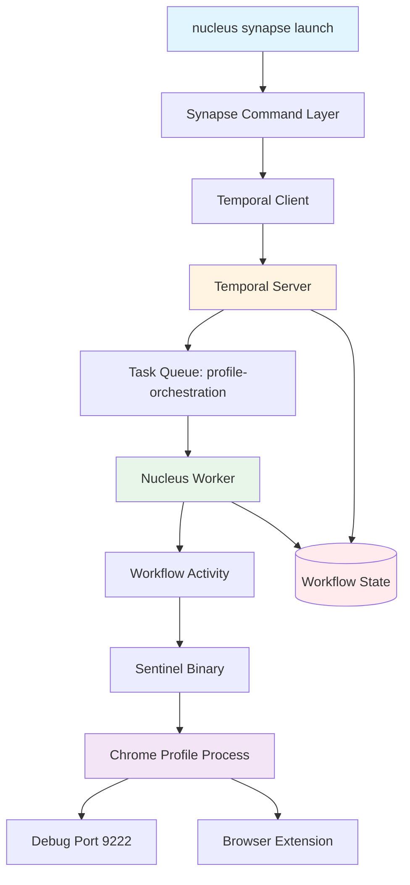

# NUCLEUS SYNAPSE USAGE GUIDE v3.0

## Resumen Ejecutivo

Synapse es la capa de orquestación de Nucleus que gestiona el ciclo de vida de perfiles de navegador mediante workflows de Temporal. Ejecuta operaciones complejas (seed, launch, shutdown) con retry automático, seguimiento de estado persistente y recuperación ante fallos.

**Arquitectura de Ejecución:**
```
Comando CLI → Synapse → Temporal Workflow → Worker → Sentinel → Chrome Profile
```

**Principio Fundamental:**  
Los perfiles son **actores con estado persistente** orquestados por Temporal. Cada perfil se mapea a un workflow de larga duración con `WorkflowID = profile_<uuid>` que maneja su ciclo de vida completo, incluyendo reintentos y recuperación ante crashes.

**🆕 Cambio Clave v3.0 (Post-Refactor Feb 2026):**  
Todas las Sentinel Activities fueron **unificadas** en `internal/orchestration/activities/sentinel_activities.go`, eliminando la dispersión anterior en múltiples archivos y simplificando el mantenimiento del código.

---

## Arquitectura del Sistema



---

## Prerequisitos y Dependencias

### 1. Temporal Server (OBLIGATORIO)

El servidor Temporal DEBE estar ejecutándose antes de cualquier operación Synapse.

**Comando seguro para automatización:**
```bash
nucleus temporal ensure
```

**NO usar para scripts/automation:**
```bash
# ❌ DEPRECADO - Modo interactivo, no apto para orquestación
nucleus temporal start
```

**Por qué `temporal ensure`:**
- Idempotente: puede ejecutarse múltiples veces sin efectos secundarios
- No interactivo: apto para scripts, systemd, supervisord
- Verifica estado: retorna éxito si ya está corriendo
- Timeout configurable: espera hasta que Temporal esté listo

**Verificación de estado:**
```bash
# Verificar que Temporal está respondiendo
curl -f http://localhost:7233/health || echo "Temporal no disponible"
```

---

### 2. Worker (OBLIGATORIO)

El Worker ejecuta las actividades de los workflows. **Sin Worker, los workflows se quedan en espera indefinida**.

**Iniciar Worker por defecto:**
```bash
nucleus worker start
```

**Iniciar Worker con cola específica (RECOMENDADO):**
```bash
nucleus worker start -q profile-orchestration
```

**Modo daemon/background:**
```bash
# Linux/macOS
nucleus worker start -q profile-orchestration &

# Windows (PowerShell)
Start-Process nucleus -ArgumentList "worker","start","-q","profile-orchestration" -WindowStyle Hidden
```

**Verificación de Worker:**
```bash
# Comprobar que el worker está registrado en Temporal
nucleus worker status

# O mediante logs
tail -f ~/.local/share/BloomNucleus/logs/orchestration/worker.log
```

---

## Secuencia de Boot Canónica (RUNBOOK)

### Modo de Producción (Completo)

```bash
# 1. Asegurar que Temporal está corriendo
nucleus temporal ensure

# 2. Iniciar Worker con cola específica
nucleus worker start -q profile-orchestration

# 3. Sembrar perfil (crear identidad persistente)
nucleus synapse seed my_profile_001 --master  # --master flag en v3.0

# 4. Lanzar perfil (iniciar Chrome + Sentinel)
nucleus synapse launch my_profile_001 --mode landing
```

### Atajos de Desarrollo

**Desarrollo rápido (todo en uno):**
```bash
nucleus dev-start
```
Equivalente a:
- `nucleus temporal ensure`
- `nucleus worker start`
- Configuración de desarrollo por defecto

**Modo servicio (systemd-friendly):**
```bash
nucleus service start
```
Equivalente a:
- `nucleus temporal ensure`
- `nucleus worker start -q profile-orchestration`
- Logging estructurado a archivo

---

## ⚠️ IMPORTANTE: Ubicación de Flags Globales

**Los flags `--json` y `--verbose` DEBEN ir después de `nucleus` y ANTES del comando:**

```bash
# ✅ CORRECTO
nucleus --json synapse seed alice
nucleus --verbose synapse launch profile_001
nucleus --json --verbose synapse status profile_123

# ❌ INCORRECTO
nucleus synapse seed alice --json
nucleus synapse launch profile_001 --verbose
```

**Por qué importa:**  
- `--json` y `--verbose` son flags **globales** de nucleus
- Los flags específicos de cada comando (como `--master`, `--mode`) sí van al final
- Esta es una diferencia crítica que puede romper scripts si se ignora

**Ejemplo combinado:**
```bash
# Flags globales ANTES + flags del comando DESPUÉS
nucleus --json synapse seed alice --master
nucleus --verbose synapse launch profile_001 --mode discovery
```

---

## Comandos Synapse

### `seed` - Crear Perfil Persistente

Crea un perfil como entidad persistente en Temporal. El perfil se convierte en un workflow de larga duración que puede ser reanudado después de reiniciar el sistema.

```bash
nucleus synapse seed <profile_alias> [--master]
```

**Parámetros:**
- `<profile_alias>`: Identificador único del perfil (ej: `my_profile_001`)
- `--master`: Flag opcional para crear perfil maestro (antes era parámetro posicional `true`)

**Ejemplos:**

```bash
# Crear perfil básico
nucleus synapse seed profile_alpha

# Crear perfil maestro (NUEVA SINTAXIS v3.0)
nucleus synapse seed profile_main --master

# Con JSON output (notar posición de --json)
nucleus --json synapse seed profile_beta
nucleus --json synapse seed profile_gamma --master
```

**Respuesta JSON (éxito):**
```json
{
  "success": true,
  "profile_id": "550e8400-e29b-41d4-a716-446655440000",
  "profile_alias": "profile_alpha",
  "workflow_id": "profile_550e8400-e29b-41d4-a716-446655440000",
  "is_master": false,
  "state": "SEEDED",
  "timestamp": 1707145200
}
```

**Respuesta JSON (error):**
```json
{
  "success": false,
  "error": "profile alias already exists",
  "timestamp": 1707145200
}
```

**Conceptos importantes:**
- Un perfil seeded persiste en Temporal incluso después de shutdown
- El `workflow_id` es único y permite recovery tras crashes
- Múltiples perfiles pueden existir simultáneamente
- `is_master` determina prioridad en recursos (futuro)

---

### `launch` - Iniciar Perfil

Lanza el navegador Chrome con el perfil especificado mediante Sentinel.

```bash
nucleus synapse launch <profile_id_or_alias> [--mode=landing|discovery]
```

**Flags disponibles:**
```
--mode <string>       Modo de lanzamiento: landing, discovery (default: landing)
```

**Ejemplos:**

```bash
# Lanzamiento básico
nucleus synapse launch profile_001

# Con modo específico
nucleus synapse launch profile_001 --mode discovery

# Con JSON output (notar posición de --json)
nucleus --json synapse launch profile_001 --mode landing
```

**Respuesta JSON (éxito):**
```json
{
  "success": true,
  "profile_id": "profile_001",
  "launch_id": "launch_profile_001_1707145200123456789",
  "workflow_id": "profile_550e8400-e29b-41d4-a716-446655440000",
  "chrome_pid": 12345,
  "debug_port": 9222,
  "extension_loaded": true,
  "sentinel_pid": 12344,
  "effective_config": {
    "mode": "landing",
    "headless": false,
    "user_data_dir": "/home/user/.local/share/BloomNucleus/profiles/profile_001",
    "debug_port": 9222
  },
  "state": "READY",
  "timestamp": 1707145200
}
```

**Respuesta JSON (error):**
```json
{
  "success": false,
  "profile_id": "profile_001",
  "launch_id": "launch_profile_001_1707145200123456789",
  "state": "FAILED",
  "error": "Chrome binary not found at expected path",
  "retry_count": 3,
  "timestamp": 1707145200
}
```

---

### `shutdown-all` - Detener Todos los Perfiles

Envía señal de shutdown a todos los workflows de perfil activos.

```bash
nucleus synapse shutdown-all
```

**Respuesta JSON:**
```json
{
  "success": true,
  "profiles_shutdown": 5,
  "profiles": [
    "profile_001",
    "profile_002",
    "profile_003",
    "profile_004",
    "profile_005"
  ],
  "timestamp": 1707145200
}
```

**Comportamiento:**
- Envía señal de terminación graceful a cada workflow
- Espera confirmación de Sentinel
- No fuerza kill de procesos (usar OS tools para forzar)
- Retorna después de señalización, no espera terminación completa

---

### `start-ollama` - Iniciar Servidor Ollama

Inicia el servidor Ollama como workflow de Temporal.

```bash
nucleus synapse start-ollama
```

**Respuesta JSON:**
```json
{
  "success": true,
  "ollama_pid": 23456,
  "api_url": "http://localhost:11434",
  "state": "RUNNING",
  "timestamp": 1707145200
}
```

---

### `vault-status` - Estado de Vault

Consulta el estado del sistema de gestión de credenciales.

```bash
nucleus synapse vault-status
```

**Respuesta JSON:**
```json
{
  "success": true,
  "vault_initialized": true,
  "vault_sealed": false,
  "profiles_with_credentials": 12,
  "timestamp": 1707145200
}
```

---

## Estados de Workflow

Los workflows de perfil transitan por los siguientes estados:

| Estado | Descripción | Siguiente Acción |
|--------|-------------|------------------|
| `IDLE` | Estado inicial, esperando señal | Ejecutar `launch` |
| `SEEDED` | Perfil creado, sin procesos activos | Ejecutar `launch` |
| `ONBOARDING` | Inicialización en progreso (Sentinel starting) | Esperar transición automática |
| `READY` | Chrome + Sentinel corriendo exitosamente | Perfil operativo |
| `DEGRADED` | Errores no críticos (extensión falló, heartbeat perdido) | Monitorear, posible recovery automático |
| `RECOVERING` | Intentando recuperación de error | Esperar o intervención manual |
| `FAILED` | Error crítico, requiere intervención | Revisar logs, ejecutar shutdown/relaunch |
| `SHUTDOWN` | Proceso de terminación en curso | Esperar finalización |
| `TERMINATED` | Workflow completado, perfil detenido | Puede relanzarse con `launch` |

**Diagrama de transiciones:**
```
IDLE → SEEDED (via seed)
SEEDED → ONBOARDING (via launch)
ONBOARDING → READY (éxito)
ONBOARDING → FAILED (error crítico)
READY → DEGRADED (error no crítico)
DEGRADED → RECOVERING (inicio recovery)
DEGRADED → READY (recovery automático)
RECOVERING → READY (éxito)
RECOVERING → FAILED (falló recovery)
* → SHUTDOWN (via shutdown)
SHUTDOWN → TERMINATED (completado)
```

---

## Integración por Tecnología

### Go

```go
package main

import (
    "context"
    "encoding/json"
    "fmt"
    "os/exec"
)

type SeedResult struct {
    Success      bool   `json:"success"`
    ProfileID    string `json:"profile_id"`
    ProfileAlias string `json:"profile_alias"`
    WorkflowID   string `json:"workflow_id"`
    IsMaster     bool   `json:"is_master"`
    State        string `json:"state"`
    Error        string `json:"error,omitempty"`
    Timestamp    int64  `json:"timestamp"`
}

type LaunchResult struct {
    Success         bool                   `json:"success"`
    ProfileID       string                 `json:"profile_id"`
    LaunchID        string                 `json:"launch_id,omitempty"`
    WorkflowID      string                 `json:"workflow_id"`
    ChromePID       int                    `json:"chrome_pid,omitempty"`
    DebugPort       int                    `json:"debug_port,omitempty"`
    ExtensionLoaded bool                   `json:"extension_loaded,omitempty"`
    SentinelPID     int                    `json:"sentinel_pid,omitempty"`
    EffectiveConfig map[string]interface{} `json:"effective_config,omitempty"`
    State           string                 `json:"state,omitempty"`
    Error           string                 `json:"error,omitempty"`
    RetryCount      int                    `json:"retry_count,omitempty"`
    Timestamp       int64                  `json:"timestamp"`
}

// SeedProfile crea un nuevo perfil persistente
func SeedProfile(ctx context.Context, alias string, isMaster bool) (*SeedResult, error) {
    // v3.0: --json va ANTES del comando, --master es flag no parámetro posicional
    args := []string{"--json", "synapse", "seed", alias}
    if isMaster {
        args = append(args, "--master")  // v3.0: flag en lugar de "true"
    }
    
    cmd := exec.CommandContext(ctx, "nucleus", args...)
    output, err := cmd.CombinedOutput()
    if err != nil {
        return nil, fmt.Errorf("seed failed: %w, output: %s", err, string(output))
    }
    
    var result SeedResult
    if err := json.Unmarshal(output, &result); err != nil {
        return nil, fmt.Errorf("invalid JSON response: %w", err)
    }
    
    if !result.Success {
        return &result, fmt.Errorf("seed failed: %s", result.Error)
    }
    
    return &result, nil
}

// LaunchProfile inicia un perfil previamente seeded
func LaunchProfile(ctx context.Context, profileID, mode string) (*LaunchResult, error) {
    // v3.0: --json va PRIMERO, solo --mode disponible
    cmd := exec.CommandContext(ctx, "nucleus", "--json", "synapse", "launch", profileID,
        "--mode", mode)
    
    output, err := cmd.CombinedOutput()
    if err != nil {
        return nil, fmt.Errorf("launch failed: %w, output: %s", err, string(output))
    }
    
    var result LaunchResult
    if err := json.Unmarshal(output, &result); err != nil {
        return nil, fmt.Errorf("invalid JSON response: %w", err)
    }
    
    if !result.Success {
        return &result, fmt.Errorf("launch failed: %s", result.Error)
    }
    
    return &result, nil
}

// Ejemplo de uso completo
func main() {
    ctx := context.Background()
    
    // 1. Seed profile
    seedResult, err := SeedProfile(ctx, "profile_alpha", false)
    if err != nil {
        log.Fatalf("Seed failed: %v", err)
    }
    fmt.Printf("Profile seeded: %s (workflow: %s)\n", 
        seedResult.ProfileID, seedResult.WorkflowID)
    
    // 2. Launch profile
    launchResult, err := LaunchProfile(ctx, seedResult.ProfileID, "landing")
    if err != nil {
        log.Fatalf("Launch failed: %v", err)
    }
    fmt.Printf("Chrome PID: %d, Debug Port: %d, State: %s\n", 
        launchResult.ChromePID, launchResult.DebugPort, launchResult.State)
}
```

---

### Electron/Node.js

```javascript
const { spawn } = require('child_process');
const { promisify } = require('util');

class NucleusSynapseClient {
  constructor(nucleusBinary = 'nucleus') {
    this.nucleusBinary = nucleusBinary;
  }

  /**
   * Ejecuta un comando de Synapse y retorna el resultado parseado
   */
  async executeCommand(args) {
    return new Promise((resolve, reject) => {
      const nucleus = spawn(this.nucleusBinary, ['--json', 'synapse', ...args]);
      let stdout = '';
      let stderr = '';
      
      nucleus.stdout.on('data', (data) => stdout += data.toString());
      nucleus.stderr.on('data', (data) => stderr += data.toString());
      
      nucleus.on('close', (code) => {
        if (code !== 0) {
          reject(new Error(`Command failed with code ${code}: ${stderr}`));
          return;
        }
        
        try {
          const result = JSON.parse(stdout);
          if (!result.success) {
            reject(new Error(result.error || 'Command failed'));
            return;
          }
          resolve(result);
        } catch (err) {
          reject(new Error(`Invalid JSON response: ${stdout}`));
        }
      });
      
      nucleus.on('error', (err) => {
        reject(new Error(`Failed to start nucleus: ${err.message}`));
      });
    });
  }

  /**
   * Crea un perfil persistente
   */
  async seedProfile(alias, isMaster = false) {
    // v3.0: --master es flag, no parámetro posicional
    const args = ['seed', alias];
    if (isMaster) {
      args.push('--master');  // v3.0: flag en lugar de 'true'
    }
    return this.executeCommand(args);
  }

  /**
   * Lanza un perfil
   */
  async launchProfile(profileId, options = {}) {
    // v3.0: solo --mode disponible
    const args = ['launch', profileId];
    
    if (options.mode) {
      args.push('--mode', options.mode);
    }
    
    return this.executeCommand(args);
  }

  /**
   * Detiene todos los perfiles
   */
  async shutdownAll() {
    return this.executeCommand(['shutdown-all']);
  }

  /**
   * Obtiene estado de Vault
   */
  async vaultStatus() {
    return this.executeCommand(['vault-status']);
  }
}

// Ejemplo de uso con async/await
async function main() {
  const client = new NucleusSynapseClient();
  
  try {
    // 1. Seed profile
    const seedResult = await client.seedProfile('profile_electron', false);
    console.log('Profile seeded:', seedResult.profile_id);
    console.log('Workflow ID:', seedResult.workflow_id);
    
    // 2. Launch profile
    const launchResult = await client.launchProfile(seedResult.profile_id, {
      mode: 'landing',
      email: 'electron@example.com',
      heartbeat: true
    });
    
    console.log('Chrome PID:', launchResult.chrome_pid);
    console.log('Debug port:', launchResult.debug_port);
    console.log('State:', launchResult.state);
    
    // 3. Conectar con Chrome DevTools Protocol
    const CDP = require('chrome-remote-interface');
    const client = await CDP({ port: launchResult.debug_port });
    // ... usar CDP para automatización
    
  } catch (error) {
    console.error('Error:', error.message);
    process.exit(1);
  }
}

// Ejemplo con callbacks (legacy)
const client = new NucleusSynapseClient();
client.seedProfile('profile_legacy', false)
  .then(seedResult => {
    return client.launchProfile(seedResult.profile_id, { mode: 'landing' });
  })
  .then(launchResult => {
    console.log('Launched with PID:', launchResult.chrome_pid);
  })
  .catch(err => {
    console.error('Error:', err.message);
  });
```

---

### Bash

```bash
#!/bin/bash

set -euo pipefail

# Colores para output
RED='\033[0;31m'
GREEN='\033[0;32m'
YELLOW='\033[1;33m'
NC='\033[0m' # No Color

log_info() {
    echo -e "${GREEN}[INFO]${NC} $1"
}

log_error() {
    echo -e "${RED}[ERROR]${NC} $1" >&2
}

log_warn() {
    echo -e "${YELLOW}[WARN]${NC} $1"
}

# Verificar que Temporal está corriendo
ensure_temporal() {
    log_info "Ensuring Temporal is running..."
    if ! nucleus temporal ensure; then
        log_error "Failed to start Temporal server"
        return 1
    fi
    log_info "Temporal is ready"
}

# Verificar que Worker está corriendo
ensure_worker() {
    log_info "Checking worker status..."
    if ! pgrep -f "nucleus worker" > /dev/null; then
        log_warn "Worker not running, starting..."
        nucleus worker start -q profile-orchestration &
        sleep 2
    fi
    log_info "Worker is running"
}

# Seed profile
seed_profile() {
    local alias=$1
    local is_master=${2:-false}
    
    log_info "Seeding profile: $alias (master: $is_master)"
    
    local result
    # v3.0: --master como flag, no parámetro posicional
    if [ "$is_master" = "true" ]; then
        result=$(nucleus --json synapse seed "$alias" --master 2>&1)
    else
        result=$(nucleus --json synapse seed "$alias" 2>&1)
    fi
    
    if [ $? -eq 0 ]; then
        local profile_id
        profile_id=$(echo "$result" | jq -r '.profile_id')
        local workflow_id
        workflow_id=$(echo "$result" | jq -r '.workflow_id')
        
        log_info "Profile seeded successfully"
        log_info "  Profile ID: $profile_id"
        log_info "  Workflow ID: $workflow_id"
        
        echo "$profile_id"
        return 0
    else
        log_error "Failed to seed profile"
        echo "$result" | jq . >&2
        return 1
    fi
}

# Launch profile
launch_profile() {
    local profile_id=$1
    local mode=${2:-landing}
    
    log_info "Launching profile: $profile_id (mode: $mode)"
    
    # v3.0: solo --mode disponible
    local args=(--json synapse launch "$profile_id" --mode "$mode")
    
    local result
    result=$(nucleus "${args[@]}" 2>&1)
    
    if [ $? -eq 0 ]; then
        local chrome_pid
        chrome_pid=$(echo "$result" | jq -r '.chrome_pid')
        local debug_port
        debug_port=$(echo "$result" | jq -r '.debug_port')
        local state
        state=$(echo "$result" | jq -r '.state')
        
        log_info "Profile launched successfully"
        log_info "  Chrome PID: $chrome_pid"
        log_info "  Debug Port: $debug_port"
        log_info "  State: $state"
        
        echo "$result"
        return 0
    else
        log_error "Failed to launch profile"
        echo "$result" | jq . >&2
        return 1
    fi
}

# Shutdown all profiles
shutdown_all() {
    log_info "Shutting down all profiles..."
    
    local result
    result=$(nucleus --json synapse shutdown-all 2>&1)
    
    if [ $? -eq 0 ]; then
        local count
        count=$(echo "$result" | jq -r '.profiles_shutdown')
        log_info "Shutdown signal sent to $count profiles"
        echo "$result" | jq -r '.profiles[]' | while read -r profile; do
            log_info "  - $profile"
        done
        return 0
    else
        log_error "Failed to shutdown profiles"
        echo "$result" >&2
        return 1
    fi
}

# Workflow completo de ejemplo
run_full_workflow() {
    local profile_alias=$1
    
    log_info "=== Starting Full Workflow ==="
    
    # 1. Ensure prerequisites
    ensure_temporal || exit 1
    ensure_worker || exit 1
    
    # 2. Seed profile
    local profile_id
    profile_id=$(seed_profile "$profile_alias" false) || exit 1
    
    # 3. Launch profile
    launch_profile "$profile_id" "landing" || exit 1
    
    log_info "=== Workflow Completed Successfully ==="
}

# Parse command line arguments
case "${1:-}" in
    seed)
        seed_profile "${2:-profile_default}" "${3:-false}"
        ;;
    launch)
        launch_profile "${2:-}" "${3:-landing}" "${4:-}"
        ;;
    shutdown)
        shutdown_all
        ;;
    full)
        run_full_workflow "${2:-profile_test}"
        ;;
    *)
        echo "Usage: $0 {seed|launch|shutdown|full} [args...]"
        echo ""
        echo "Commands:"
        echo "  seed <alias> [is_master]     - Seed a new profile"
        echo "  launch <profile_id> [mode] [email] - Launch a profile"
        echo "  shutdown                     - Shutdown all profiles"
        echo "  full <alias>                 - Run complete workflow"
        exit 1
        ;;
esac
```

---

### PowerShell

```powershell
# Nucleus Synapse PowerShell Module

$ErrorActionPreference = "Stop"

function Write-ColorOutput {
    param(
        [string]$Message,
        [string]$Level = "Info"
    )
    
    $color = switch ($Level) {
        "Info" { "Green" }
        "Warn" { "Yellow" }
        "Error" { "Red" }
        default { "White" }
    }
    
    Write-Host "[$Level] $Message" -ForegroundColor $color
}

function Invoke-NucleusCommand {
    param(
        [string[]]$Arguments
    )
    
    $allArgs = @("--json", "synapse") + $Arguments
    $result = & nucleus $allArgs 2>&1 | Out-String
    
    if ($LASTEXITCODE -ne 0) {
        throw "Nucleus command failed: $result"
    }
    
    try {
        $parsed = $result | ConvertFrom-Json
        if (-not $parsed.success) {
            throw "Command failed: $($parsed.error)"
        }
        return $parsed
    } catch {
        throw "Invalid JSON response: $result"
    }
}

function Ensure-Temporal {
    Write-ColorOutput "Ensuring Temporal server is running..." "Info"
    
    try {
        & nucleus temporal ensure
        if ($LASTEXITCODE -eq 0) {
            Write-ColorOutput "Temporal is ready" "Info"
            return $true
        }
    } catch {
        Write-ColorOutput "Failed to start Temporal: $_" "Error"
        return $false
    }
}

function Ensure-Worker {
    Write-ColorOutput "Checking worker status..." "Info"
    
    $workerProcess = Get-Process -Name "nucleus" -ErrorAction SilentlyContinue | 
        Where-Object { $_.CommandLine -like "*worker start*" }
    
    if (-not $workerProcess) {
        Write-ColorOutput "Worker not running, starting..." "Warn"
        Start-Process nucleus -ArgumentList "worker","start","-q","profile-orchestration" -WindowStyle Hidden
        Start-Sleep -Seconds 2
    }
    
    Write-ColorOutput "Worker is running" "Info"
}

function New-NucleusProfile {
    param(
        [Parameter(Mandatory=$true)]
        [string]$Alias,
        
        [bool]$IsMaster = $false
    )
    
    Write-ColorOutput "Seeding profile: $Alias (master: $IsMaster)" "Info"
    
    # v3.0: --master es flag, no parámetro posicional
    $args = @("seed", $Alias)
    if ($IsMaster) {
        $args += "--master"  # v3.0: flag en lugar de "true"
    }
    
    try {
        $result = Invoke-NucleusCommand -Arguments $args
        
        Write-ColorOutput "Profile seeded successfully" "Info"
        Write-ColorOutput "  Profile ID: $($result.profile_id)" "Info"
        Write-ColorOutput "  Workflow ID: $($result.workflow_id)" "Info"
        
        return $result
    } catch {
        Write-ColorOutput "Failed to seed profile: $_" "Error"
        throw
    }
}

function Start-NucleusProfile {
    param(
        [Parameter(Mandatory=$true)]
        [string]$ProfileId,
        
        [string]$Mode = "landing"
    )
    
    Write-ColorOutput "Launching profile: $ProfileId (mode: $Mode)" "Info"
    
    # v3.0: solo --mode disponible
    $args = @("launch", $ProfileId, "--mode", $Mode)
    
    try {
        $result = Invoke-NucleusCommand -Arguments $args
        
        Write-ColorOutput "Profile launched successfully" "Info"
        Write-ColorOutput "  Chrome PID: $($result.chrome_pid)" "Info"
        Write-ColorOutput "  Debug Port: $($result.debug_port)" "Info"
        Write-ColorOutput "  State: $($result.state)" "Info"
        
        return $result
    } catch {
        Write-ColorOutput "Failed to launch profile: $_" "Error"
        throw
    }
}

function Stop-AllNucleusProfiles {
    Write-ColorOutput "Shutting down all profiles..." "Info"
    
    try {
        $result = Invoke-NucleusCommand -Arguments @("shutdown-all")
        
        Write-ColorOutput "Shutdown signal sent to $($result.profiles_shutdown) profiles" "Info"
        foreach ($profile in $result.profiles) {
            Write-ColorOutput "  - $profile" "Info"
        }
        
        return $result
    } catch {
        Write-ColorOutput "Failed to shutdown profiles: $_" "Error"
        throw
    }
}

function Get-NucleusVaultStatus {
    Write-ColorOutput "Checking Vault status..." "Info"
    
    try {
        $result = Invoke-NucleusCommand -Arguments @("vault-status")
        
        Write-ColorOutput "Vault Status:" "Info"
        Write-ColorOutput "  Initialized: $($result.vault_initialized)" "Info"
        Write-ColorOutput "  Sealed: $($result.vault_sealed)" "Info"
        Write-ColorOutput "  Profiles with credentials: $($result.profiles_with_credentials)" "Info"
        
        return $result
    } catch {
        Write-ColorOutput "Failed to get Vault status: $_" "Error"
        throw
    }
}

function Start-NucleusFullWorkflow {
    param(
        [Parameter(Mandatory=$true)]
        [string]$ProfileAlias,
        
        [string]$Email = "user@example.com"
    )
    
    Write-ColorOutput "=== Starting Full Workflow ===" "Info"
    
    try {
        # 1. Ensure prerequisites
        if (-not (Ensure-Temporal)) {
            throw "Failed to ensure Temporal"
        }
        Ensure-Worker
        
        # 2. Seed profile
        $seedResult = New-NucleusProfile -Alias $ProfileAlias
        
        # 3. Launch profile
        $launchResult = Start-NucleusProfile -ProfileId $seedResult.profile_id -Email $Email
        
        Write-ColorOutput "=== Workflow Completed Successfully ===" "Info"
        
        return @{
            SeedResult = $seedResult
            LaunchResult = $launchResult
        }
    } catch {
        Write-ColorOutput "Workflow failed: $_" "Error"
        throw
    }
}

# Exportar funciones
Export-ModuleMember -Function @(
    'Invoke-NucleusCommand',
    'Ensure-Temporal',
    'Ensure-Worker',
    'New-NucleusProfile',
    'Start-NucleusProfile',
    'Stop-AllNucleusProfiles',
    'Get-NucleusVaultStatus',
    'Start-NucleusFullWorkflow'
)

# Ejemplo de uso:
# Import-Module .\NucleusSynapse.psm1
# Start-NucleusFullWorkflow -ProfileAlias "my_profile" -Email "test@example.com"
```

---

## Troubleshooting Guide

### Problema: "Connection refused" al ejecutar Synapse

**Síntoma:**
```json
{
  "success": false,
  "error": "failed to create temporal client: connection refused"
}
```

**Causa:**  
El servidor Temporal no está ejecutándose.

**Solución:**
```bash
# Iniciar Temporal con comando idempotente
nucleus temporal ensure

# Verificar que está respondiendo
curl -f http://localhost:7233/health
```

---

### Problema: "Workflow execution timeout"

**Síntoma:**
```bash
# El comando se queda esperando indefinidamente
nucleus synapse launch profile_001
# ... (sin respuesta después de 30+ segundos)
```

**Causa:**  
El Worker no está ejecutándose. Los workflows se quedan en cola esperando a que un Worker los procese.

**Solución:**
```bash
# Verificar si hay Workers activos
nucleus worker status

# Si no hay Workers, iniciar uno
nucleus worker start -q profile-orchestration

# En otra terminal, reintentar el comando
nucleus synapse launch profile_001
```

**Diagnóstico avanzado:**
```bash
# Ver logs del Worker
tail -f ~/.local/share/BloomNucleus/logs/orchestration/worker.log

# Ver logs de Temporal
tail -f ~/.local/share/BloomNucleus/logs/temporal/temporal.log
```

---

### Problema: "Profile not found"

**Síntoma:**
```json
{
  "success": false,
  "error": "profile not found: profile_001"
}
```

**Causa:**  
El perfil no ha sido seeded todavía.

**Solución:**
```bash
# Primero seed el perfil
nucleus synapse seed profile_001

# Luego launch
nucleus synapse launch profile_001
```

---

### Problema: "Task queue mismatch"

**Síntoma:**
Los workflows no se ejecutan, pero Temporal y Worker están corriendo.

**Causa:**  
El Worker está escuchando en una task queue diferente a la que usa Synapse.

**Solución:**
```bash
# Asegurarse de usar la cola correcta
nucleus worker start -q profile-orchestration

# Verificar en logs que la cola coincide
grep "task_queue" ~/.local/share/BloomNucleus/logs/orchestration/worker.log
```

**Configuración correcta:**
- Worker debe usar: `profile-orchestration`
- Synapse workflows usan: `profile-orchestration` (por defecto)

---

### Problema: "Sentinel binary not found"

**Síntoma:**
```json
{
  "success": false,
  "error": "sentinel binary not found at: /usr/local/bin/sentinel"
}
```

**Causa:**  
La ruta al binario Sentinel no está configurada o no existe.

**Solución:**
```bash
# Configurar ruta a Sentinel en worker config
# Editar: ~/.config/BloomNucleus/worker-config.yaml
sentinel_path: "/opt/bloom/sentinel"

# O mediante variable de entorno
export NUCLEUS_SENTINEL_PATH="/opt/bloom/sentinel"

# Reiniciar Worker
pkill -f "nucleus worker"
nucleus worker start -q profile-orchestration
```

---

### Problema: Chrome no inicia (PID = 0)

**Síntoma:**
```json
{
  "success": false,
  "chrome_pid": 0,
  "state": "FAILED",
  "error": "chrome process failed to start"
}
```

**Causas comunes:**
1. Chrome no instalado o no en PATH
2. Permisos insuficientes
3. Display no disponible (Linux headless)

**Solución:**

```bash
# Verificar que Chrome está instalado
which google-chrome || which chromium

# Linux headless: instalar xvfb
sudo apt-get install xvfb
export DISPLAY=:99
Xvfb :99 -screen 0 1920x1080x24 &

# O usar modo headless
nucleus synapse launch profile_001 --mode headless

# Verificar permisos de directorio de perfiles
ls -la ~/.local/share/BloomNucleus/profiles/
```

---

### Problema: Extension no carga

**Síntoma:**
```json
{
  "success": true,
  "extension_loaded": false,
  "state": "DEGRADED"
}
```

**Causa:**  
La extensión no está en la ruta especificada o tiene errores de carga.

**Solución:**
```bash
# Verificar que la extensión existe
ls -la /path/to/extension/manifest.json

# Ver logs de Chrome para detalles
tail -f ~/.local/share/BloomNucleus/profiles/profile_001/chrome_debug.log

# Probar sin extensión primero
nucleus synapse launch profile_001  # sin --extension flag
```

---

### Problema: Heartbeat lost (estado DEGRADED)

**Síntoma:**
El perfil entra en estado `DEGRADED` con mensaje "heartbeat lost".

**Causa:**  
Sentinel no está enviando heartbeats o la conexión se perdió.

**Diagnóstico:**
```bash
# Ver si Sentinel está corriendo
ps aux | grep sentinel

# Ver logs de Sentinel
tail -f ~/.local/share/BloomNucleus/logs/sentinel/profile_001.log

# Ver métricas de heartbeat
grep "heartbeat" ~/.local/share/BloomNucleus/logs/orchestration/telemetry.json | tail -20
```

**Recovery automático:**  
Temporal reintentará reconectar automáticamente. Si no se recupera en 5 minutos:

```bash
# Forzar shutdown y relaunch
nucleus synapse shutdown-all
sleep 5
nucleus synapse launch profile_001 --heartbeat
```

---

### Problema: Múltiples Workers interfieren

**Síntoma:**  
Workflows se ejecutan de forma inconsistente o múltiples veces.

**Causa:**  
Múltiples instancias del Worker compitiendo por las mismas tareas.

**Solución:**
```bash
# Detener TODOS los Workers
pkill -f "nucleus worker"

# Verificar que no queden procesos
pgrep -f "nucleus worker"

# Iniciar solo UNA instancia
nucleus worker start -q profile-orchestration

# Opcionalmente, usar systemd para control
sudo systemctl start nucleus-worker
```

---

## 🆕 Estructura de Archivos Post-Refactor (v3.0)

### Cambio Clave: Unificación de Sentinel Activities

**Antes del refactor (v2.0 y anteriores):**
```
internal/orchestration/
├── activities/
│   ├── launch_sentinel.go      # Disperso
│   ├── monitor_sentinel.go     # Disperso
│   ├── shutdown_sentinel.go    # Disperso
│   └── status_sentinel.go      # Disperso
```

**Después del refactor (v3.0 - Febrero 2026):**
```
internal/orchestration/
└── activities/
    └── sentinel_activities.go     # ✅ TODO unificado aquí
```

**Activities disponibles en el archivo unificado:**
- `LaunchSentinel`: Inicia Chrome con extensión cargada
- `MonitorSentinel`: Supervisa el proceso y heartbeat
- `ShutdownSentinel`: Cierra Chrome de forma limpia
- `GetSentinelStatus`: Query de estado actual

**Beneficios de la unificación:**
- ✅ Una única fuente de verdad para todas las Sentinel Activities
- ✅ Más fácil de mantener y actualizar
- ✅ Reduce la duplicación de código
- ✅ Simplifica el debugging y testing
- ✅ Mejor cohesión lógica

### Estructura Completa Actualizada

```
nucleus/
├── internal/
│   ├── orchestration/
│   │   ├── activities/
│   │   │   └── sentinel_activities.go        # ✅ Activities unificadas
│   │   ├── commands/
│   │   │   └── synapse.go                    # Comandos CLI
│   │   ├── queries/
│   │   │   └── status.go
│   │   ├── signals/
│   │   │   ├── brain_events.go
│   │   │   └── system_events.go
│   │   ├── temporal/
│   │   │   ├── bootstrap/
│   │   │   │   ├── ensure.go              # ✅ Comando ensure
│   │   │   │   ├── cleanup.go
│   │   │   │   ├── diagnostics.go
│   │   │   │   └── ... (otros helpers)
│   │   │   ├── temporal_client.go
│   │   │   ├── worker.go
│   │   │   └── workflows/
│   │   │       ├── profile_lifecycle.go
│   │   │       └── system_workflows.go
│   │   ├── types/
│   │   │   └── orchestration.go
│   │   └── workflows/
│   │       ├── recovery_flow.go
│   │       └── system_gate.go
│   ├── synapse/
│   │   └── synapse_commands.go            # ✅ CLI synapse
│   ├── supervisor/
│   │   ├── dev_start.go
│   │   ├── health.go
│   │   ├── service.go
│   │   └── supervisor.go
│   ├── core/
│   │   ├── build_info.go
│   │   ├── core.go
│   │   ├── logger.go
│   │   └── ... (otros core files)
│   ├── governance/
│   │   ├── alfred.go
│   │   ├── ollama_client.go
│   │   └── ... (otros governance files)
│   └── vault/
│       └── vault.go
└── main.go
```

### Ubicación de Archivos Clave

| Componente | Ubicación | Descripción |
|------------|-----------|-------------|
| **Sentinel Activities** | `internal/orchestration/activities/sentinel_activities.go` | Todas las activities unificadas |
| **Synapse Commands** | `internal/synapse/synapse_commands.go` | CLI commands (seed, launch, etc.) |
| **Temporal Ensure** | `internal/orchestration/temporal/bootstrap/ensure.go` | Comando idempotente para asegurar Temporal |
| **Profile Lifecycle** | `internal/orchestration/temporal/workflows/profile_lifecycle.go` | Workflow principal de perfiles |
| **Temporal Client** | `internal/orchestration/temporal/temporal_client.go` | Cliente para interactuar con Temporal |

---

## Performance y Métricas

### Tiempos típicos de operación

| Operación | Tiempo esperado | Timeout |
|-----------|----------------|---------|
| `temporal ensure` | 2-5 segundos | 30 segundos |
| `worker start` | 1-2 segundos | 10 segundos |
| `synapse seed` | 0.5-1 segundo | 5 segundos |
| `synapse launch` (cold start) | 8-15 segundos | 60 segundos |
| `synapse launch` (warm start) | 3-5 segundos | 30 segundos |
| `synapse shutdown-all` | 2-5 segundos | 30 segundos |

### Límites del sistema

- **Workflows concurrentes**: 1000+ (limitado por Temporal config)
- **Perfiles por Worker**: 50-100 (depende de recursos)
- **Retry automático**: 3 intentos con backoff exponencial (2s, 4s, 8s)
- **Workflow timeout**: 30 minutos (configurable)
- **Activity timeout**: 5 minutos (configurable)
- **Heartbeat interval**: 10 segundos

### Monitoring

**Telemetría en tiempo real:**
```bash
# Ver eventos de telemetría
tail -f ~/.local/share/BloomNucleus/logs/orchestration/telemetry.json | jq .

# Filtrar solo eventos de launch
tail -f ~/.local/share/BloomNucleus/logs/orchestration/telemetry.json | jq 'select(.event == "launch")'
```

**Métricas de Temporal:**
```bash
# UI de Temporal (si está habilitado)
open http://localhost:8233

# Métricas vía API
curl http://localhost:7233/metrics
```

---

## Creación de Nuevos Comandos Synapse

### 1. Definir Command en CLI Layer

**Archivo:** `cmd/synapse/my_command.go`

```go
package synapse

import (
    "encoding/json"
    "fmt"
    "github.com/spf13/cobra"
    "nucleus/internal/core"
    "nucleus/internal/orchestration/temporal"
)

type MyCommandResult struct {
    Success   bool   `json:"success"`
    Message   string `json:"message"`
    Data      string `json:"data,omitempty"`
    Error     string `json:"error,omitempty"`
    Timestamp int64  `json:"timestamp"`
}

func newMyCommand(c *core.Core) *cobra.Command {
    cmd := &cobra.Command{
        Use:   "mycommand <arg1> [arg2]",
        Short: "Description of what this command does",
        Long: `Longer description with examples:

  nucleus synapse mycommand value1
  nucleus synapse mycommand value1 value2 --flag`,
        Args: cobra.MinimumNArgs(1),
        RunE: func(cmd *cobra.Command, args []string) error {
            // Parse flags
            flagValue, _ := cmd.Flags().GetString("my-flag")
            
            // Execute Temporal workflow
            result, err := executeMyWorkflow(c, args[0], flagValue)
            if err != nil {
                if c.IsJSON {
                    errResult := &MyCommandResult{
                        Success:   false,
                        Error:     err.Error(),
                        Timestamp: time.Now().Unix(),
                    }
                    output, _ := json.Marshal(errResult)
                    fmt.Println(string(output))
                    return nil  // Don't double-print error
                }
                return err
            }
            
            // Output result
            if c.IsJSON {
                output, _ := json.Marshal(result)
                fmt.Println(string(output))
            } else {
                fmt.Printf("Success: %s\n", result.Message)
            }
            
            return nil
        },
    }
    
    // Add flags
    cmd.Flags().String("my-flag", "default", "Description of flag")
    
    return cmd
}
```

### 2. Registrar Command

**Archivo:** `cmd/synapse/synapse.go`

```go
func NewSynapseCommand(c *core.Core) *cobra.Command {
    cmd := &cobra.Command{
        Use:   "synapse",
        Short: "Temporal workflow orchestration",
    }
    
    cmd.AddCommand(newLaunchCommand(c))
    cmd.AddCommand(newSeedCommand(c))
    cmd.AddCommand(newMyCommand(c))  // ← Añadir aquí
    
    return cmd
}
```

### 3. Definir Workflow de Temporal

**Archivo:** `internal/orchestration/temporal/workflows/my_workflow.go`

```go
package workflows

import (
    "time"
    "go.temporal.io/sdk/workflow"
)

type MyWorkflowInput struct {
    Arg1      string
    FlagValue string
}

type MyWorkflowResult struct {
    Success   bool
    Message   string
    Data      string
    Timestamp int64
}

func MyWorkflow(ctx workflow.Context, input MyWorkflowInput) (*MyWorkflowResult, error) {
    // Configurar opciones de activity
    activityOptions := workflow.ActivityOptions{
        StartToCloseTimeout: 5 * time.Minute,
        RetryPolicy: &temporal.RetryPolicy{
            MaximumAttempts: 3,
            InitialInterval: 2 * time.Second,
            BackoffCoefficient: 2.0,
        },
    }
    ctx = workflow.WithActivityOptions(ctx, activityOptions)
    
    // Ejecutar activity
    var activityResult string
    err := workflow.ExecuteActivity(ctx, MyActivity, input).Get(ctx, &activityResult)
    if err != nil {
        return &MyWorkflowResult{
            Success: false,
            Message: "Activity failed",
        }, err
    }
    
    // Retornar resultado
    return &MyWorkflowResult{
        Success:   true,
        Message:   "Operation completed",
        Data:      activityResult,
        Timestamp: workflow.Now(ctx).Unix(),
    }, nil
}
```

### 4. Definir Activity

**Archivo:** `internal/orchestration/temporal/activities/my_activity.go`

```go
package activities

import (
    "context"
    "nucleus/internal/orchestration/temporal/workflows"
)

type MyActivities struct {
    // Dependencies inyectadas
}

func (a *MyActivities) MyActivity(ctx context.Context, input workflows.MyWorkflowInput) (string, error) {
    // Lógica de negocio
    // Puede llamar a Sentinel, interactuar con Chrome, etc.
    
    result := performOperation(input.Arg1, input.FlagValue)
    return result, nil
}

func performOperation(arg1, flagValue string) string {
    // Implementación
    return "operation result"
}
```

### 5. Registrar Workflow y Activity en Worker

**Archivo:** `internal/orchestration/temporal/worker.go`

```go
func (w *Worker) Start(ctx context.Context) error {
    // ... código existente ...
    
    // Registrar workflows
    w.worker.RegisterWorkflow(workflows.LaunchWorkflow)
    w.worker.RegisterWorkflow(workflows.SeedWorkflow)
    w.worker.RegisterWorkflow(workflows.MyWorkflow)  // ← Añadir
    
    // Registrar activities
    activities := &activities.MyActivities{}
    w.worker.RegisterActivity(activities.MyActivity)  // ← Añadir
    
    // ... resto del código ...
}
```

### 6. Crear Client Helper

**Archivo:** `internal/orchestration/temporal/client.go`

```go
func (c *Client) ExecuteMyWorkflow(
    ctx context.Context,
    arg1, flagValue string,
) (*workflows.MyWorkflowResult, error) {
    workflowOptions := client.StartWorkflowOptions{
        ID:        fmt.Sprintf("my_workflow_%s_%d", arg1, time.Now().Unix()),
        TaskQueue: c.config.TaskQueue,
    }
    
    input := workflows.MyWorkflowInput{
        Arg1:      arg1,
        FlagValue: flagValue,
    }
    
    we, err := c.client.ExecuteWorkflow(ctx, workflowOptions, workflows.MyWorkflow, input)
    if err != nil {
        return nil, fmt.Errorf("failed to start workflow: %w", err)
    }
    
    var result workflows.MyWorkflowResult
    if err := we.Get(ctx, &result); err != nil {
        return nil, fmt.Errorf("workflow execution failed: %w", err)
    }
    
    return &result, nil
}
```

### 7. Testing

```bash
# 1. Asegurar prerequisites
nucleus temporal ensure
nucleus worker start -q profile-orchestration

# 2. Probar comando
nucleus --json synapse mycommand test_value --my-flag custom_value

# 3. Verificar output
{
  "success": true,
  "message": "Operation completed",
  "data": "operation result",
  "timestamp": 1707145200
}

# 4. Ver logs
tail -f ~/.local/share/BloomNucleus/logs/orchestration/worker.log
```

---

## Arquitectura de Perfiles como Actores

### Modelo Conceptual

Cada perfil es un **actor con estado persistente** representado por un Temporal Workflow de larga duración:

```
Profile = Long-Running Workflow
  ├─ WorkflowID: profile_<uuid>
  ├─ Estado persistente en Temporal
  ├─ Puede recibir señales (launch, shutdown, update)
  ├─ Se recupera automáticamente tras crashes
  └─ Mantiene historia completa de eventos
```

### Lifecycle de un Profile Actor

```
1. SEED → Crear workflow persistente (indefinido)
2. SIGNAL:launch → Transición a ONBOARDING
3. Activity:StartSentinel → Iniciar Chrome
4. Heartbeat monitoring → Mantener estado READY
5. SIGNAL:shutdown → Transición a SHUTDOWN
6. Activity:StopSentinel → Terminar Chrome
7. Workflow termina → Estado TERMINATED
```

### Ventajas del Modelo

- **Persistencia:** El estado sobrevive a reinicios del sistema
- **Recovery:** Temporal reintenta actividades fallidas automáticamente
- **Observabilidad:** Historia completa de eventos en Temporal UI
- **Escalabilidad:** Miles de perfiles pueden coexistir
- **Orchestration:** Lógica compleja de coordinación en un solo lugar

### Ejemplo de Workflow de Profile Actor

```go
func ProfileActorWorkflow(ctx workflow.Context, profileID string) error {
    // Estado inicial
    state := "SEEDED"
    
    // Selector para manejar señales
    selector := workflow.NewSelector(ctx)
    
    // Channel para recibir señales de launch
    launchChan := workflow.GetSignalChannel(ctx, "launch")
    selector.AddReceive(launchChan, func(c workflow.ReceiveChannel, more bool) {
        var launchConfig LaunchConfig
        c.Receive(ctx, &launchConfig)
        
        // Ejecutar launch activity
        state = "ONBOARDING"
        err := workflow.ExecuteActivity(ctx, StartSentinelActivity, launchConfig).Get(ctx, nil)
        if err != nil {
            state = "FAILED"
        } else {
            state = "READY"
        }
    })
    
    // Channel para recibir señales de shutdown
    shutdownChan := workflow.GetSignalChannel(ctx, "shutdown")
    selector.AddReceive(shutdownChan, func(c workflow.ReceiveChannel, more bool) {
        c.Receive(ctx, nil)
        
        state = "SHUTDOWN"
        workflow.ExecuteActivity(ctx, StopSentinelActivity, profileID).Get(ctx, nil)
        // Workflow terminará
    })
    
    // Event loop - esperar señales indefinidamente
    for {
        selector.Select(ctx)
        
        if state == "SHUTDOWN" {
            break
        }
    }
    
    return nil
}
```

---

## Configuración Avanzada

### Variables de Entorno

```bash
# Temporal
export TEMPORAL_HOST="localhost:7233"
export TEMPORAL_NAMESPACE="default"

# Worker
export NUCLEUS_WORKER_TASK_QUEUE="profile-orchestration"
export NUCLEUS_WORKER_MAX_CONCURRENT=10

# Sentinel
export NUCLEUS_SENTINEL_PATH="/opt/bloom/sentinel"
export NUCLEUS_SENTINEL_TIMEOUT="60s"

# Chrome
export NUCLEUS_CHROME_PATH="/usr/bin/google-chrome"
export NUCLEUS_CHROME_DEBUG_PORT="9222"

# Logging
export NUCLEUS_LOG_LEVEL="info"  # debug, info, warn, error
export NUCLEUS_LOG_FORMAT="json"  # json, text
```

### Archivo de Configuración

**Ubicación:** `~/.config/BloomNucleus/nucleus.yaml`

```yaml
temporal:
  host: "localhost:7233"
  namespace: "default"
  
worker:
  task_queue: "profile-orchestration"
  max_concurrent_activities: 10
  max_concurrent_workflows: 100
  
sentinel:
  binary_path: "/opt/bloom/sentinel"
  timeout: "60s"
  retry_attempts: 3
  
chrome:
  binary_path: "/usr/bin/google-chrome"
  debug_port: 9222
  user_data_base: "~/.local/share/BloomNucleus/profiles"
  
logging:
  level: "info"
  format: "json"
  output: "~/.local/share/BloomNucleus/logs"
```

---

## Deployment en Producción

### Systemd Service (Linux)

**Archivo:** `/etc/systemd/system/nucleus-worker.service`

```ini
[Unit]
Description=Nucleus Worker Service
After=network.target

[Service]
Type=simple
User=nucleus
Group=nucleus
WorkingDirectory=/opt/bloom/nucleus
ExecStart=/usr/local/bin/nucleus worker start -q profile-orchestration
Restart=always
RestartSec=10
StandardOutput=journal
StandardError=journal

[Install]
WantedBy=multi-user.target
```

**Comandos:**
```bash
sudo systemctl daemon-reload
sudo systemctl enable nucleus-worker
sudo systemctl start nucleus-worker
sudo systemctl status nucleus-worker
```

---

### Docker Compose

```yaml
version: '3.8'

services:
  temporal:
    image: temporalio/auto-setup:latest
    ports:
      - "7233:7233"
      - "8233:8233"
    environment:
      - DB=postgresql
      - POSTGRES_SEEDS=postgres
    depends_on:
      - postgres
    
  postgres:
    image: postgres:13
    environment:
      - POSTGRES_PASSWORD=temporal
      - POSTGRES_USER=temporal
    volumes:
      - temporal-data:/var/lib/postgresql/data
  
  nucleus-worker:
    build: .
    depends_on:
      - temporal
    environment:
      - TEMPORAL_HOST=temporal:7233
      - NUCLEUS_WORKER_TASK_QUEUE=profile-orchestration
    command: ["nucleus", "worker", "start", "-q", "profile-orchestration"]
    volumes:
      - ./profiles:/root/.local/share/BloomNucleus/profiles

volumes:
  temporal-data:
```

---

## Logs y Debugging

### Ubicación de Logs

**Linux:**
```
~/.local/share/BloomNucleus/logs/
├── orchestration/
│   ├── worker.log
│   ├── temporal.log
│   └── telemetry.json
├── sentinel/
│   └── profile_*.log
└── chrome/
    └── profile_*/
        └── chrome_debug.log
```

**Windows:**
```
%LOCALAPPDATA%\BloomNucleus\logs\
├── orchestration\
│   ├── worker.log
│   ├── temporal.log
│   └── telemetry.json
├── sentinel\
│   └── profile_*.log
└── chrome\
    └── profile_*\
        └── chrome_debug.log
```

### Habilitar Debug Logging

```bash
# Mediante variable de entorno
export NUCLEUS_LOG_LEVEL=debug
nucleus worker start

# Mediante config file
# En ~/.config/BloomNucleus/nucleus.yaml
logging:
  level: debug
```

### Ver Logs en Tiempo Real

```bash
# Worker logs
tail -f ~/.local/share/BloomNucleus/logs/orchestration/worker.log

# Telemetry (JSON estructurado)
tail -f ~/.local/share/BloomNucleus/logs/orchestration/telemetry.json | jq .

# Sentinel para un perfil específico
tail -f ~/.local/share/BloomNucleus/logs/sentinel/profile_001.log

# Filtrar solo errores
tail -f ~/.local/share/BloomNucleus/logs/orchestration/worker.log | grep ERROR
```

---

## FAQ

### ¿Cuál es la diferencia entre `seed` y `launch`?

- **`seed`**: Crea la identidad persistente del perfil en Temporal. Es como "crear una cuenta". El perfil existe pero no tiene procesos corriendo.
- **`launch`**: Inicia los procesos (Chrome + Sentinel) asociados a un perfil seeded. Es como "iniciar sesión".

### ¿Puedo relanzar un perfil después de shutdown?

Sí. Después de `shutdown`, el perfil permanece en Temporal en estado `TERMINATED`. Puedes ejecutar `launch` nuevamente sobre el mismo `profile_id` y retomará desde su estado persistido.

### ¿Qué pasa si el Worker se cae?

Los workflows quedan en pausa esperando. Cuando reinicies el Worker, retomará automáticamente todos los workflows pendientes desde su último checkpoint.

### ¿Puedo tener múltiples Workers?

Sí. Múltiples Workers pueden compartir la misma task queue. Temporal distribuirá automáticamente las tareas entre ellos (load balancing).

### ¿Cuántos perfiles puedo correr simultáneamente?

Depende de tus recursos (RAM, CPU). Un perfil Chrome consume ~300-500 MB de RAM. En un sistema con 16 GB de RAM, podrías correr ~20-30 perfiles simultáneamente.

### ¿Cómo escalo horizontalmente?

1. Despliega múltiples Workers en diferentes máquinas
2. Todos apuntan al mismo Temporal Server
3. Usa la misma task queue (`profile-orchestration`)
4. Temporal distribuirá automáticamente la carga

---

## Changelog

### v3.0.0 (2026-02-16) - Post-Refactor Release
- 🆕 **Unificación de Activities**: Todas las Sentinel Activities consolidadas en `sentinel_activities.go`
- 🆕 **Sintaxis actualizada**: `seed` usa flag `--master` en lugar de parámetro posicional
- 🆕 **Simplificación de `launch`**: Solo flag `--mode` disponible (landing, discovery)
- 🆕 **Comando `shutdown-all`**: Nuevo comando para detener todos los perfiles de una vez
- 🆕 **Documentación de flags globales**: Sección dedicada sobre ubicación correcta de `--json` y `--verbose`
- ✅ Actualización completa de ejemplos (Go, Node.js, Bash, PowerShell)
- ✅ Nueva sección de estructura de archivos post-refactor
- ✅ Paths actualizados según tree del proyecto

### v2.0.0 (2026-02-16)
- ✅ Actualizada secuencia de boot con `temporal ensure`
- ✅ Deprecado `temporal start` para automation
- ✅ Documentado `seed` + `launch` lifecycle
- ✅ Agregada sección de troubleshooting completa
- ✅ Añadido modelo de Profile Actor
- ✅ Ejemplos actualizados para Go, Node.js, Bash, PowerShell
- ✅ Diagrama de arquitectura en Mermaid
- ✅ Guía de creación de nuevos comandos
- ✅ Sección de deployment en producción
- ✅ FAQ y mejores prácticas

### v1.0.0 (2026-02-06)
- Versión inicial

---

## Referencias

- **Temporal Documentation:** https://docs.temporal.io
- **Chrome DevTools Protocol:** https://chromedevtools.github.io/devtools-protocol/
- **Nucleus GitHub:** https://github.com/bloom/nucleus (internal)

---

**Versión:** 3.0.0  
**Fecha:** 2026-02-16  
**Autor:** Platform Engineering Team  
**Estado:** Production Ready  
**Cambios v3.0:** Activities unificadas, sintaxis de comandos actualizada, documentación ampliada