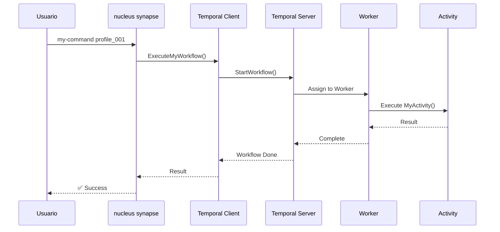

# 🧬 Guía de Creación de Comandos SYNAPSE v1.0

Esta guía define el proceso paso a paso para agregar nuevos comandos al sistema **Synapse**, la capa de orquestación de Nucleus que gestiona perfiles mediante workflows de Temporal.

---

## 📋 Índice

1. [¿Cuándo Crear un Comando Synapse?](#1-cuándo-crear-un-comando-synapse)
2. [Anatomía de un Comando Synapse](#2-anatomía-de-un-comando-synapse)
3. [Paso a Paso: Crear un Nuevo Comando](#3-paso-a-paso-crear-un-nuevo-comando)
4. [Integración con Temporal](#4-integración-con-temporal)
5. [Testing y Validación](#5-testing-y-validación)
6. [Checklist Completo](#6-checklist-completo)
7. [Ejemplos Completos](#7-ejemplos-completos)

---

## 1. ¿Cuándo Crear un Comando Synapse?

### 1.1 Propósito de Synapse

**Synapse es la capa de orquestación** que:
- Gestiona el ciclo de vida de perfiles de navegador
- Coordina workflows de Temporal de larga duración
- Ejecuta activities de Sentinel (unificadas en `sentinel_activities.go`)
- Proporciona comandos CLI para interactuar con los workflows

### 1.2 Criterios para Crear un Comando Synapse

✅ **CREAR comando Synapse si:**
- La operación involucra workflows de Temporal
- Necesitas gestionar el ciclo de vida de perfiles
- Requieres ejecutar activities de Sentinel
- La operación es de larga duración con estado persistente
- Necesitas recovery automático ante fallos

❌ **NO crear comando Synapse si:**
- Es una operación de sistema (usa categoría `SYSTEM`)
- Es governance/auditoría (usa categoría `GOVERNANCE`)
- No involucra workflows de Temporal
- Es una operación simple sin estado

### 1.3 Comandos Synapse Existentes (v3.0)

```bash
nucleus synapse seed <alias> [--master]      # Crear perfil persistente
nucleus synapse launch <profile_id>          # Lanzar Sentinel + Chrome
nucleus synapse status <profile_id>          # Query estado del workflow
nucleus synapse shutdown-all                 # Detener todos los perfiles
nucleus synapse start-ollama                 # Iniciar Ollama workflow
nucleus synapse vault-status                 # Estado del vault
```

---

## 2. Anatomía de un Comando Synapse

### 2.1 Arquitectura de Capas

```
┌─────────────────────────────────────┐
│ CLI Command Layer                   │  ← internal/synapse/synapse_commands.go
│ (synapse seed, launch, etc.)        │
└─────────────────────────────────────┘
           ↓
┌─────────────────────────────────────┐
│ Temporal Client                     │  ← internal/orchestration/temporal/temporal_client.go
│ (ExecuteSeedWorkflow, etc.)         │
└─────────────────────────────────────┘
           ↓
┌─────────────────────────────────────┐
│ Temporal Server                     │  ← Orquestador externo
│ (maneja workflows, retries, state)  │
└─────────────────────────────────────┘
           ↓
┌─────────────────────────────────────┐
│ Worker                              │  ← Ejecuta activities
└─────────────────────────────────────┘
           ↓
┌─────────────────────────────────────┐
│ Sentinel Activities                 │  ← internal/orchestration/activities/sentinel_activities.go
│ (LaunchSentinel, MonitorSentinel)   │
└─────────────────────────────────────┘
           ↓
┌─────────────────────────────────────┐
│ Chrome Profile Process              │  ← Instancia final de navegador
└─────────────────────────────────────┘
```

### 2.2 Ubicación de Archivos

```
nucleus/
├── internal/
│   ├── synapse/
│   │   └── synapse_commands.go           # ✅ Comandos CLI Synapse
│   ├── orchestration/
│   │   ├── activities/
│   │   │   └── sentinel_activities.go    # ✅ Activities unificadas
│   │   ├── temporal/
│   │   │   ├── temporal_client.go        # ✅ Client helpers
│   │   │   ├── worker.go                 # Worker registration
│   │   │   └── workflows/
│   │   │       └── profile_lifecycle.go  # ✅ Workflow definitions
│   │   └── types/
│   │       └── orchestration.go          # Tipos compartidos
│   └── core/
│       └── registry.go                   # Sistema de registro
└── main.go                               # Import del paquete
```

### 2.3 Patrón de Registro

**⚠️ IMPORTANTE**: Synapse usa el patrón **multi-comando en un solo archivo** porque:
- Todos los comandos están fuertemente acoplados a Temporal
- Comparten el mismo cliente Temporal
- Comparten estructuras de resultado comunes

```go
// File: internal/synapse/synapse_commands.go
package synapse

func init() {
	core.RegisterCommand("SYNAPSE", seedCmd)
	core.RegisterCommand("SYNAPSE", launchCmd)
	core.RegisterCommand("SYNAPSE", statusCmd)
	core.RegisterCommand("SYNAPSE", shutdownCmd)
	// ← Aquí agregarás tu nuevo comando
}
```

---

## 3. Paso a Paso: Crear un Nuevo Comando

### PASO 1: Definir el Comando CLI

**Archivo**: `internal/synapse/synapse_commands.go`

```go
// Agregar al final del archivo, ANTES del init()
func myNewCmd(c *core.Core) *cobra.Command {
	var jsonOutput bool
	var customFlag string

	cmd := &cobra.Command{
		Use:   "my-command <arg1> [arg2]",
		Short: "Brief description of what this command does",
		Long: `Detailed explanation of the command.
		
This command performs X operation on profiles by:
- Creating a workflow in Temporal
- Executing MyActivity
- Returning the result`,
		Args: cobra.RangeArgs(1, 2),  // 1 obligatorio, 1 opcional
		
		Annotations: map[string]string{
			"category": "SYNAPSE",
			"json_response": `{
  "success": true,
  "profile_id": "abc123",
  "operation": "my-command",
  "result": "completed"
}`,
		},
		
		Example: `  nucleus synapse my-command profile_001
  nucleus synapse my-command profile_001 optional_arg --custom-flag value
  nucleus --json synapse my-command profile_001`,
		
		Run: func(cmd *cobra.Command, args []string) {
			profileID := args[0]
			optionalArg := ""
			if len(args) > 1 {
				optionalArg = args[1]
			}

			// Crear logger
			logger, err := core.InitLogger(&c.Paths, "SYNAPSE", jsonOutput)
			if err != nil {
				fmt.Fprintf(os.Stderr, "[ERROR] Failed to initialize logger: %v\n", err)
				os.Exit(1)
			}
			defer logger.Close()

			if !jsonOutput {
				logger.Info("Executing my-command for profile: %s", profileID)
			}

			// Crear cliente Temporal
			ctx := context.Background()
			tc, err := temporalclient.NewClient(ctx, &c.Paths, jsonOutput)
			if err != nil {
				if jsonOutput {
					outputJSON(map[string]interface{}{
						"success": false,
						"error":   fmt.Sprintf("failed to connect to Temporal: %v", err),
					})
				} else {
					logger.Error("Failed to connect to Temporal: %v", err)
				}
				os.Exit(1)
			}
			defer tc.Close()

			// Ejecutar workflow (ver PASO 3)
			result, err := tc.ExecuteMyWorkflow(ctx, logger, profileID, customFlag)
			if err != nil {
				if jsonOutput {
					outputJSON(map[string]interface{}{
						"success":    false,
						"profile_id": profileID,
						"error":      err.Error(),
					})
				} else {
					logger.Error("My command failed: %v", err)
				}
				os.Exit(1)
			}

			// Output
			if jsonOutput {
				outputJSON(result)
			} else {
				logger.Success("✅ My command completed successfully")
				logger.Info("Profile ID: %s", result.ProfileID)
				logger.Info("Result: %s", result.Result)
			}
		},
	}

	cmd.Flags().BoolVar(&jsonOutput, "json", false, "Output in JSON format")
	cmd.Flags().StringVar(&customFlag, "custom-flag", "default", "Custom flag description")

	return cmd
}
```

### PASO 2: Registrar el Comando

**En el mismo archivo** (`synapse_commands.go`), agregar al `init()`:

```go
func init() {
	core.RegisterCommand("SYNAPSE", seedCmd)
	core.RegisterCommand("SYNAPSE", launchCmd)
	core.RegisterCommand("SYNAPSE", statusCmd)
	core.RegisterCommand("SYNAPSE", shutdownCmd)
	core.RegisterCommand("SYNAPSE", myNewCmd)  // ✅ Agregar aquí
}
```

### PASO 3: Definir el Workflow

**Archivo**: `internal/orchestration/temporal/workflows/my_workflow.go` (NUEVO ARCHIVO)

```go
package workflows

import (
	"time"
	"go.temporal.io/sdk/workflow"
	"go.temporal.io/sdk/temporal"
)

// MyWorkflowInput define los parámetros de entrada
type MyWorkflowInput struct {
	ProfileID  string
	CustomFlag string
}

// MyWorkflowResult define la respuesta del workflow
type MyWorkflowResult struct {
	Success   bool   `json:"success"`
	ProfileID string `json:"profile_id"`
	Operation string `json:"operation"`
	Result    string `json:"result"`
	Timestamp int64  `json:"timestamp"`
}

// MyWorkflow es el workflow que orquesta la operación
func MyWorkflow(ctx workflow.Context, input MyWorkflowInput) (*MyWorkflowResult, error) {
	// Configurar opciones de activity
	activityOptions := workflow.ActivityOptions{
		StartToCloseTimeout: 5 * time.Minute,
		HeartbeatTimeout:    30 * time.Second,
		RetryPolicy: &temporal.RetryPolicy{
			MaximumAttempts:    3,
			InitialInterval:    2 * time.Second,
			BackoffCoefficient: 2.0,
		},
	}
	ctx = workflow.WithActivityOptions(ctx, activityOptions)

	// Ejecutar activity (ver PASO 4)
	var activityResult string
	err := workflow.ExecuteActivity(ctx, "MyActivity", input).Get(ctx, &activityResult)
	if err != nil {
		return &MyWorkflowResult{
			Success:   false,
			ProfileID: input.ProfileID,
			Operation: "my-command",
			Result:    "failed",
			Timestamp: workflow.Now(ctx).Unix(),
		}, err
	}

	// Retornar resultado exitoso
	return &MyWorkflowResult{
		Success:   true,
		ProfileID: input.ProfileID,
		Operation: "my-command",
		Result:    activityResult,
		Timestamp: workflow.Now(ctx).Unix(),
	}, nil
}
```

### PASO 4: Definir la Activity

**Archivo**: `internal/orchestration/activities/sentinel_activities.go` (MODIFICAR ARCHIVO EXISTENTE)

**⚠️ IMPORTANTE**: Las activities van en el archivo **unificado** de Sentinel Activities.

```go
// Agregar al final del archivo sentinel_activities.go

// MyActivity ejecuta la lógica de negocio
func (a *SentinelActivities) MyActivity(ctx context.Context, input workflows.MyWorkflowInput) (string, error) {
	// Lógica específica de tu comando
	// Puede involucrar:
	// - Llamar a Sentinel
	// - Interactuar con Chrome
	// - Ejecutar operaciones del sistema
	// - Comunicarse con servicios externos
	
	// Ejemplo: obtener información del perfil
	profileData, err := a.getProfileData(input.ProfileID)
	if err != nil {
		return "", fmt.Errorf("failed to get profile data: %w", err)
	}
	
	// Ejecutar operación principal
	result := fmt.Sprintf("Processed profile %s with flag %s", 
		profileData.Alias, input.CustomFlag)
	
	return result, nil
}

// Helper privado para la activity
func (a *SentinelActivities) getProfileData(profileID string) (*ProfileData, error) {
	// Implementación...
	return &ProfileData{Alias: "test"}, nil
}
```

### PASO 5: Registrar Activity en Worker

**Archivo**: `internal/orchestration/temporal/worker.go` (MODIFICAR)

```go
func (w *Worker) Start(ctx context.Context) error {
	// ... código existente ...
	
	// Registrar workflows
	w.worker.RegisterWorkflow(workflows.LaunchWorkflow)
	w.worker.RegisterWorkflow(workflows.SeedWorkflow)
	w.worker.RegisterWorkflow(workflows.MyWorkflow)  // ✅ Agregar aquí
	
	// Registrar activities
	activities := &activities.SentinelActivities{}
	w.worker.RegisterActivity(activities.LaunchSentinel)
	w.worker.RegisterActivity(activities.MonitorSentinel)
	w.worker.RegisterActivity(activities.MyActivity)  // ✅ Agregar aquí
	
	// ... resto del código ...
}
```

### PASO 6: Crear Helper en Temporal Client

**Archivo**: `internal/orchestration/temporal/temporal_client.go` (MODIFICAR)

```go
// Agregar al final del archivo

// ExecuteMyWorkflow ejecuta el workflow de tu nuevo comando
func (c *Client) ExecuteMyWorkflow(
	ctx context.Context,
	logger *core.Logger,
	profileID string,
	customFlag string,
) (*workflows.MyWorkflowResult, error) {
	workflowOptions := client.StartWorkflowOptions{
		ID:        fmt.Sprintf("my_command_%s_%d", profileID, time.Now().Unix()),
		TaskQueue: c.config.TaskQueue,
	}
	
	input := workflows.MyWorkflowInput{
		ProfileID:  profileID,
		CustomFlag: customFlag,
	}
	
	logger.Debug("Starting MyWorkflow for profile: %s", profileID)
	
	we, err := c.client.ExecuteWorkflow(ctx, workflowOptions, workflows.MyWorkflow, input)
	if err != nil {
		return nil, fmt.Errorf("failed to start workflow: %w", err)
	}
	
	var result workflows.MyWorkflowResult
	if err := we.Get(ctx, &result); err != nil {
		return nil, fmt.Errorf("workflow execution failed: %w", err)
	}
	
	return &result, nil
}
```

### PASO 7: Definir Tipos (si es necesario)

**Archivo**: `internal/orchestration/types/orchestration.go` (MODIFICAR si necesitas tipos compartidos)

```go
// Agregar solo si necesitas tipos compartidos entre múltiples componentes

type ProfileData struct {
	ID        string
	Alias     string
	IsMaster  bool
	CreatedAt time.Time
}

// ... otros tipos según necesidad
```

---

## 4. Integración con Temporal

### 4.1 Flujo Completo de Ejecución



### 4.2 Consideraciones de Temporal

**Timeouts:**
```go
activityOptions := workflow.ActivityOptions{
	StartToCloseTimeout: 5 * time.Minute,   // Tiempo total máximo
	HeartbeatTimeout:    30 * time.Second,  // Intervalo de heartbeat
	ScheduleToStartTimeout: 1 * time.Minute, // Máximo en cola
}
```

**Retry Policy:**
```go
RetryPolicy: &temporal.RetryPolicy{
	MaximumAttempts:    3,              // Intentos máximos
	InitialInterval:    2 * time.Second, // Primera espera
	BackoffCoefficient: 2.0,            // Multiplicador exponencial
	MaximumInterval:    30 * time.Second, // Máximo entre reintentos
}
```

**Workflow ID:**
- Debe ser **único** por ejecución
- Usar patrón: `{operation}_{profile_id}_{timestamp}`
- Ejemplo: `my_command_profile_001_1708095022`

**Task Queue:**
- Usar: `profile-orchestration` (default de Synapse)
- Worker debe estar escuchando en esta cola

---

## 5. Testing y Validación

### 5.1 Compilar y Verificar

```bash
# 1. Compilar
go build -o nucleus.exe

# 2. Verificar que el comando aparece
nucleus synapse --help

# Debe aparecer:
#   my-command    Brief description of what this command does
```

### 5.2 Testing del Comando

```bash
# 1. Asegurar Temporal corriendo
nucleus temporal ensure

# 2. Iniciar Worker
nucleus worker start -q profile-orchestration

# 3. Probar comando
nucleus synapse my-command profile_001

# 4. Con JSON
nucleus --json synapse my-command profile_001 --custom-flag test

# 5. Verificar en Temporal UI
open http://localhost:8233
```

### 5.3 Testing de la Activity

**Archivo**: `internal/orchestration/activities/sentinel_activities_test.go`

```go
package activities

import (
	"context"
	"testing"
	"nucleus/internal/orchestration/workflows"
)

func TestMyActivity(t *testing.T) {
	// Setup
	activities := &SentinelActivities{}
	
	input := workflows.MyWorkflowInput{
		ProfileID:  "test_profile",
		CustomFlag: "test_value",
	}
	
	// Execute
	result, err := activities.MyActivity(context.Background(), input)
	
	// Assert
	if err != nil {
		t.Fatalf("Activity failed: %v", err)
	}
	
	if result == "" {
		t.Error("Expected non-empty result")
	}
	
	t.Logf("Activity result: %s", result)
}
```

**Ejecutar test:**
```bash
go test ./internal/orchestration/activities/... -v
```

### 5.4 Testing del Workflow

**Archivo**: `internal/orchestration/temporal/workflows/my_workflow_test.go`

```go
package workflows

import (
	"testing"
	"go.temporal.io/sdk/testsuite"
)

func TestMyWorkflow(t *testing.T) {
	// Setup test suite
	testSuite := &testsuite.WorkflowTestSuite{}
	env := testSuite.NewTestWorkflowEnvironment()
	
	// Mock activity
	env.OnActivity("MyActivity", mock.Anything, mock.Anything).Return("mocked result", nil)
	
	// Input
	input := MyWorkflowInput{
		ProfileID:  "test_profile",
		CustomFlag: "test",
	}
	
	// Execute
	env.ExecuteWorkflow(MyWorkflow, input)
	
	// Assert
	if !env.IsWorkflowCompleted() {
		t.Error("Workflow did not complete")
	}
	
	err := env.GetWorkflowError()
	if err != nil {
		t.Fatalf("Workflow failed: %v", err)
	}
	
	var result MyWorkflowResult
	err = env.GetWorkflowResult(&result)
	if err != nil {
		t.Fatalf("Failed to get result: %v", err)
	}
	
	if !result.Success {
		t.Error("Expected successful result")
	}
}
```

---

## 6. Checklist Completo

### Pre-Desarrollo
- [ ] He leído la Guía Maestra de Implementación de Comandos NUCLEUS
- [ ] He leído el NUCLEUS SYNAPSE USAGE GUIDE v3.0
- [ ] Entiendo cuándo usar Synapse vs otros comandos
- [ ] He definido claramente qué hace mi comando
- [ ] He identificado si necesito un workflow de larga duración

### Desarrollo
- [ ] **PASO 1**: Comando CLI creado en `synapse_commands.go`
- [ ] **PASO 2**: Comando registrado en `init()`
- [ ] **PASO 3**: Workflow definido en `workflows/my_workflow.go`
- [ ] **PASO 4**: Activity agregada a `sentinel_activities.go`
- [ ] **PASO 5**: Activity registrada en `worker.go`
- [ ] **PASO 6**: Helper creado en `temporal_client.go`
- [ ] **PASO 7**: Tipos definidos (si es necesario)

### Documentación
- [ ] `Use` define sintaxis correcta
- [ ] `Short` describe en una línea
- [ ] `Long` explica en detalle
- [ ] `Annotations` tiene `category` y `json_response`
- [ ] `Example` muestra casos de uso reales
- [ ] JSON response es válido y completo

### Testing
- [ ] Compila sin errores
- [ ] Aparece en `nucleus synapse --help`
- [ ] Funciona con argumentos básicos
- [ ] Funciona con `--json`
- [ ] Funciona con `--verbose`
- [ ] Tests unitarios de activity pasan
- [ ] Tests de workflow pasan
- [ ] Verificado en Temporal UI

### Integración
- [ ] Worker puede ejecutar la activity
- [ ] Workflow completa exitosamente
- [ ] Manejo de errores funciona
- [ ] Retry policy se comporta correctamente
- [ ] Logging es claro y útil

---

## 7. Ejemplos Completos

### Ejemplo 1: Comando Simple (Query)
Comando que hace una query rápida sobre el estado de un perfil sin modificarlo.

**Características:**
- No necesita workflow de larga duración
- Usa query directo a Temporal
- Retorna inmediatamente
- No modifica estado

```go
// synapse_commands.go
func profileInfoCmd(c *core.Core) *cobra.Command {
	var jsonOutput bool

	cmd := &cobra.Command{
		Use:   "profile-info <profile_id>",
		Short: "Get detailed information about a profile",
		Args:  cobra.ExactArgs(1),
		
		Annotations: map[string]string{
			"category": "SYNAPSE",
			"json_response": `{
  "success": true,
  "profile_id": "abc123",
  "alias": "my_profile",
  "is_master": false,
  "state": "RUNNING",
  "created_at": 1708095022,
  "sentinel_pid": 12345
}`,
		},
		
		Run: func(cmd *cobra.Command, args []string) {
			profileID := args[0]
			
			logger, _ := core.InitLogger(&c.Paths, "SYNAPSE", jsonOutput)
			defer logger.Close()
			
			ctx := context.Background()
			tc, err := temporalclient.NewClient(ctx, &c.Paths, jsonOutput)
			if err != nil {
				logger.Error("Failed to connect: %v", err)
				os.Exit(1)
			}
			defer tc.Close()
			
			// Query directo (no ejecuta workflow)
			info, err := tc.QueryProfileInfo(ctx, profileID)
			if err != nil {
				logger.Error("Query failed: %v", err)
				os.Exit(1)
			}
			
			if jsonOutput {
				outputJSON(info)
			} else {
				logger.Info("Profile: %s", info.Alias)
				logger.Info("State: %s", info.State)
			}
		},
	}
	
	cmd.Flags().BoolVar(&jsonOutput, "json", false, "Output in JSON format")
	return cmd
}
```

**temporal_client.go:**
```go
func (c *Client) QueryProfileInfo(ctx context.Context, profileID string) (*ProfileInfo, error) {
	workflowID := fmt.Sprintf("profile_%s", profileID)
	
	resp, err := c.client.QueryWorkflow(ctx, workflowID, "", "GetProfileInfo")
	if err != nil {
		return nil, err
	}
	
	var info ProfileInfo
	if err := resp.Get(&info); err != nil {
		return nil, err
	}
	
	return &info, nil
}
```

---

### Ejemplo 2: Comando con Workflow (Operación con Estado)

Comando que ejecuta una operación compleja que modifica el estado del perfil.

**Características:**
- Usa workflow completo
- Ejecuta activities
- Maneja retry automático
- Persiste estado

```go
// synapse_commands.go
func restartProfileCmd(c *core.Core) *cobra.Command {
	var jsonOutput bool
	var force bool

	cmd := &cobra.Command{
		Use:   "restart <profile_id>",
		Short: "Restart a profile (shutdown + launch)",
		Long: `Restart a profile by shutting it down gracefully and relaunching it.
		
This operation:
- Shuts down Sentinel and Chrome
- Waits for clean termination
- Relaunches with previous configuration
- Updates workflow state`,
		Args: cobra.ExactArgs(1),
		
		Annotations: map[string]string{
			"category": "SYNAPSE",
			"json_response": `{
  "success": true,
  "profile_id": "abc123",
  "operation": "restart",
  "old_pid": 12345,
  "new_pid": 12346,
  "state": "RUNNING"
}`,
		},
		
		Example: `  nucleus synapse restart profile_001
  nucleus synapse restart profile_001 --force
  nucleus --json synapse restart profile_001`,
		
		Run: func(cmd *cobra.Command, args []string) {
			profileID := args[0]
			
			logger, _ := core.InitLogger(&c.Paths, "SYNAPSE", jsonOutput)
			defer logger.Close()
			
			if !jsonOutput {
				logger.Info("Restarting profile: %s (force: %v)", profileID, force)
			}
			
			ctx := context.Background()
			tc, _ := temporalclient.NewClient(ctx, &c.Paths, jsonOutput)
			defer tc.Close()
			
			result, err := tc.ExecuteRestartWorkflow(ctx, logger, profileID, force)
			if err != nil {
				if jsonOutput {
					outputJSON(map[string]interface{}{
						"success": false,
						"error":   err.Error(),
					})
				} else {
					logger.Error("Restart failed: %v", err)
				}
				os.Exit(1)
			}
			
			if jsonOutput {
				outputJSON(result)
			} else {
				logger.Success("✅ Profile restarted successfully")
				logger.Info("Old PID: %d", result.OldPID)
				logger.Info("New PID: %d", result.NewPID)
			}
		},
	}
	
	cmd.Flags().BoolVar(&jsonOutput, "json", false, "Output in JSON format")
	cmd.Flags().BoolVar(&force, "force", false, "Force restart even if profile is busy")
	
	return cmd
}
```

**workflows/restart_workflow.go:**
```go
package workflows

import (
	"time"
	"go.temporal.io/sdk/workflow"
)

type RestartWorkflowInput struct {
	ProfileID string
	Force     bool
}

type RestartWorkflowResult struct {
	Success   bool   `json:"success"`
	ProfileID string `json:"profile_id"`
	Operation string `json:"operation"`
	OldPID    int    `json:"old_pid"`
	NewPID    int    `json:"new_pid"`
	State     string `json:"state"`
}

func RestartWorkflow(ctx workflow.Context, input RestartWorkflowInput) (*RestartWorkflowResult, error) {
	activityOptions := workflow.ActivityOptions{
		StartToCloseTimeout: 5 * time.Minute,
		HeartbeatTimeout:    30 * time.Second,
		RetryPolicy: &temporal.RetryPolicy{
			MaximumAttempts:    3,
			InitialInterval:    2 * time.Second,
			BackoffCoefficient: 2.0,
		},
	}
	ctx = workflow.WithActivityOptions(ctx, activityOptions)
	
	// 1. Obtener PID actual
	var oldPID int
	err := workflow.ExecuteActivity(ctx, "GetSentinelPID", input.ProfileID).Get(ctx, &oldPID)
	if err != nil {
		return nil, err
	}
	
	// 2. Shutdown graceful
	err = workflow.ExecuteActivity(ctx, "ShutdownSentinel", input.ProfileID, input.Force).Get(ctx, nil)
	if err != nil {
		return nil, err
	}
	
	// 3. Esperar terminación (puede hacer sleep)
	err = workflow.Sleep(ctx, 2*time.Second)
	if err != nil {
		return nil, err
	}
	
	// 4. Relaunch
	var newPID int
	err = workflow.ExecuteActivity(ctx, "LaunchSentinel", input.ProfileID).Get(ctx, &newPID)
	if err != nil {
		return nil, err
	}
	
	return &RestartWorkflowResult{
		Success:   true,
		ProfileID: input.ProfileID,
		Operation: "restart",
		OldPID:    oldPID,
		NewPID:    newPID,
		State:     "RUNNING",
	}, nil
}
```

**sentinel_activities.go (agregar):**
```go
func (a *SentinelActivities) GetSentinelPID(ctx context.Context, profileID string) (int, error) {
	// Lógica para obtener PID
	return 12345, nil
}
```

**temporal_client.go (agregar):**
```go
func (c *Client) ExecuteRestartWorkflow(
	ctx context.Context,
	logger *core.Logger,
	profileID string,
	force bool,
) (*workflows.RestartWorkflowResult, error) {
	workflowOptions := client.StartWorkflowOptions{
		ID:        fmt.Sprintf("restart_%s_%d", profileID, time.Now().Unix()),
		TaskQueue: c.config.TaskQueue,
	}
	
	input := workflows.RestartWorkflowInput{
		ProfileID: profileID,
		Force:     force,
	}
	
	logger.Debug("Starting RestartWorkflow for profile: %s", profileID)
	
	we, err := c.client.ExecuteWorkflow(ctx, workflowOptions, workflows.RestartWorkflow, input)
	if err != nil {
		return nil, fmt.Errorf("failed to start workflow: %w", err)
	}
	
	var result workflows.RestartWorkflowResult
	if err := we.Get(ctx, &result); err != nil {
		return nil, fmt.Errorf("workflow execution failed: %w", err)
	}
	
	return &result, nil
}
```

**worker.go (agregar):**
```go
w.worker.RegisterWorkflow(workflows.RestartWorkflow)
w.worker.RegisterActivity(activities.GetSentinelPID)
// ShutdownSentinel y LaunchSentinel ya existen
```

---

### Ejemplo 3: Comando con Señal (Signal)

Comando que envía una señal a un workflow de larga duración existente.

**Características:**
- No crea nuevo workflow
- Envía señal a workflow existente
- Workflow reacciona a la señal
- Usado para cambios de configuración en caliente

```go
// synapse_commands.go
func updateConfigCmd(c *core.Core) *cobra.Command {
	var jsonOutput bool
	var configKey string
	var configValue string

	cmd := &cobra.Command{
		Use:   "update-config <profile_id>",
		Short: "Update profile configuration without restart",
		Args:  cobra.ExactArgs(1),
		
		Annotations: map[string]string{
			"category": "SYNAPSE",
			"json_response": `{
  "success": true,
  "profile_id": "abc123",
  "config_key": "mode",
  "config_value": "discovery",
  "applied": true
}`,
		},
		
		Run: func(cmd *cobra.Command, args []string) {
			profileID := args[0]
			
			logger, _ := core.InitLogger(&c.Paths, "SYNAPSE", jsonOutput)
			defer logger.Close()
			
			ctx := context.Background()
			tc, _ := temporalclient.NewClient(ctx, &c.Paths, jsonOutput)
			defer tc.Close()
			
			err := tc.SignalUpdateConfig(ctx, profileID, configKey, configValue)
			if err != nil {
				logger.Error("Signal failed: %v", err)
				os.Exit(1)
			}
			
			if jsonOutput {
				outputJSON(map[string]interface{}{
					"success":      true,
					"profile_id":   profileID,
					"config_key":   configKey,
					"config_value": configValue,
					"applied":      true,
				})
			} else {
				logger.Success("✅ Configuration updated")
				logger.Info("%s = %s", configKey, configValue)
			}
		},
	}
	
	cmd.Flags().BoolVar(&jsonOutput, "json", false, "Output in JSON format")
	cmd.Flags().StringVar(&configKey, "key", "", "Configuration key")
	cmd.Flags().StringVar(&configValue, "value", "", "Configuration value")
	cmd.MarkFlagRequired("key")
	cmd.MarkFlagRequired("value")
	
	return cmd
}
```

**temporal_client.go (agregar):**
```go
func (c *Client) SignalUpdateConfig(ctx context.Context, profileID, key, value string) error {
	workflowID := fmt.Sprintf("profile_%s", profileID)
	
	signalData := map[string]string{
		"key":   key,
		"value": value,
	}
	
	err := c.client.SignalWorkflow(ctx, workflowID, "", "UpdateConfig", signalData)
	if err != nil {
		return fmt.Errorf("failed to send signal: %w", err)
	}
	
	return nil
}
```

**profile_lifecycle.go (modificar workflow existente):**
```go
// En el workflow ProfileLifecycleWorkflow, agregar:

configUpdateChan := workflow.GetSignalChannel(ctx, "UpdateConfig")
selector.AddReceive(configUpdateChan, func(c workflow.ReceiveChannel, more bool) {
	var configUpdate map[string]string
	c.Receive(ctx, &configUpdate)
	
	// Aplicar configuración sin reiniciar
	key := configUpdate["key"]
	value := configUpdate["value"]
	
	// Actualizar estado interno
	profileState.Config[key] = value
	
	logger.Info("Configuration updated: %s = %s", key, value)
})
```

---

## 8. Errores Comunes y Soluciones

### Error 1: "Command not found"

**Síntoma:**
```bash
$ nucleus synapse my-command profile_001
Error: unknown command "my-command" for "nucleus synapse"
```

**Causas:**
1. Comando no registrado en `init()`
2. Paquete no compilado correctamente

**Solución:**
```go
// Verificar en synapse_commands.go
func init() {
	core.RegisterCommand("SYNAPSE", myNewCmd)  // ← Debe estar aquí
}

// Recompilar
go build -o nucleus.exe
```

---

### Error 2: "Workflow not registered"

**Síntoma:**
```
[ERROR] Workflow execution failed: workflow type not registered
```

**Causa:** Workflow no registrado en Worker

**Solución:**
```go
// En worker.go
w.worker.RegisterWorkflow(workflows.MyWorkflow)  // ← Agregar
```

---

### Error 3: "Activity not found"

**Síntoma:**
```
[ERROR] Activity execution failed: activity type not registered
```

**Causa:** Activity no registrada en Worker

**Solución:**
```go
// En worker.go
activities := &activities.SentinelActivities{}
w.worker.RegisterActivity(activities.MyActivity)  // ← Agregar
```

---

### Error 4: "Temporal client connection refused"

**Síntoma:**
```json
{
  "success": false,
  "error": "failed to connect to Temporal: connection refused"
}
```

**Causa:** Temporal Server no está corriendo

**Solución:**
```bash
# Iniciar Temporal
nucleus temporal ensure

# Verificar
curl http://localhost:7233/health
```

---

### Error 5: "Workflow execution timeout"

**Síntoma:** El comando se queda esperando indefinidamente

**Causa:** Worker no está corriendo

**Solución:**
```bash
# En otra terminal
nucleus worker start -q profile-orchestration

# Verificar
nucleus worker status
```

---

## 9. Mejores Prácticas

### 9.1 Naming Conventions

```go
// ✅ CORRECTO
func seedCmd(c *core.Core) *cobra.Command         // Nombre del comando
func ExecuteSeedWorkflow(...)                      // Client helper
func SeedWorkflow(ctx workflow.Context, ...)       // Workflow
func (a *Activities) SeedProfile(...)             // Activity

// ❌ INCORRECTO
func createSeedCommand(...)                        // Demasiado verboso
func seed(...)                                     // Muy genérico
func DoSeed(...)                                   // No sigue convención
```

### 9.2 Error Handling

```go
// ✅ CORRECTO - Diferenciar JSON vs humano
if err != nil {
	if jsonOutput {
		outputJSON(map[string]interface{}{
			"success": false,
			"error":   err.Error(),
		})
	} else {
		logger.Error("Operation failed: %v", err)
	}
	os.Exit(1)
}

// ❌ INCORRECTO - Mezclar outputs
if err != nil {
	fmt.Println("Error:", err)  // No sigue convención
	return
}
```

### 9.3 Logging

```go
// ✅ CORRECTO - Usar logger con niveles
logger.Debug("Starting workflow with input: %+v", input)
logger.Info("Processing profile: %s", profileID)
logger.Warning("Retry attempt %d of %d", attempt, maxAttempts)
logger.Error("Failed to connect: %v", err)
logger.Success("✅ Operation completed")

// ❌ INCORRECTO - fmt.Println directo
fmt.Println("Starting...")
```

### 9.4 Workflow Design

```go
// ✅ CORRECTO - Workflow es orchestrator
func MyWorkflow(ctx workflow.Context, input Input) (*Result, error) {
	// Solo orquestación
	err := workflow.ExecuteActivity(ctx, Activity1, data).Get(ctx, &result1)
	err = workflow.ExecuteActivity(ctx, Activity2, result1).Get(ctx, &result2)
	return &result2, nil
}

// ❌ INCORRECTO - Lógica de negocio en workflow
func MyWorkflow(ctx workflow.Context, input Input) (*Result, error) {
	// NO hacer esto - la lógica va en activities
	data := processData(input)  // ← Esto va en activity
	result := calculateStuff(data)  // ← Esto también
	return &result, nil
}
```

### 9.5 Activity Design

```go
// ✅ CORRECTO - Activity es stateless
func (a *Activities) ProcessData(ctx context.Context, input Data) (*Result, error) {
	// Lógica de negocio aquí
	// No guardar estado en 'a'
	result := doWork(input)
	return &result, nil
}

// ❌ INCORRECTO - Activity con estado mutable
func (a *Activities) ProcessData(ctx context.Context, input Data) (*Result, error) {
	a.counter++  // ← NO hacer esto
	return &Result{Count: a.counter}, nil
}
```

---

## 10. Debugging

### 10.1 Ver Logs de Workflow

```bash
# Temporal UI
open http://localhost:8233

# Buscar tu workflow por ID
# Ver event history completo
# Ver inputs/outputs de activities
```

### 10.2 Logs Locales

```bash
# Worker logs
tail -f ~/.local/share/BloomNucleus/logs/orchestration/worker.log

# Temporal logs
tail -f ~/.local/share/BloomNucleus/logs/temporal/temporal.log

# Activity logs (si logeas desde activity)
tail -f ~/.local/share/BloomNucleus/logs/sentinel/*.log
```

### 10.3 Verbose Mode

```bash
# Ejecutar con verbose para ver más detalles
nucleus --verbose synapse my-command profile_001
```

---

## 11. Checklist Final

Antes de considerar tu comando terminado:

### Funcionalidad
- [ ] El comando ejecuta correctamente con argumentos válidos
- [ ] Maneja errores de argumentos inválidos
- [ ] Funciona con `--json`
- [ ] Funciona con `--verbose`
- [ ] Timeout configurado apropiadamente
- [ ] Retry policy definida

### Documentación
- [ ] `Short` es clara y concisa
- [ ] `Long` explica todos los detalles
- [ ] `Example` muestra casos de uso reales
- [ ] `Annotations` tiene `json_response` completo
- [ ] README o documentación externa actualizada

### Testing
- [ ] Tests unitarios de activity
- [ ] Tests de workflow
- [ ] Probado end-to-end manualmente
- [ ] Verificado en Temporal UI
- [ ] Probado con perfiles reales

### Integración
- [ ] Workflow registrado en worker
- [ ] Activity registrada en worker
- [ ] Helper en temporal_client
- [ ] Comando registrado en init()
- [ ] Compila sin warnings

### Calidad
- [ ] Código sigue convenciones de Go
- [ ] Sin panics no manejados
- [ ] Logging apropiado en cada paso
- [ ] Comentarios en código complejo
- [ ] Sin TODOs pendientes críticos

---

## 12. Recursos

### Documentación Relacionada
- **NUCLEUS SYNAPSE USAGE GUIDE v3.0**: Guía de uso de Synapse
- **Guía Maestra de Implementación de Comandos NUCLEUS**: Patrones generales de comandos
- **Temporal Documentation**: https://docs.temporal.io

### Archivos Clave
```
internal/
├── synapse/synapse_commands.go          ← Tus comandos CLI
├── orchestration/
│   ├── activities/sentinel_activities.go ← Tus activities
│   ├── temporal/
│   │   ├── temporal_client.go           ← Tus helpers
│   │   ├── worker.go                    ← Registro
│   │   └── workflows/*.go               ← Tus workflows
│   └── types/orchestration.go           ← Tipos
```

### Comandos Útiles
```bash
# Compilar
go build -o nucleus.exe

# Ver comandos
nucleus synapse --help

# Ejecutar con JSON
nucleus --json synapse my-command arg1

# Ver Temporal UI
open http://localhost:8233

# Logs en tiempo real
tail -f ~/.local/share/BloomNucleus/logs/orchestration/worker.log
```

---

**Versión**: 1.0  
**Fecha**: 2026-02-16  
**Autor**: Platform Engineering Team  
**Estado**: Production Ready  
**Contexto**: Post-refactor Feb 2026 (Activities unificadas)

---

## Apéndice: Template Rápido

### Copiar y adaptar este template:

```go
// ==========================================
// NUEVO COMANDO SYNAPSE - TEMPLATE
// ==========================================

// 1. COMANDO CLI (en synapse_commands.go)
func myCommandCmd(c *core.Core) *cobra.Command {
	var jsonOutput bool
	
	cmd := &cobra.Command{
		Use:   "my-command <arg>",
		Short: "Brief description",
		Args:  cobra.ExactArgs(1),
		
		Annotations: map[string]string{
			"category": "SYNAPSE",
			"json_response": `{"success": true}`,
		},
		
		Run: func(cmd *cobra.Command, args []string) {
			logger, _ := core.InitLogger(&c.Paths, "SYNAPSE", jsonOutput)
			defer logger.Close()
			
			ctx := context.Background()
			tc, _ := temporalclient.NewClient(ctx, &c.Paths, jsonOutput)
			defer tc.Close()
			
			result, err := tc.ExecuteMyWorkflow(ctx, logger, args[0])
			if err != nil {
				logger.Error("Failed: %v", err)
				os.Exit(1)
			}
			
			if jsonOutput {
				outputJSON(result)
			} else {
				logger.Success("✅ Done")
			}
		},
	}
	
	cmd.Flags().BoolVar(&jsonOutput, "json", false, "JSON output")
	return cmd
}

// 2. REGISTRAR (en init() de synapse_commands.go)
func init() {
	core.RegisterCommand("SYNAPSE", myCommandCmd)
}

// 3. WORKFLOW (en workflows/my_workflow.go)
func MyWorkflow(ctx workflow.Context, input Input) (*Result, error) {
	opts := workflow.ActivityOptions{
		StartToCloseTimeout: 5 * time.Minute,
	}
	ctx = workflow.WithActivityOptions(ctx, opts)
	
	var result string
	err := workflow.ExecuteActivity(ctx, "MyActivity", input).Get(ctx, &result)
	return &Result{Data: result}, err
}

// 4. ACTIVITY (en sentinel_activities.go)
func (a *SentinelActivities) MyActivity(ctx context.Context, input Input) (string, error) {
	// Lógica aquí
	return "result", nil
}

// 5. CLIENT HELPER (en temporal_client.go)
func (c *Client) ExecuteMyWorkflow(ctx context.Context, logger *core.Logger, arg string) (*Result, error) {
	opts := client.StartWorkflowOptions{
		ID: fmt.Sprintf("my_op_%s_%d", arg, time.Now().Unix()),
		TaskQueue: c.config.TaskQueue,
	}
	
	we, err := c.client.ExecuteWorkflow(ctx, opts, workflows.MyWorkflow, Input{Arg: arg})
	if err != nil {
		return nil, err
	}
	
	var result Result
	err = we.Get(ctx, &result)
	return &result, err
}

// 6. REGISTRAR EN WORKER (en worker.go)
w.worker.RegisterWorkflow(workflows.MyWorkflow)
w.worker.RegisterActivity(activities.MyActivity)
```

¡Copia este template y reemplaza los nombres!
