# Investigación técnica — Whisper (STT) + Kokoro (TTS) locales en BTIPS

**Alcance:** integración 100% offline, sin runtime Python obligatorio, redistribuible en app comercial cerrada, multiplataforma (Windows/Linux/macOS).
**Contexto BTIPS:** el stack actual usa **Conductor** (Electron/Node) como UI soberana y **Brain** (Python) como motor de ejecución de intents. La recomendación de este documento es que STT/TTS vivan en el **proceso Node/Electron de Conductor**, no en Brain — así se cumple el requisito "sin Python" sin tocar la arquitectura de intents/Mandates.

---

## 1. Resumen ejecutivo

| Capa | Recomendación | Runtime | Licencia |
|---|---|---|---|
| STT (voz→texto) | **whisper.cpp** vía binding nativo Node (`smart-whisper` o `nodejs-whisper`) | C/C++ nativo (sin Python) | MIT |
| TTS (texto→voz) | **Kokoro-82M** vía **ONNX Runtime** + `kokoro-js` (paquete npm oficial derivado de Transformers.js) | ONNX Runtime (Node/Electron) | Modelo Apache-2.0, runtime MIT/Apache |
| Captura de micrófono | `navigator.mediaDevices.getUserMedia` en el renderer de Electron (Chromium nativo) | Ninguno adicional | N/A (built-in) |
| Empaquetado | `electron-builder` con `asarUnpack` para binarios nativos + notarización macOS | — | MIT |

**Punto crítico de licencias a resolver antes de shippear:** la implementación *oficial* en Python de Kokoro (`pip install kokoro`) depende de **espeak-ng, licenciado GPL-3.0**, para la fonemización (texto→fonemas). Enlazar/redistribuir espeak-ng en un binario comercial cerrado puede arrastrar obligaciones GPL sobre esa parte del producto. La ruta `kokoro-js` (JS/ONNX) evita esto porque usa un fonemizador propio en JavaScript puro (portado del código de `misaki`/`phonemize.js` de hexgrad), **no** el binario de espeak-ng. Ver §4.

---

## 2. STT — Whisper offline sin Python

### 2.1 Implementación recomendada: whisper.cpp

- Repo: `ggml-org/whisper.cpp` (antes `ggerganov/whisper.cpp`). **Licencia MIT**, confirmada en el `LICENSE` del repo (Copyright 2023-2026 The ggml authors).
- Es un port C/C++ *dependency-free* de Whisper, sin PyTorch ni Python en el runtime. Corre en Windows, Linux y macOS, con aceleración Metal en Apple Silicon y soporte OpenBLAS/CUDA en Windows/Linux.
- Los pesos del modelo Whisper original (OpenAI) también están bajo **licencia MIT** — libres para redistribución comercial. Los archivos `.bin` en formato ggml (convertidos desde los checkpoints de OpenAI) se descargan desde el repo de Hugging Face `ggerganov/whisper.cpp` (también MIT).

### 2.2 Binding para Node/Electron (evita Python)

Dos opciones viables, ambas MIT y mantenidas activamente:

- **`smart-whisper`** — addon nativo Node (node-addon-api) que compila/enlaza contra `libwhisper`. Soporta Windows/Linux/macOS "out of the box", con aceleración GPU/CPU automática en macOS y soporte BYOL (Bring Your Own Library) para compilar con OpenBLAS/CUDA en Win/Linux. Existe también la variante `smart-whisper-electron` empaquetada específicamente para Electron.
- **`nodejs-whisper`** — wrapper más simple que invoca el binario CLI de whisper.cpp (requiere `make`/build tools en la máquina de build, no en la del usuario final si se distribuyen binarios precompilados).

Para BTIPS, dado que Conductor ya es Electron, `smart-whisper` (native addon, sin invocar un proceso CLI externo) es la opción más limpia: se puede cargar el modelo una vez en el proceso principal de Electron y reutilizarlo para múltiples inferencias sin overhead de proceso.

### 2.3 Selección de modelo

- `tiny`/`base` (39–74M params): tiempo real en CPU, ideal para dictado corto en el Conductor.
- `small`/`medium`: mejor precisión multilingüe (relevante porque BTIPS es hispanohablante), más pesado.
- Recomendación: shippear `base` (o `small` multilingüe) por defecto y permitir que el usuario descargue `medium`/`large-v3` bajo demanda — evita inflar el instalador con modelos de varios GB.

### 2.4 Captura de audio

No hace falta ningún binario adicional (ni `sox`, ni `arecord`, que además tienen licencias GPL/BSD variables). Electron expone Chromium nativo en el renderer: `navigator.mediaDevices.getUserMedia({audio:true})` + `MediaRecorder` capturan el micrófono sin dependencias nativas ni permisos de sistema más allá de los que ya gestiona el propio empaquetado (Info.plist en macOS, manifest en Windows). El PCM/WAV resultante se pasa por IPC al proceso principal para inferencia con whisper.cpp.

---

## 3. TTS — Kokoro offline sin Python

### 3.1 El modelo

- `hexgrad/Kokoro-82M`, 82M parámetros, arquitectura StyleTTS2 + decoder ISTFTNet (sin paso de difusión → rápido en CPU). **Licencia Apache-2.0**, confirmada en el `README.md`/metadata del repo de Hugging Face. Explícitamente autorizado para despliegue comercial.
- 54 voces preestablecidas (sin clonación de voz).

### 3.2 Implementación recomendada: ONNX + `kokoro-js` (NO el paquete Python oficial)

- Hugging Face publica una conversión oficial a ONNX: `onnx-community/Kokoro-82M-v1.0-ONNX`, **también Apache-2.0**, mantenida por el mismo equipo (Xenova/HF).
- El paquete npm **`kokoro-js`** (`npm i kokoro-js`) consume ese modelo ONNX vía `onnxruntime` y corre 100% en JS/WASM — pensado originalmente para navegador, pero funciona igual de bien en el proceso Node/Electron de Conductor.
- Cuantizaciones disponibles (`fp32`, `fp16`, `q8`, `q4`, `q4f16`) para ajustar tamaño de modelo vs. calidad — relevante para el instalador (el modelo fp32 pesa ~326 MB; `q8`/`q4` bajan considerablemente el tamaño de distribución).

### 3.3 El problema de licencias que hay que evitar: espeak-ng

Este es el hallazgo más importante de la investigación:

- El pipeline **oficial en Python** de Kokoro (`pip install kokoro`) usa `phonemizer` + el binario **`espeak-ng`, licenciado GPL-3.0**, para convertir texto a fonemas IPA antes de pasarlos al modelo.
- Enlazar o redistribuir GPL-3.0 dentro de un ejecutable comercial de código cerrado es lo que se conoce como "contaminación GPL": puede obligar a liberar el código fuente del componente enlazado bajo la misma licencia si se lo considera "obra derivada" en la distribución. Es un tema discutido activamente por la propia comunidad de Kokoro (issue #247 del repo) y señalado por análisis externos como un riesgo real para productos cerrados.
- **La ruta `kokoro-js` evita este problema**: el fonemizador que usa (`phonemize.js`, portado del código de referencia de hexgrad) es una reimplementación en JavaScript puro, sin invocar el binario de espeak-ng ni enlazar contra su librería. No hay proceso `espeak-ng` corriendo ni objeto GPL enlazado en el binario final.
- ⚠️ Advertencia práctica: existe también un paquete separado `phonemizer.js` / `phonemizer` de npm que sí es un wrapper de espeak-ng compilado a WASM — **no usar ese paquete** si el objetivo es evitar GPL. Confirmar en el `package.json` de `kokoro-js` qué fonemizador trae por defecto antes de fijar la versión en producción, y volver a auditar en cada actualización mayor (la política de fonemización es el punto que más cambia entre versiones del proyecto).

### 3.4 Recomendación de licencias TTS

1. Usar `kokoro-js` + modelo ONNX oficial (`onnx-community/Kokoro-82M-v1.0-ONNX`) → cadena completa Apache-2.0/MIT, sin GPL.
2. Nunca invocar el binario `espeak-ng` del sistema ni la librería `phonemizer` de Python en el flujo de producción, ni siquiera como fallback opcional, para no reintroducir GPL por la puerta de atrás.
3. Documentar la atribución Apache-2.0 (aviso de copyright + NOTICE si el upstream lo trae) en el instalador/about-box del producto, como ya hacen productos comerciales que la usan (ver ejemplo de atribución de Subtitle Studio para whisper.cpp — mismo patrón aplica a Kokoro).

---

## 4. Motor ONNX Runtime — la pieza común

`kokoro-js` corre sobre `onnxruntime-node` (o `onnxruntime-web` si se decidiera moverlo a un `<webview>`). **ONNX Runtime es un proyecto de Microsoft, licencia MIT**, con binarios nativos precompilados para Windows, Linux y macOS (incluye soporte DirectML en Windows, CUDA/TensorRT en Linux, CoreML/Metal en macOS vía ejecutores opcionales). Es seguro para redistribución comercial y no impone condiciones más allá de mantener el aviso de copyright MIT.

Esto significa que **whisper.cpp (STT) y Kokoro-ONNX (TTS) pueden convivir en el mismo proceso Node/Electron sin ningún runtime Python**, cada uno con su propio binding nativo:

```
Conductor (Electron main process, Node.js)
 ├── smart-whisper (native addon)  → libwhisper.{so,dylib,dll}  → modelos .bin (ggml)
 └── kokoro-js (onnxruntime-node)  → onnxruntime.{so,dylib,dll} → modelo .onnx + voicepacks .bin
```

Ninguno de los dos toca a **Brain** (el motor Python de BTIPS): quedan aislados en Conductor, que es exactamente donde vive hoy la interacción directa con el usuario (Bloom Conductor / Sovereign Intent Interface).

---

## 5. Punto exacto de integración en la arquitectura BTIPS

### 5.1 "Workspace" y "Conductor" son el mismo componente

En el diagrama de arquitectura del BTIP (§2, nodo `Workspace[🎛️ Bloom Conductor / Sovereign Intent Interface]`), **Workspace es el nombre que el diagrama le da a Bloom Conductor** — no son dos componentes distintos. El BTIP no define ninguna edición/tier "Core" de Conductor; el análisis de esta sección asume que "Workspace" se refiere al Conductor tal cual está documentado en §2.4 — la app de escritorio Electron, no la Chrome Extension (Cortex, §2.3), no el VS Code Plugin (§2.5), no la app mobile (§10).

### 5.2 Los dos puntos de integración dentro de Conductor

De las cinco capacidades documentadas de Conductor (§2.4, "Capacidades Principales"), voz encaja en dos de forma directa:

| Capacidad de Conductor (BTIP §2.4) | Integración de voz |
|---|---|
| **Intent Editor Avanzado** — "Crea, edita e integra intents con sintaxis asistida" | **Entrada (STT):** el usuario dicta la descripción del intent en vez de tipearla. Whisper transcribe localmente y el texto cae en el mismo campo que hoy llena el teclado. |
| **Event Bus Visualization** — "Observa en tiempo real cada evento que fluye por el sistema (intents ejecutándose, resultados llegando, errores detectados)" | **Salida (TTS):** los mismos eventos que hoy solo se muestran en pantalla pueden leerse en voz alta — útil cuando el ingeniero está trabajando en otra ventana y quiere enterarse por audio de que un intent terminó o falló. |
| Vault Shield, Project Switcher, Rehydration Automática | Sin relación directa con voz — no se tocan. |

```mermaid
flowchart LR
    User["👨‍💻 Usuario"] -- "habla" --> Mic["🎙️ getUserMedia\n(Chromium nativo)"]
    Mic -- "PCM/WAV vía IPC" --> STT["🗣️→📝 whisper.cpp\n(smart-whisper addon)"]
    STT -- "texto" --> IntentEditor["📝 Intent Editor Avanzado"]
    IntentEditor -- "flujo sin cambios\n(línea 315 del BTIP)" --> NucleusExe["⚖️ Nucleus firma"]

    EventBus["📡 Event Bus Visualization"] -- "evento/resultado" --> TTS["📝→🔊 Kokoro ONNX\n(kokoro-js)"]
    TTS -- "audio buffer" --> Speaker["🔈 Reproducción\n(Web Audio API)"]

    NucleusExe -.emite eventos.-> EventBus
```



### 5.3 Por qué no en otro punto del ecosistema

- **No en Cortex (Chrome Extension, §2.3)** — Cortex es "deliberadamente stateless", delega todo razonamiento a Brain y no tiene margen para cargar binarios nativos como lo tiene un proceso Electron completo.
- **No en Companion (§2.3, activo v6.0)** — es un `<webview>` de la sesión de Gemini del usuario, pensado solo para inyección de contexto (`INJECT_BISP`, etc.), no para lógica propia de BTIPS.
- **No en el VS Code Plugin (§2.5)** — su diferencial es "contexto de código en tiempo real", no interacción conversacional; el editor de texto nativo de VS Code ya cubre esa necesidad.
- **No en Brain (§2.6, motor Python)** — meter STT/TTS ahí reintroduciría exactamente la dependencia de Python que el requisito original buscaba evitar.

### 5.4 Flujo de datos y gobernanza — sin cambios

- **STT y TTS son capacidades de UI/UX del Conductor**, no intents gobernados por Nucleus. No pasan por el Event Bus de Sentinel ni generan Mandates — son entrada/salida de interfaz, igual que si el usuario tipeara o leyera texto en pantalla.
- El texto que produce Whisper entra al **mismo pipeline documentado en §2.4 (línea 315)**: se serializa como `.json` en `.bloom/.intents/`, Nucleus lo firma, Temporal lo ejecuta. No se necesita ningún cambio en Sentinel/Nucleus/Brain.
- **Coherencia con el diseño Stateless UI de Conductor** (§2.1, "Data Persistence & Stateless UI"): los buffers de audio y el estado "escuchando/hablando" son transitorios de UI — viven en memoria del proceso Electron durante la sesión de voz y no dejan rastro en el filesystem. Esto es compatible con la "Rehydration Automática" (§2.4): si Conductor se cierra a mitad de un dictado, no hay nada que reconstruir — el intent simplemente no se creó, igual que si el usuario hubiera cerrado la ventana a mitad de escribir texto a mano.
- Carga de modelos: usar el mismo patrón lazy-load que ya usa IonPump en Brain (§2.6) — cargar bajo demanda, no al arrancar Conductor, para no penalizar el tiempo de arranque con Whisper + Kokoro en memoria.

---

## 6. Empaquetado multiplataforma

BTIPS ya usa **Electron** para Conductor, así que el camino natural es **`electron-builder`**, licencia MIT.

### 6.1 Puntos críticos para no romper el build

1. **`asarUnpack`**: los binarios nativos (`.node` de smart-whisper, `.dll/.so/.dylib` de onnxruntime) **no pueden quedar dentro del archivo `.asar`** — Node no puede hacer `dlopen`/`require` de un binario nativo comprimido dentro del asar. Hay que declarar explícitamente esos paths en `asarUnpack` (electron-builder detecta automáticamente la mayoría de módulos nativos, pero conviene verificarlo por plataforma en CI).
2. **Notarización macOS**: todo binario dentro del `.app` — incluidos los `.dylib` de onnxruntime y whisper.cpp — debe estar firmado (`hardenedRuntime: true`, `entitlements`) o Gatekeeper bloqueará el arranque. Se firma con `@electron/notarize` en un hook `afterSign`, usando `APPLE_API_KEY`/`APPLE_ID` + contraseña de aplicación.
3. **Tamaño del instalador**: onnxruntime nativo + whisper.cpp + modelos suman fácilmente 300–800 MB si se bundlean todos los modelos. Recomendado: shippear solo binarios nativos + modelo *tiny/base* de Whisper y *q8* de Kokoro en el instalador, y descargar modelos más grandes on-demand (patrón similar al de Metamorph con validación SHA-256 y swap atómico que BTIPS ya usa para binarios — reutilizable aquí para modelos).
4. **Build por plataforma**: los binarios nativos (`smart-whisper`, `onnxruntime-node`) traen prebuilds por SO/arquitectura (win-x64, linux-x64, darwin-x64, darwin-arm64). Hay que compilar/empaquetar CI en cada plataforma objetivo (GitHub Actions con matrix de OS es el patrón estándar) — no se puede cross-compilar un `.node` de Windows desde Linux de forma confiable.
5. **Windows**: `smart-whisper` requiere Visual C++ Build Tools si se compila desde fuente en la máquina de CI (no en la del usuario, que solo recibe el binario ya compilado).

---

## 7. Tabla de licencias — checklist final para legal/compliance

| Componente | Licencia | ¿Redistribuible en app comercial cerrada? | Nota |
|---|---|---|---|
| whisper.cpp (runtime) | MIT | ✅ Sí | Sin restricciones más allá de aviso de copyright |
| Modelo Whisper (OpenAI, pesos ggml) | MIT | ✅ Sí | Igual que el runtime |
| smart-whisper (binding Node) | MIT | ✅ Sí | — |
| Kokoro-82M (pesos) | Apache-2.0 | ✅ Sí | Uso comercial explícitamente permitido |
| Kokoro-82M-ONNX (conversión HF) | Apache-2.0 | ✅ Sí | Mismo modelo, formato ONNX |
| kokoro-js | MIT/Apache-2.0 (transformers.js) | ✅ Sí | Fonemizador propio en JS, sin espeak-ng |
| onnxruntime-node | MIT | ✅ Sí | Microsoft |
| ❌ espeak-ng | **GPL-3.0** | ⚠️ Riesgo de contaminación GPL | **No usar** en el pipeline de producción |
| ❌ paquete Python oficial `kokoro` (pip) | Apache-2.0, pero arrastra espeak-ng | ⚠️ Evitar | Usar la ruta ONNX/JS en su lugar |

---

## 8. Recomendaciones finales

1. **STT**: whisper.cpp + `smart-whisper` (o `smart-whisper-electron`), modelo `base`/`small` bundleado, `medium`/`large-v3` descargable bajo demanda. Todo MIT.
2. **TTS**: Kokoro vía `kokoro-js` + `onnx-community/Kokoro-82M-v1.0-ONNX`, cuantización `q8` por defecto para balance tamaño/calidad. Todo Apache-2.0/MIT, **sin espeak-ng**.
3. **Ubicación en la arquitectura**: dentro del proceso Node/Electron de **Conductor**, aislado de Brain (Python) — cumple el requisito "sin Python" sin reestructurar el runtime de intents.
4. **Captura de audio**: `getUserMedia` nativo de Chromium, cero dependencias extra.
5. **Empaquetado**: `electron-builder` + `asarUnpack` de todos los `.node`/binarios nativos + notarización macOS obligatoria + CI matrix por SO.
6. **Antes de cerrar la decisión**: hacer un audit pass del `package.json` de la versión exacta de `kokoro-js` que se vaya a fijar, para confirmar que su fonemizador interno sigue siendo la implementación JS pura y no ha empezado a depender de un wrapper de espeak-ng en alguna versión futura — es el único punto de licencia que requiere vigilancia continua en este stack.
