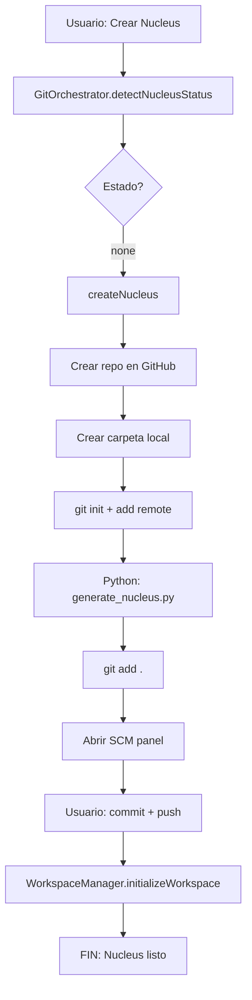
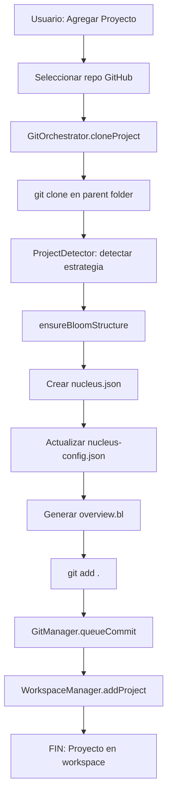

# 🔧 BLOOM - Implementación Git Orchestration v1.0

**Documento de Implementación Práctica**  
*Basado en: Git Orchestration Plan + Codebase Actual*

---

## 📋 Índice de Implementación

1. [Estado Actual del Sistema](#estado-actual)
2. [Arquitectura del GitOrchestrator](#arquitectura)
3. [Instalación de Dependencias](#dependencias)
4. [Implementación del Módulo Core](#implementación-core)
5. [Integración con Comandos Existentes](#integración)
6. [Flujos Específicos](#flujos)
7. [Testing y Validación](#testing)

---

## 1. Estado Actual del Sistema

### ✅ Componentes YA Implementados

**Git Management Básico:**
- `src/utils/gitManager.ts` - Sistema de commits pendientes
- `src/utils/githubApi.ts` - Interacción con GitHub API
- `src/utils/githubOAuth.ts` - Autenticación OAuth

**Nucleus Management:**
- `src/core/nucleusManager.ts` - Creación básica de Nucleus
- `src/commands/createNucleusProject.ts` - Comando de creación
- `src/commands/linkToNucleus.ts` - Vinculación de proyectos
- `src/ui/welcome/welcomeView.ts` - Flujo de registro y creación

**Workspace Management:**
- `src/managers/workspaceManager.ts` - Multi-root workspace
- Creación automática de `.code-workspace`
- Agregar/remover proyectos del workspace

### ❌ Componentes FALTANTES (A Implementar)

**GitOrchestrator Core:**
- ❌ Módulo unificado `src/core/gitOrchestrator.ts`
- ❌ Detección de estado Git/GitHub (local/remoto)
- ❌ Lógica de vinculación (caso 3: local + remoto existen)
- ❌ Manejo de conflictos y estados inconsistentes
- ❌ Push explícito confirmable con SCM panel

**Integración Python:**
- ❌ Ejecución post-git de `generate_nucleus.py`
- ❌ Ejecución post-git de `generate_project_context.py`
- ❌ Coordinación entre TS y Python

---

## 2. Arquitectura del GitOrchestrator

### Diagrama de Módulos

```
GitOrchestrator (Nuevo)
├── NucleusGitManager
│   ├── detectNucleusStatus()
│   ├── createNucleus()
│   ├── cloneNucleus()
│   └── linkNucleus()
├── ProjectGitManager
│   ├── createProject()
│   ├── cloneProject()
│   └── linkProject()
├── GitStateDetector
│   ├── checkLocalRepo()
│   ├── checkRemoteRepo()
│   └── validateConsistency()
└── SCMIntegration
    ├── stageAll()
    ├── openSCMPanel()
    └── ensureInitialCommit()

Integra con:
- GitManager (existente) → Para commits pendientes
- WorkspaceManager (existente) → Para agregar al workspace
- PythonScriptRunner (existente) → Para generación
- githubApi (existente) → Para operaciones remotas
```

### Interfaces TypeScript

```typescript
export interface NucleusStatus {
  exists: boolean;
  location: 'local' | 'remote' | 'both' | 'none';
  localPath?: string;
  remoteUrl?: string;
  hasValidStructure?: boolean;
  conflictDetected?: boolean;
}

export interface NucleusResult {
  success: boolean;
  nucleusPath: string;
  action: 'created' | 'cloned' | 'linked';
  message: string;
  error?: string;
}

export interface ProjectResult {
  success: boolean;
  projectPath: string;
  action: 'created' | 'cloned' | 'linked';
  strategy: string;
  linkedToNucleus: boolean;
  message: string;
}
```

---

## 3. Instalación de Dependencias

### 3.1 Dependencias Requeridas

```bash
# En bloom-development-extension/
npm install simple-git@latest
npm install @octokit/rest@latest

# Verificar versiones
npm list simple-git @octokit/rest
```

### 3.2 Actualizar package.json

```json
{
  "dependencies": {
    "@octokit/rest": "^20.0.2",
    "simple-git": "^3.20.0",
    // ... existentes
  }
}
```

### 3.3 Verificar VSCode Git Extension

```typescript
// En extension.ts - Verificar disponibilidad
const gitExtension = vscode.extensions.getExtension('vscode.git');
if (!gitExtension) {
  logger.error('VSCode Git extension not available');
}
```

---

## 4. Implementación del Módulo Core

### 4.1 Crear `src/core/gitOrchestrator.ts`

```typescript
// src/core/gitOrchestrator.ts
import * as vscode from 'vscode';
import * as path from 'path';
import * as fs from 'fs';
import simpleGit, { SimpleGit } from 'simple-git';
import { Octokit } from '@octokit/rest';
import { Logger } from '../utils/logger';
import { PythonScriptRunner } from './pythonScriptRunner';
import { WorkspaceManager } from '../managers/workspaceManager';
import { GitManager } from '../utils/gitManager';

export interface NucleusStatus {
  exists: boolean;
  location: 'local' | 'remote' | 'both' | 'none';
  localPath?: string;
  remoteUrl?: string;
  hasValidStructure?: boolean;
  conflictDetected?: boolean;
}

export interface NucleusResult {
  success: boolean;
  nucleusPath: string;
  action: 'created' | 'cloned' | 'linked';
  message: string;
  error?: string;
}

export class GitOrchestrator {
  private octokit: Octokit;
  private git: SimpleGit;
  private logger: Logger;
  private pythonRunner: PythonScriptRunner;

  constructor(
    githubToken: string,
    logger: Logger,
    pythonRunner: PythonScriptRunner
  ) {
    this.octokit = new Octokit({ auth: githubToken });
    this.git = simpleGit();
    this.logger = logger;
    this.pythonRunner = pythonRunner;
  }

  /**
   * FLUJO 1: Detectar estado de Nucleus
   */
  async detectNucleusStatus(org: string): Promise<NucleusStatus> {
    const nucleusName = `nucleus-${org}`;
    const status: NucleusStatus = {
      exists: false,
      location: 'none'
    };

    // 1. Verificar remoto en GitHub
    const remoteExists = await this.checkRemoteRepo(org, nucleusName);
    
    // 2. Verificar local (en parent folder del workspace)
    const localPath = this.findLocalNucleus(org);

    if (remoteExists && localPath) {
      status.exists = true;
      status.location = 'both';
      status.localPath = localPath;
      status.remoteUrl = `https://github.com/${org}/${nucleusName}.git`;
      
      // Validar consistencia
      const isConsistent = await this.validateConsistency(localPath, status.remoteUrl);
      status.conflictDetected = !isConsistent;
      status.hasValidStructure = this.hasValidBloomStructure(localPath);
      
    } else if (remoteExists) {
      status.exists = true;
      status.location = 'remote';
      status.remoteUrl = `https://github.com/${org}/${nucleusName}.git`;
      
    } else if (localPath) {
      status.exists = true;
      status.location = 'local';
      status.localPath = localPath;
      status.hasValidStructure = this.hasValidBloomStructure(localPath);
    }

    this.logger.info(`Nucleus status for ${org}: ${JSON.stringify(status)}`);
    return status;
  }

  /**
   * FLUJO 2: Crear Nucleus (local + remoto nuevo)
   */
  async createNucleus(org: string, parentPath: string): Promise<NucleusResult> {
    const nucleusName = `nucleus-${org}`;
    const nucleusPath = path.join(parentPath, nucleusName);

    try {
      // 1. Crear repo remoto en GitHub
      this.logger.info(`Creating remote repo: ${nucleusName}`);
      await this.octokit.repos.createForAuthenticatedUser({
        name: nucleusName,
        description: `Nucleus organizacional para ${org}`,
        private: false,
        auto_init: false
      });

      // 2. Crear carpeta local
      if (!fs.existsSync(nucleusPath)) {
        fs.mkdirSync(nucleusPath, { recursive: true });
      }

      // 3. Inicializar Git
      const git = simpleGit(nucleusPath);
      await git.init();
      await git.addRemote('origin', `https://github.com/${org}/${nucleusName}.git`);

      // 4. Ejecutar Python para generar estructura
      this.logger.info('Generating Nucleus structure with Python...');
      await this.pythonRunner.generateNucleus(nucleusPath, org);

      // 5. Stage archivos generados
      await git.add('./*');

      // 6. Crear workspace
      await WorkspaceManager.initializeWorkspace(nucleusPath);

      // 7. Abrir SCM panel para commit confirmable
      await this.openSCMPanel(nucleusPath);

      return {
        success: true,
        nucleusPath,
        action: 'created',
        message: `Nucleus creado en ${nucleusPath}. Revisa los cambios en el panel SCM.`
      };

    } catch (error: any) {
      this.logger.error('Error creating nucleus', error);
      return {
        success: false,
        nucleusPath,
        action: 'created',
        message: 'Error al crear Nucleus',
        error: error.message
      };
    }
  }

  /**
   * FLUJO 3: Clonar Nucleus (remoto existe)
   */
  async cloneNucleus(org: string, parentPath: string): Promise<NucleusResult> {
    const nucleusName = `nucleus-${org}`;
    const nucleusPath = path.join(parentPath, nucleusName);
    const repoUrl = `https://github.com/${org}/${nucleusName}.git`;

    try {
      this.logger.info(`Cloning nucleus from ${repoUrl}`);

      // 1. Clonar repositorio
      await simpleGit().clone(repoUrl, nucleusPath);

      // 2. Verificar estructura .bloom/
      const needsCompletion = !this.hasValidBloomStructure(nucleusPath);

      if (needsCompletion) {
        this.logger.info('Completing missing .bloom/ structure...');
        await this.pythonRunner.generateNucleus(nucleusPath, org, { skipExisting: true });
        
        // Stage archivos generados
        const git = simpleGit(nucleusPath);
        await git.add('./*');
        
        // Abrir SCM para commit
        await this.openSCMPanel(nucleusPath);
      }

      // 3. Crear workspace
      await WorkspaceManager.initializeWorkspace(nucleusPath);

      return {
        success: true,
        nucleusPath,
        action: 'cloned',
        message: needsCompletion 
          ? 'Nucleus clonado. Se agregaron archivos faltantes - revisar SCM.'
          : 'Nucleus clonado exitosamente.'
      };

    } catch (error: any) {
      this.logger.error('Error cloning nucleus', error);
      return {
        success: false,
        nucleusPath,
        action: 'cloned',
        message: 'Error al clonar Nucleus',
        error: error.message
      };
    }
  }

  /**
   * FLUJO 4: Vincular Nucleus (local + remoto existen)
   */
  async linkNucleus(localPath: string, org: string): Promise<NucleusResult> {
    try {
      const nucleusName = `nucleus-${org}`;
      const expectedRemote = `https://github.com/${org}/${nucleusName}.git`;

      // 1. Validar que el directorio existe
      if (!fs.existsSync(localPath)) {
        throw new Error(`Path no existe: ${localPath}`);
      }

      // 2. Verificar .git
      const git = simpleGit(localPath);
      const isRepo = await git.checkIsRepo();
      
      if (!isRepo) {
        throw new Error('No es un repositorio Git válido');
      }

      // 3. Verificar remote origin
      const remotes = await git.getRemotes(true);
      const origin = remotes.find(r => r.name === 'origin');
      
      if (!origin) {
        // Agregar origin si no existe
        await git.addRemote('origin', expectedRemote);
      } else if (origin.refs.fetch !== expectedRemote) {
        throw new Error(`Remote origin no coincide. Esperado: ${expectedRemote}, Actual: ${origin.refs.fetch}`);
      }

      // 4. Validar estructura .bloom/
      const needsCompletion = !this.hasValidBloomStructure(localPath);
      
      if (needsCompletion) {
        this.logger.info('Completing .bloom/ structure...');
        await this.pythonRunner.generateNucleus(localPath, org, { skipExisting: true });
        
        await git.add('./*');
        await this.openSCMPanel(localPath);
      }

      // 5. Registrar en Bloom registry (global state)
      // TODO: Implementar registro en UserManager

      // 6. Crear workspace si no existe
      await WorkspaceManager.initializeWorkspace(localPath);

      return {
        success: true,
        nucleusPath: localPath,
        action: 'linked',
        message: needsCompletion
          ? 'Nucleus vinculado. Se agregaron archivos faltantes - revisar SCM.'
          : 'Nucleus vinculado exitosamente.'
      };

    } catch (error: any) {
      this.logger.error('Error linking nucleus', error);
      return {
        success: false,
        nucleusPath: localPath,
        action: 'linked',
        message: 'Error al vincular Nucleus',
        error: error.message
      };
    }
  }

  /**
   * UTILIDADES PRIVADAS
   */

  private async checkRemoteRepo(org: string, repoName: string): Promise<boolean> {
    try {
      await this.octokit.repos.get({
        owner: org,
        repo: repoName
      });
      return true;
    } catch (error: any) {
      if (error.status === 404) {
        return false;
      }
      throw error;
    }
  }

  private findLocalNucleus(org: string): string | null {
    const nucleusName = `nucleus-${org}`;
    const workspaceRoot = vscode.workspace.workspaceFolders?.[0]?.uri.fsPath;
    
    if (!workspaceRoot) return null;

    // Buscar en parent directory
    const parentDir = path.dirname(workspaceRoot);
    const possiblePath = path.join(parentDir, nucleusName);

    if (fs.existsSync(possiblePath)) {
      return possiblePath;
    }

    // Buscar en workspace actual
    if (path.basename(workspaceRoot) === nucleusName) {
      return workspaceRoot;
    }

    return null;
  }

  private async validateConsistency(localPath: string, remoteUrl: string): Promise<boolean> {
    try {
      const git = simpleGit(localPath);
      const remotes = await git.getRemotes(true);
      const origin = remotes.find(r => r.name === 'origin');
      
      if (!origin) return false;
      
      // Normalizar URLs para comparación
      const normalizedLocal = this.normalizeGitUrl(origin.refs.fetch);
      const normalizedRemote = this.normalizeGitUrl(remoteUrl);
      
      return normalizedLocal === normalizedRemote;
    } catch {
      return false;
    }
  }

  private normalizeGitUrl(url: string): string {
    return url
      .replace(/\.git$/, '')
      .replace(/^https:\/\//, '')
      .replace(/^git@github\.com:/, 'github.com/')
      .toLowerCase();
  }

  private hasValidBloomStructure(nucleusPath: string): boolean {
    const requiredPaths = [
      '.bloom',
      '.bloom/core',
      '.bloom/core/nucleus-config.json',
      '.bloom/organization',
      '.bloom/projects'
    ];

    return requiredPaths.every(p => 
      fs.existsSync(path.join(nucleusPath, p))
    );
  }

  private async openSCMPanel(repoPath: string): Promise<void> {
    // Enfocar en el repo específico
    const uri = vscode.Uri.file(repoPath);
    await vscode.commands.executeCommand('workbench.view.scm');
    
    // Opcional: Mostrar mensaje
    vscode.window.showInformationMessage(
      '📝 Archivos agregados al stage. Revisa el panel SCM para hacer commit.',
      'Abrir SCM'
    ).then(selection => {
      if (selection === 'Abrir SCM') {
        vscode.commands.executeCommand('workbench.view.scm');
      }
    });
  }
}
```

---

## 5. Integración con Comandos Existentes

### 5.1 Modificar `src/ui/welcome/welcomeView.ts`

```typescript
// Reemplazar método createNucleus() existente
private async createNucleus(githubOrg?: string) {
  try {
    const user = await getCurrentGitHubUser();
    const orgs = await getUserOrgs();

    await UserManager.init(this.context).saveUser({
      githubUsername: user.login,
      githubOrg: githubOrg || user.login,
      allOrgs: [user.login, ...orgs.map(o => o.login)]
    });

    // NUEVO: Usar GitOrchestrator
    const orchestrator = new GitOrchestrator(
      this.context,
      user.token, // Obtener del OAuth
      new Logger(),
      new PythonScriptRunner()
    );

    // 1. Detectar estado
    const status = await orchestrator.detectNucleusStatus(githubOrg || user.login);

    // 2. Elegir acción según estado
    let result: NucleusResult;

    if (status.location === 'none') {
      // Crear nuevo
      const folder = await vscode.window.showOpenDialog({
        canSelectFolders: true,
        title: 'Seleccionar carpeta parent para Nucleus'
      });
      
      if (!folder) return;
      
      result = await orchestrator.createNucleus(
        githubOrg || user.login,
        folder[0].fsPath
      );

    } else if (status.location === 'remote') {
      // Clonar
      const folder = await vscode.window.showOpenDialog({
        canSelectFolders: true,
        title: 'Seleccionar carpeta donde clonar'
      });
      
      if (!folder) return;
      
      result = await orchestrator.cloneNucleus(
        githubOrg || user.login,
        folder[0].fsPath
      );

    } else if (status.location === 'both' || status.location === 'local') {
      // Vincular existente
      result = await orchestrator.linkNucleus(
        status.localPath!,
        githubOrg || user.login
      );
    }

    // Mostrar resultado
    if (result.success) {
      this.panel?.webview.postMessage({
        command: 'nucleusCreated',
        message: result.message
      });
      
      setTimeout(() => {
        this.panel?.dispose();
        vscode.commands.executeCommand('bloom.syncNucleusProjects');
      }, 2000);
    } else {
      throw new Error(result.error || 'Error desconocido');
    }

  } catch (err: any) {
    this.panel?.webview.postMessage({
      command: 'error',
      text: err.message
    });
  }
}
```

### 5.2 Actualizar `src/commands/manageProject.ts`

```typescript
// En función cloneFromGitHub() - Reemplazar lógica de clonación
async function cloneFromGitHub(nucleusPath: string, orgName: string): Promise<void> {
  // ... código existente hasta selección de repo ...

  // NUEVO: Usar GitOrchestrator para clonar
  const orchestrator = new GitOrchestrator(
    this.context,
    await getGithubToken(),
    new Logger(),
    new PythonScriptRunner()
  );

  const result = await orchestrator.cloneProject(
    selected.repo.clone_url,
    parentDir,
    nucleusPath
  );

  if (result.success) {
    vscode.window.showInformationMessage(result.message);
  } else {
    throw new Error(result.error);
  }
}
```

---

## 6. Flujos Específicos

### 6.1 Flujo Completo: Crear Nucleus desde Cero



### 6.2 Flujo Completo: Clonar Proyecto a Nucleus



---

## 7. Testing y Validación

### 7.1 Tests Unitarios

```typescript
// test/gitOrchestrator.test.ts
import { GitOrchestrator } from '../src/core/gitOrchestrator';

describe('GitOrchestrator', () => {
  test('detectNucleusStatus - none', async () => {
    const orchestrator = new GitOrchestrator(
      this.context,
      token, 
      logger, 
      runner
    );
    const status = await orchestrator.detectNucleusStatus('test-org');
    expect(status.location).toBe('none');
  });

  test('createNucleus - success', async () => {
    const result = await orchestrator.createNucleus('test-org', '/tmp/test');
    expect(result.success).toBe(true);
    expect(result.action).toBe('created');
  });

  // ... más tests
});
```

### 7.2 Tests de Integración

**Escenarios manuales:**

1. **Crear Nucleus desde cero**
   - ✓ Repo remoto creado
   - ✓ Carpeta local creada
   - ✓ .bloom/ estructura completa
   - ✓ SCM panel abierto
   - ✓ Commit confirmable

2. **Clonar Nucleus existente**
   - ✓ Repo clonado correctamente
   - ✓ Estructura .bloom/ validada
   - ✓ Archivos faltantes agregados
   - ✓ Workspace creado

3. **Vincular Nucleus (local + remoto)**
   - ✓ Remote origin validado
   - ✓ Estructura completada si falta
   - ✓ NO se clona sobre existente
   - ✓ Registrado en UserManager

---

## 8. Próximos Pasos

### Prioridad Alta (Esta Semana)
- [ ] Implementar `GitOrchestrator.ts` core
- [ ] Integrar con `welcomeView.ts`
- [ ] Testing manual de 3 flujos Nucleus
- [ ] Fix bugs detectados

### Prioridad Media (Próxima Semana)
- [ ] Extender a proyectos (cloneProject, linkProject)
- [ ] Mejorar UI del SCM panel (modal custom?)
- [ ] Agregar progress indicators
- [ ] Documentar en README

### Prioridad Baja (Futuro)
- [ ] Manejo de branches
- [ ] Detección de conflictos avanzada
- [ ] Rollback automático en errores
- [ ] Tests automatizados completos

---

## 📚 Referencias

- **Git Orchestration Plan:** `BLOOM – Git Orchestration Plan (v1.0).md`
- **Unified Spec:** `bloom_unified_spec.md`
- **Codebase Actual:** `codebase.md`
- **simple-git docs:** https://github.com/steveukx/git-js
- **Octokit docs:** https://octokit.github.io/rest.js/

---

**Versión:** 1.0.0  
**Última Actualización:** 25 de Noviembre de 2025  
**Autor:** Claude + Equipo Bloom
